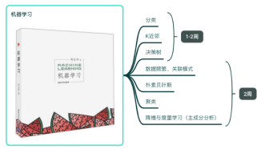

### Python语言
```bash
计算机本科入门C语言，后续java语言，选修python语言
·软硬件等系统的底层逻辑为C、C++语言：学习完《数据结构》会基本掌握C语言的大概核心知识；
·前后端开发常用java语言：建议直接从搭建完整系统开始，从而熟悉SSM、Spring-boot等框架，https://how2j.cn/stage/39.html
·算法设计常用python语言：API查询 https://docs.python.org/zh-cn/3.13/contents.html 熟悉和使用
    之前自己学习python玩过：莫烦Python-https://mofanpy.com，派森编程-https://pycoding.com ，怎么说呢，纯玩了就🤣
现在编程语言学习没那么难，debuug大模型会帮改，但咱得知道 问题出在哪里？有个大概解决思路？然后再去问大模型！
```

### Visual Studio code编辑器
```shell
1.主要编译和运行python语言：本地安装Anaconda后
    新建python环境 ：conda new 环境名，
    激活环境：conda activate 环境名
    之后安装各种库包：conda/pip install 包名
    成功界面如下图所示：可直接 python XX.py
「中间会涉及windows或linux常用的命令，查看ls、复制cp、删除rm等。」
```


```bash
2.可以编译C语言（在‘扩展’中下载C/C++编译环境的插件即可）。
```

### 书籍和代码 
```bash
通过网盘分享的文件：AI学习资源
链接: https://pan.baidu.com/s/1vo2ihvLC1A1TqYZ0ZDlBlA?pwd=5ng4 提取码: 5ng4 
--来自百度网盘超级会员v5的分享

1《数据结构》严蔚敏，计划4～5周 ##本科书籍，重点掌握
    ·网课：B站 鲍松山老师，我当时各种考试都反复看他的视频！讲的很好理解！
https://www.bilibili.com/video/BV1bM411u7Ki/?spm_id_from=333.1387.favlist.content.click&vd_source=8f43c3a38f673faa87fc5770fa2e2e30
    ·电子书和代码都在网盘中，代码可直接拷贝到vscode中编译和运行。

2.1 《统计学习》李航，计划4～5周 ##研究生书籍，详细掌握
    ·电子书在网盘里。
2.2 《机器学习》周志华，俗称西瓜书，计划3～4周 
    ·这个目前没有电子版😥，但书如下图所示，因为可以和2.1并行学习，同一类知识可共同参考，个人感觉这本书的概念稍微抽象些。
上述的分类、回归、聚类等机器学习算法基本都是python中的已有库函数，只要熟悉库函数的输入输出，编程中可直接调库使用。
```



```bash
3.1 《深度学习》俗称花书，计划4～5周  ##作为参考书，常看常新
    网页版：https://zh.d2l.ai/index.html
    熟悉人工智能的发展进程，了解常用的网络模型，学会搭建简单的网络模型。现有的pytorch等深度学习库也包含基本模型，直接调用即可。
3.2 《神经网络与深度学习》邱锡鹏，计划3～4周 ###研究生书籍，详细掌握
    网页版：https://nndl.github.io/nndl-book.pdf，

推荐学习好用工具：
    前馈神经网络的图文解释：https://playground.tensorflow.org/
    卷积神经网络的图文解释：https://poloclub.github.io/cnn-explainer/
```

### 人工智能
```bash
1.中国计算机学会CCF：https://www.ccf.org.cn/Academic_Evaluation/By_category/
    不同学校不同要求，但‘计算机’的学术成果按CCF级别评估，每几年会更新相关的会议和期刊目录，当然也有中文核心期刊推荐，大家一般投论文按照如下顺序进行：
    ·先会议->后期刊：因为会议审稿快，需要审稿意见，根据意见修改后，若被会议拒，就转投期刊！【会议截稿可看：https://ccfddl.com/】
    ·B刊->C刊：由高到低的投，但最近计算机论文过度饱和，投稿量巨大，若没有很强的学术追求，建议投 Sci2区及以上的IEEE汇刊也行
2.各个领域研究：https://sotapapers.com/research_areas、https://www.semanticscholar.org
3.高质量论文数据库：https://dblp.uni-trier.de、https://scholar.google.com/
4.Github：https://github.com/，关注OpenMMLab、Meta Reasearch、Hugging Face、DeepSeek等常活跃的用户社区，时常关注AI热点！
```