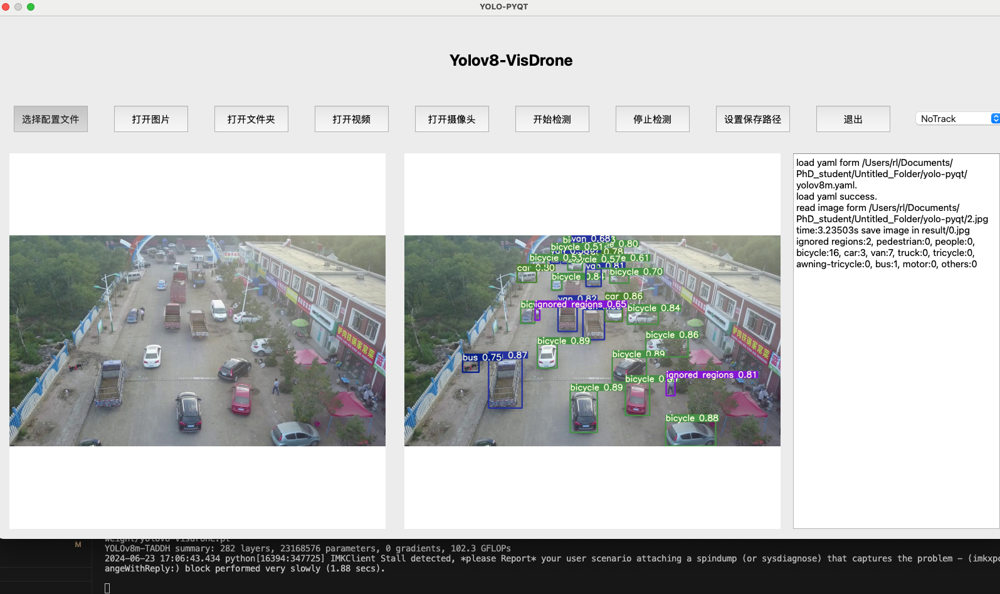
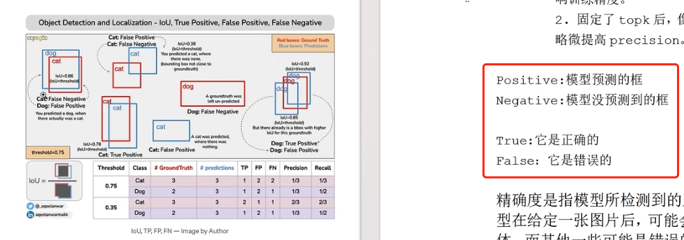
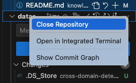

### 横纵坐标【铝管压痕检测】
```text
1. 横坐标（X轴）
表示方式：横坐标通常表示图像中的列坐标，即图像从左到右的像素位置。
范围：横坐标的范围从图像的最左边开始（通常为0）到最右边（列数减去1）。
应用场景：在铝管压痕检测中，横坐标可以用来表示压痕在水平方向上的位置。例如，横坐标可以表示压痕沿着铝管的周向位置。
2. 纵坐标（Y轴）
表示方式：纵坐标通常表示图像中的行坐标，即图像从上到下的像素位置。
范围：纵坐标的范围从图像的最上边开始（通常为0）到最下边（行数减去1）。
应用场景：在铝管压痕检测中，纵坐标可以用来表示压痕在垂直方向上的位置。例如，纵坐标可以表示压痕沿着铝管长度方向的位置。
3. 图像矩阵：
    在图像矩阵中，元素的索引通常用 (i, j) 表示，其中 i 代表行（纵坐标），j 代表列（横坐标）。
    例如，矩阵元素 M[i][j] 表示图像中第 i 行、第 j 列的像素值。
```

### [人工智能名词字典](https://zhuanlan.zhihu.com/p/671175717)

### 稠密和稀疏处理
```text
- 在计算机视觉领域，稠密(dense )和稀疏(sparse)通常用来描述图像处理中的两种不同的数据处理方式。

·稠密处理：指对图像中的每个像素都进行操作，通常用于需要对整个图像进行分析或处理的任务，例如图像识别、图像分割等。在稠密处理中，需要对每个像素进行操作，以获得完整的图像信息。这种方式可以提供更精确的结果，但也需要更多的计算资源和时间。

·稀疏处理：指只对图像中的一部分像素进行操作，通常用于对图像进行特征提取或关键点检测等任务。在稀疏处理中，只对图像中的一部分像素进行操作，通常是具有特定特征或重要性的像素。这种方式可以减少计算量和加快处理速度，但可能会牺牲一些信息的精确度.
```

### yolov8-pyqt
- 与训练环境一致
```bash
conda create -n mmcv python=3.9
conda activate mmcv
pip install torch torchvision torchaudio
conda install -c openmmlab mmcv-full
pip install PyQt5
```

- 开始运行
```bash
把ultralytics目录搬过来，防止找不到包！
cd yolo-pyqt
# yolov8m.yaml : [device :cpu] 
python run_gui.py
```




- 登录窗口调用主窗口
    https://blog.csdn.net/qilei2010/article/details/131077794
    ```bash
    run_gui.py
    __init__()
        self.loginW = None # 保存登录对话框
        # self.show() # 主窗口先不显示
    __main__()
        from login import LoginWindow
        w.loginW = LoginWindow(w) # 创建窗体，将主窗口作为参数传入
        w.loginW.show() # 

    login.py
    __init__(self,mainwin)
        self.mainwin = mainwin # 保存主窗口的引用，因为要给主窗口传递信息
    login(self)
        if username == 'user' and password == 'pass':
            # 登录成功后切换到新界面
            self.hide()  # 隐藏当前登录窗口
            self.mainwin.show() # 显示主窗口
            self.close() # 登录使命完成，关闭自己
    ```


### 神经网络可视化工具汇总

- <https://cloud.tencent.com/developer/article/2333299>

· 直接导入权重pt文件即可显示网络结构(网页在线版)，<https://github.com/lutzroeder/Netron?tab=readme-ov-file>

· 自己画图时，可参考的形状：<https://docs.google.com/presentation/d/11mR1nkIR9fbHegFkcFq8z9oDQ5sjv8E3JJp1LfLGKuk/edit#slide=id.g78327f1586_217_712>


### command useless
```bash
python train.py --yaml ultralytics/cfg/models/v8/yolov8-dyhead.yaml  --info --project runs/train
```

### 目标检测论文发展方向
```text
🙅 backbone、注意力机制、loss

除非是顶会新提的结构，可以结合
```


### git-test

** 具体步骤在goodnotes上有标明！

- fatal: unable to access 'XX': Failed to connect to github.com port 443: 连接超时

[解决方式参考](https://blog.csdn.net/zpf1813763637/article/details/128340109)

```bash
git config --global --get http.proxy
git config --global --get https.proxy

sudo vi /etc/hosts
添加了 ping github.com的IP地址
```

- 提示22端口不能用了 , 连接失败，没有仓库

```bash
ssh -T git@github.com  # 报错
ssh -T -p 443 git@ssh.github.com  #成功
vim ~/.ssh/config
    <!-- Host github.com 
        Hostname ssh.github.com 
        Port 443 -->
cat ~/.ssh/config
ssh -T git@github.com
```

- Git:execute git fail

```text
commit中存在大文件，出现的错误
```

### github🔗

```bash
git init
git add README.md
git config --global user.email "you@example.com"
git config --global user.name "Your Name"
git commit -m "first commit"
git branch -M main
git remote add origin https://github.com/Wang-Phil/test.git
git push -u origin main
```

```bash
ssh -T git@github.com
cd .git
ls
cat config 
###
    [core]
    repositoryformatversion = 0
    filemode = true
    bare = false
    logallrefupdates = true
    [remote "origin"]
        url = https://github.com/LiuJiaji1999/power.git
        fetch = +refs/heads/*:refs/remotes/origin/*
    [branch "main"]
        remote = origin
        merge = refs/heads/main
###
vim config 
    url = git@github.com:LiuJiaji1999/power.git

cd ~/.ssh
ls
cat id_ras.pub # github设置中的remote-ssh

# 撤销 提交历史 ，回退2次
git reset HEAD~2

# 出现分支不同的问题 https://blog.csdn.net/qq_38856939/article/details/123333383
git fetch origin
git rebase origin/main

# 在git那里，右键选择 

```




```text
- A：Added
    表示该文件是新添加的文件，已经被Git跟踪，并且将会包含在下一次的提交中。当使用git add命令将新文件添加到暂存区后，文件的状态会从U（Untracked）变为A（Added）。
- U：Untracked
    表示该文件是未被Git跟踪的文件，Git不会自动将其包含在版本控制中。这意味着该文件不会被提交到版本库中，也不会被包含在Git的快照中。如果希望Git开始跟踪该文件，需要使用git add命令将其添加到暂存区，然后文件的状态会从U（Untracked）变为A（Added）。
- M：Modified
    表示该文件已被修改。当对已跟踪的文件进行了修改后，文件的状态会从A（Added）变为M（Modified）。这意味着该文件在上一次提交之后发生了变化，但尚未被添加到暂存区。
```

· 表格制作示例
                                        
| sample | clsId- | clsName- | instanceNum | train | test | val |
| :----: | :----: | :----: | :----: | :----: | :----: | :----: |
| pin| 0-defect-6011 | 1-rust-2000 |2-uninstal-1832| 6579 | 1880 | 940 |
| Einsulator | 3-burn-475 | 4-defect-508 | 5-dirty-440 | 951 | 272 | 137 |
