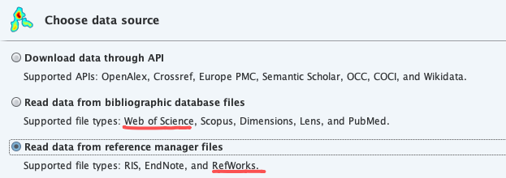

# 轻量级模型设计与部署总结

#### 关键词定义及理解
1. 计算量

    ·FLOPs：floating point operations 指的是浮点运算次数，理解为计算量，可以用来衡量算法/模型时间的复杂度。

    ·FLOPS：（全部大写），Floating-point Operations Per Second，每秒所执行的浮点运算次数，理解为计算速度, 是一个衡量硬件性能/模型速度的指标，即一个芯片的算力。

    ·MACCs：multiply-accumulate operations，乘-加操作次数，MACCs 大约是 FLOPs 的一半。将 w[0]∗x[0]+... 视为一个乘法累加或 1 个 MACC。
2. 内存访问代价 MAC

    MAC: Memory Access Cost 内存访问代价。指的是输入单个样本（一张图像），模型/卷积层完成一次前向传播所发生的内存交换总量，即模型的空间复杂度，单位是 Byte。

3. GPU内存带宽

    ·GPU 的内存带宽决定了它将数据从内存 (vRAM) 移动到计算核心的速度，是比 GPU 内存速度更具代表性的指标。

    ·GPU 的内存带宽的值取决于内存和计算核心之间的数据传输速度，以及这两个部分之间总线中单独并行链路的数量。

4. Latency and Throughput 延迟和吞吐量
    
    深度学习领域延迟 Latency 和吞吐量 Throughput的一般解释：

    ·延迟 (Latency): 人和机器做决策或采取行动时都需要反应时间。延迟是指提出请求与收到反应之间经过的时间。大部分人性化软件系统（不只是 AI 系统），延迟都是以毫秒来计量的。

    ·吞吐量 (Throughput): 在给定创建或部署的深度学习网络规模的情况下，可以传递多少推断结果。简单理解就是在一个时间单元（如：一秒）内网络能处理的最大输入样例数。
    
    CPU 是低延迟低吞吐量处理器；GPU 是高延迟高吞吐量处理器。    

5. Volatile GPU Util

    一般，很多人通过 nvidia-smi 命令查看 Volatile GPU Util 数据来得出 GPU 利用率，但是！关于这个利用率(GPU Util)，容易产生两个误区：

    误区一: GPU 的利用率 = GPU 内计算单元干活的比例。利用率越高，算力就必然发挥得越充分。

    误区二: 同条件下，利用率越高，耗时一定越短。
    
    但实际上，GPU Util 的本质只是反应了，在采样时间段内，一个或多个内核（kernel）在 GPU 上执行的时间百分比，采样时间段取值 1/6s~1s。通俗来讲，就是，在一段时间范围内， GPU 内核运行的时间占总时间的比例。
    
    比如 GPU Util 是 69%，时间段是 1s，那么在过去的 1s 中内，GPU 内核运行的时间是 0.69s。如果 GPU Util 是 0%，则说明 GPU 没有被使用，处于空闲中。也就是说它并没有告诉我们使用了多少个 SM 做计算，或者程序有多“忙”，或者内存使用方式是什么样的，简而言之即不能体现出算力的发挥情况。

6. 英伟达 GPU 架构

    GPU 设计了更多的晶体管（transistors）用于数据处理（data process）而不是数据缓冲（data caching）和流控（flow control），因此 GPU 很适合做高度并行计算（highly parallel computations）。同时，GPU 提供比 CPU 更高的指令吞吐量和内存带宽（instruction throughput and memory bandwidth）。

    CPU 和 GPU 的直观对比图如下所示：
    

最后简单总结下英伟达 GPU 架构的一些特点:

·SIMT (Single Instruction Multiple Threads) 模式，即多个 Core 同一时刻只能执行同样的指令。虽然看起来与现代 CPU 的 SIMD（单指令多数据）有些相似，但实际上有着根本差别。

·更适合计算密集与数据并行的程序，原因是缺少 Cache 和 Control。


# 神经网络可视化工具汇总
- https://cloud.tencent.com/developer/article/2333299

· 直接导入权重pt文件即可显示网络结构(网页在线版)，https://github.com/lutzroeder/Netron?tab=readme-ov-file

· 自己画图时，可参考的形状：https://docs.google.com/presentation/d/11mR1nkIR9fbHegFkcFq8z9oDQ5sjv8E3JJp1LfLGKuk/edit#slide=id.g78327f1586_217_712

# command useless
```
python train.py --yaml ultralytics/cfg/models/v8/yolov8-dyhead.yaml  --info --project runs/train
```
# 目标检测
🙅 backbone、注意力机制、loss

除非是顶会新提的结构，可以结合

# git-test

`具体步骤在goodnotes上有标明！

提示443 链接超时的解决
- https://blog.csdn.net/zpf1813763637/article/details/128340109

- sudo vi /etc/hosts
添加了 ping github.com的IP地址

## linux服务器提示git  连接失败，没有仓库

-   提示22端口不能用了，修改如下：
```
    ssh -T git@github.com  # 报错
    ssh -T -p 443 git@ssh.github.com  #成功
    vim ~/.ssh/config
        <!-- Host github.com 
            Hostname ssh.github.com 
            Port 443 -->
    cat ~/.ssh/config
    ssh -T git@github.com
```

## Git:execute git fail
commit中存在大文件，出现的错误

表格制作
                                            |image number|
| sample | clsId- | clsName- | instanceNum | train | test | val | 
| :----: | :----: | :----: | :----: | :----: | :----: | :----: |
| pin| 0-defect-6011 | 1-rust-2000 |2-uninstal-1832| 6579 | 1880 | 940 | 
| Einsulator | 3-burn-475 | 4-defect-508 | 5-dirty-440 | 951 | 272 | 137 | 


## github🔗
```
    ssh -T git@github.com
    cd .git
    ls
    cat config 
    ###
        [core]
        repositoryformatversion = 0
        filemode = true
        bare = false
        logallrefupdates = true
        [remote "origin"]
            url = https://github.com/LiuJiaji1999/power.git
            fetch = +refs/heads/*:refs/remotes/origin/*
        [branch "main"]
            remote = origin
            merge = refs/heads/main
    ###
    vim config 
        url = git@github.com:LiuJiaji1999/power.git

    cd ~/.ssh
    ls
    cat id_ras.pub # github设置中的remote-ssh

    # 撤销 提交历史 ，回退2次
    git reset HEAD~2
```

- A：Added
        
    表示该文件是新添加的文件，已经被Git跟踪，并且将会包含在下一次的提交中。当使用git add命令将新文件添加到暂存区后，文件的状态会从U（Untracked）变为A（Added）。
- U：Untracked
    
    表示该文件是未被Git跟踪的文件，Git不会自动将其包含在版本控制中。这意味着该文件不会被提交到版本库中，也不会被包含在Git的快照中。如果希望Git开始跟踪该文件，需要使用git add命令将其添加到暂存区，然后文件的状态会从U（Untracked）变为A（Added）。
- M：Modified

    表示该文件已被修改。当对已跟踪的文件进行了修改后，文件的状态会从A（Added）变为M（Modified）。这意味着该文件在上一次提交之后发生了变化，但尚未被添加到暂存区。


