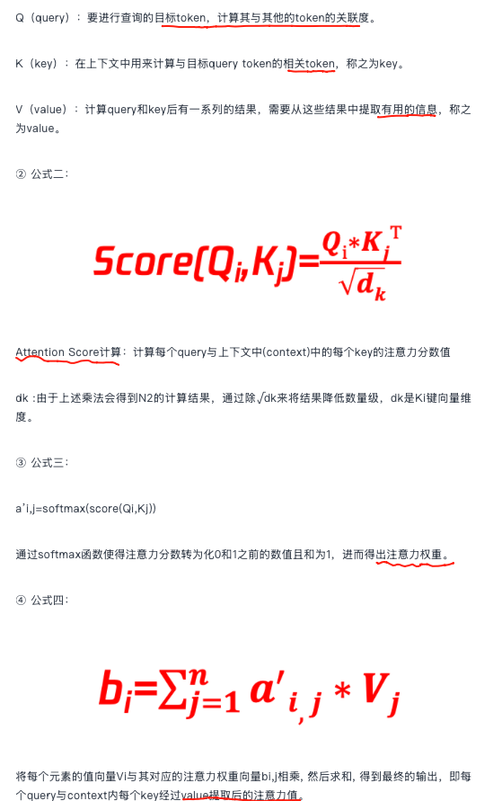
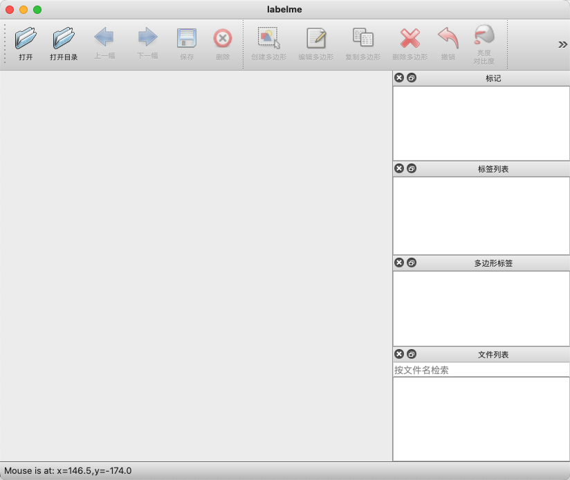
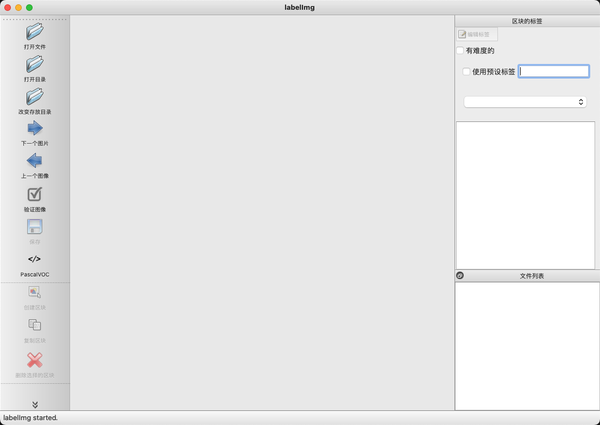
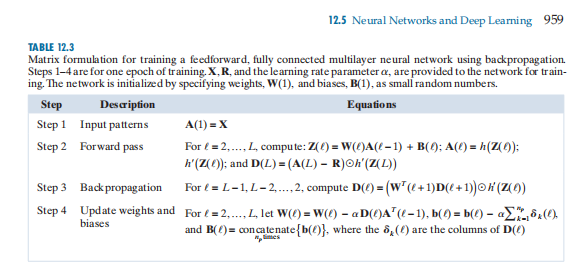
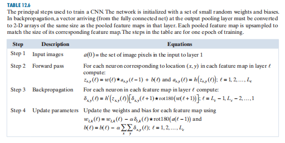
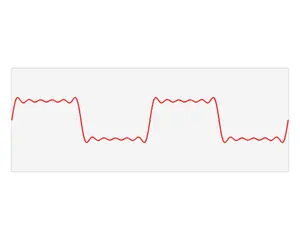
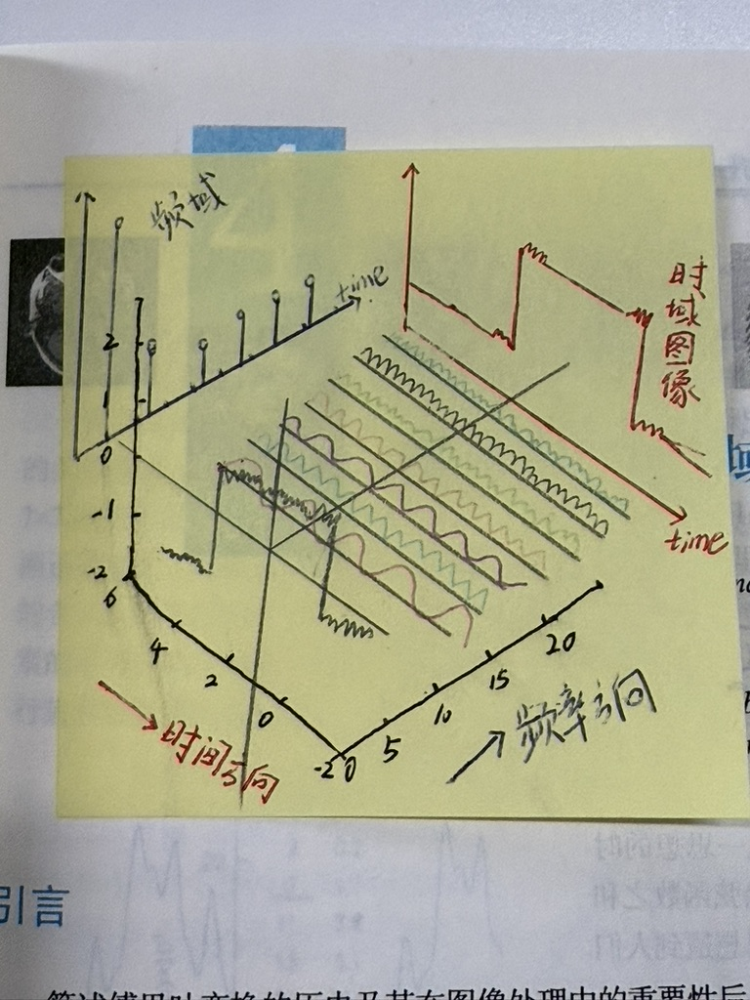
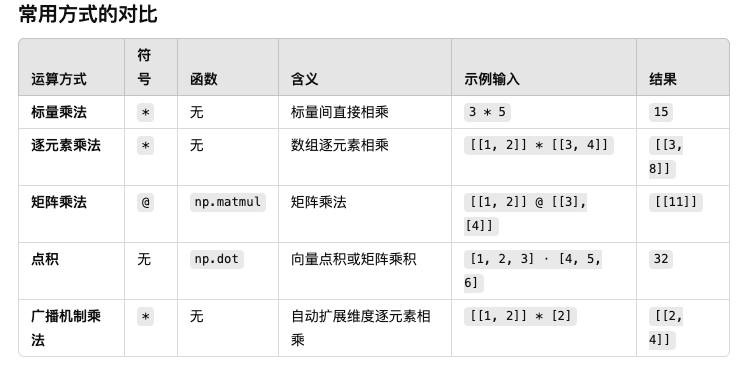
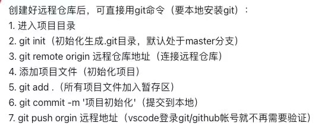

[toc]

⛔️不能提交 huggingface中的 token，带密码口令的不可以

### 小波变换（Wavelet Transform）
```bash
在图像处理中是一种多尺度分析工具，通过局部化时频特性，克服了傅里叶变换在非平稳信号分析中的局限性。以下是其原理、目的及应用的详细说明：
例如：基于频域技术检测小目标时使用小波变换分离图像的低频和高频成分，并通过阈值处理高频成分来检测小目标。
    低频成分通常表示图像的整体轮廓和大面积平滑区域；而小目标多表现为细节和边缘，对应于图像频谱中的高频成分。
    通过离散余弦变换（DCT）和高通滤波器过滤低频成分，可以突出小目标。
    信号杂波比（SCR）被用来量化这种过滤的有效性，SCR值越高表明目标越显著。
一、小波变换的原理
 1. 数学基础
   - 小波函数：
```
   由母小波（Mother Wavelet）\(\psi(t)\)通过平移和缩放生成：
\[
\psi_{a,b}(t) = \frac{1}{\sqrt{a}} \psi\left(\frac{t-b}{a}\right)
\]
其中，\(a\)为尺度参数（控制频率），\(b\)为平移参数（控制位置）。

```bash
   - 离散小波变换（DWT）：对图像进行多级分解，常用滤波器组（如Haar、Daubechies）实现。
2. 图像处理中的实现
   - 二维DWT：对图像的行和列分别进行一维小波分解，生成4个子带：
     - LL（低频近似）：保留图像的主要结构。
     - LH（水平细节）：捕捉水平方向边缘。
     - HL（垂直细节）：捕捉垂直方向边缘。
     - HH（对角线细节）：捕捉对角线方向高频信息。
   - 多级分解：对LL子带递归分解，形成金字塔结构（如3级分解）。
二、小波变换的目的
1. 多分辨率分析：同时提供图像的全局概览（低频）和局部细节（高频），适应不同任务需求。
2. 时频局部化：在空间域和频率域均具有局部化能力，适合分析非平稳信号（如边缘、纹理）。
3. 数据压缩与去噪：高频子带（LH/HL/HH）可被阈值化（如硬阈值、软阈值），去除噪声或压缩数据。
4. 特征提取：小波系数可作为纹理分类、边缘检测的特征。
三、在图像处理中的典型应用
1. 图像压缩（JPEG 2000）
   - 原理：保留低频子带（LL），量化高频子带（利用人眼对高频不敏感的特性）。
   - 优势：比JPEG（基于DCT）更抗块效应，支持渐进传输。
2. 图像去噪
   - 步骤：
     1. 对图像进行DWT分解。
     2. 对高频子带应用阈值（如VisuShrink、BayesShrink）。
     3. 逆变换重构图像。
   - 效果：保留边缘的同时抑制噪声。
3. 边缘检测，利用高频子带（LH/HL）增强边缘信息，结合模极大值法检测边缘。
4. 图像融合：对不同图像的频带进行选择性融合（如红外与可见光图像的LL子带加权平均）。
5. 纹理分析：统计小波子带能量或系数分布，用于纹理分类（如Gabor小波）。
四、小波基的选择
不同小波基适用于不同任务：
- Haar：简单、计算快，适合边缘检测。
- Daubechies（dbN）：紧支撑，平衡时频性能（常用db4、db8）。
- Symlets：近似对称，减少相位失真。
- Biorthogonal：线性相位，适合图像压缩。
五、实例演示（Python代码）
import pywt
import cv2
import numpy as np
# 读取图像并转为灰度
image = cv2.imread('lena.jpg', 0).astype(np.float32)
# 2级小波分解（使用Daubechies小波）
coeffs = pywt.wavedec2(image, 'db2', level=2)
LL, (LH, HL, HH), (LH2, HL2, HH2) = coeffs
# 阈值去噪（硬阈值）
threshold = 20
LH = pywt.threshold(LH, threshold, mode='hard')
HL = pywt.threshold(HL, threshold, mode='hard')
HH = pywt.threshold(HH, threshold, mode='hard')
# 重构图像
denoised_image = pywt.waverec2([LL, (LH, HL, HH), (LH2, HL2, HH2)], 'db2')
```


### CUDA （Compute Unified Device Architecture） 理解
```shell
英伟达（NVIDIA）公司开发的并行计算平台和编程模型。它允许开发者使用NVIDIA的GPU（图形处理单元）来执行计算任务，而不仅仅是传统的图形渲染任务。
<!-- CPU：通用车间 -->
首先，我们日常用的电脑里都有一个 CPU（中央处理器），它就像一个多功能车间。这个车间什么活都能干，比如管理文件、上网、运行各种应用程序。它处理任务的方式是一个接着一个，即便有多个任务，它也是快速地在它们之间切换，每次只专注于一小部分。这对于那些需要精确控制和顺序执行的任务来说非常高效。
<!-- GPU 与 CUDA：专业生产线 -->
而 GPU（图形处理器），最初是用来处理电脑游戏里的复杂图形的。你看游戏里那么多精细的场景、人物、特效，如果让 CPU 一个个去算，那画面早就卡得没法看了。GPU 之所以能搞定这些，是因为它内部有成千上万个小小的“工人”。这些“工人”虽然单个能力不强，但它们能同时处理很多相同类型的简单任务。为了让这些“工人”发挥最大效率，NVIDIA 公司就发明了一套特殊的“管理系统”和“操作指南”，这就是 CUDA。
<!-- CUDA 的作用 -->
CUDA 理解为一套专门为 GPU 设计的“生产线蓝图”和“管理系统”。 它定义了如何将一个大任务拆分成成千上万个小任务，然后分配给 GPU 里那些成千上万的“工人”去同时执行。一套“编程语言”和“工具包”。 工程师和科学家可以用它来告诉 GPU ：“嘿，别光顾着画图了，你这些并行处理的能力，也可以用来帮我算这些复杂的科学问题、分析海量数据或者训练人工智能模型！”
<!-- CUDA 的核心价值 -->
当一个任务需要大量重复且独立的计算时（比如计算一百万个数字的平方根，或者识别一万张图片里的猫），如果用 CPU 这个“通用车间”，它得一个一个地算，速度慢。
但有了 CUDA，你就可以把这个任务拆分成一百万个计算平方根的小任务，或者一万个识别图片的小任务，然后通过 CUDA 的“蓝图”和“管理系统”，让 GPU 里那成千上万个“工人”同时动手。
    它将 GPU 从一个“只会画画的工具”，变成了一个能处理各种并行计算任务的“超级计算平台”，从而在处理大数据、人工智能、科学模拟等领域，带来了前所未有的效率提升。它就像把一个需要单兵作战的任务，变成了大规模、协同作战的军队，效率自然不可同日而语。
```


### v5 v8检测代码解释
```shell
import torch

# 假设有 3 个 anchor，每个网格单元 5 个预测值 (x, y, w, h, confidence)
y = torch.randn(1, 3, 5, 5, 5)  # (batch, anchor, grid_h, grid_w, 5)

xy, wh, conf = y.split((2, 2, 1), 4)  # 在最后一个维度上拆分
print(xy.shape)   # (1, 3, 5, 5, 2) -> x, y
print(wh.shape)   # (1, 3, 5, 5, 2) -> w, h
print(conf.shape) # (1, 3, 5, 5, 1) -> 置信度

# 假设 batch=2，每个网格有 3 个 anchor，特征图大小 5x5，每个框有 85 个参数
bs, anchors, grid_h, grid_w, no = 2, 3, 5, 5, 85
# 创建一个随机 tensor，形状是 (2, 3, 5, 5, 85)
y = torch.randn(bs, anchors, grid_h, grid_w, no)
# 重新 reshape，转换成 (batch_size, total_predictions, no)
y = y.view(bs, -1, no)
print(y.shape)  # 输出: (2, 75, 85)


torch.cat(z, 1) 的作用 类似于 NumPy 的 np.concatenate()。
    z 是一个包含多个张量的列表，每个张量的形状类似：（batch_size, num_predictions_per_level, num_features）
    维度1 ，实际第二个维度，进行拼接，(b,chw)
z[0] -> (batch_size, 300, num_features)  # 低分辨率大感受野
z[1] -> (batch_size, 1200, num_features) # 中等分辨率
z[2] -> (batch_size, 4800, num_features) # 高分辨率小目标
(torch.cat(z, 1)) -> (batch_size, 300 + 1200 + 4800, num_features)


```


### 系统设计
```shell
可参考：System list、https://mbd.pub/o/bread/Z52Tk5ds
本地部署：smart-medicince
写法：北邮博士论文，尽管两张系统图，但内容值得参考（结合AI算法+未来展望）；
```

### GeForce RTX 显卡性能对比
```shell
3090, 4090, A10, A40, A100, A800, L20, L40 
https://juejin.cn/post/7428197475964272690
```

### linux命令突然 OOM
```shell
https://blog.csdn.net/Castlehe/article/details/122936585
```

### 数据相关性分析
```bash
https://blog.csdn.net/sinat_36192944/article/details/143994818

相关性 ≠ 因果关系
    正相关:当一个特征\变量的值增加时，另一个特征\变量的值也相应地增加。
    负相关:当一个特征\变量的值增加时，另一个特征\变量的值却减少。
    不相关:如果两个特征\变量之间没有明显的关联，即一个特征\变量的变化对另一个特征\变量没有明显影响，那么它们被称为不相关。

相关系数：如皮尔逊相关系数、斯皮尔曼秩相关系数等。这些系数提供了一个量化指标，用于评估两个变量之间的线性关系强度和方向。
    相关系数的值域通常在-1到1之间，其中1表示完全正相关，-1表示完全负相关，0表示不相关。

- 不同变量间的相关性：例如温度和用电量的关系。  
- 相同变量间的相关性：例如时间序列中的自相关性，或图像中相邻像素的空间相关性。  
- 去相关性：在冗余特征、多重共线性或过拟合等问题下需要进行。  
- 预测数据：PCA、特征选择、正则化。  
- 图像数据：数据增强、去背景、域适配。
- 这些方法可以有效减少无效相关性，提升模型的鲁棒性和泛化性能。

---
具体如下：
## 不同变量和相同变量间的相关性
1. 不同变量间的相关性  
   - 定义：不同变量间的相关性是指两个或多个不同变量之间存在某种统计关系，例如一个变量的变化会引起另一个变量的变化。  
   - 例子：  在预测数据中，温度与用电量之间可能存在正相关关系；
            在图像数据中，物体的尺寸与图像中像素区域大小可能存在相关性。  
2. 相同变量间的相关性  
   - 定义：相同变量间的相关性通常指 同一变量在不同时间、不同场景或不同维度上的自相关性。  
   - 例子：在时间序列预测中，今天的股票价格与昨天的股票价格存在自相关性；
          在图像处理中，相邻像素之间往往存在空间相关性。  
---
## 什么情况下需要去相关性？
1. 当变量相关性对模型性能产生负面影响时  
   - 冗余特征：不同变量之间存在较高相关性，可能导致信息冗余，影响模型的泛化能力。  
   - 多重共线性：在回归模型中，高度相关的变量可能导致模型不稳定，参数估计不准确。  
2. 防止过拟合  
   - 高相关性的特征可能使模型过度依赖某些特征，导致在未见过的数据上表现不佳。
3. 确保模型的泛化能力  
   - 在迁移学习或跨领域学习中，源域和目标域之间的高相关性可能导致模型对特定领域的依赖性过强，降低泛化性能。
---
## 预测数据和图像数据中的去相关性
### 1. 预测数据中的去相关性
- 问题场景：在时间序列预测中，如果历史温度数据和湿度数据高度相关，模型可能过度依赖其中一个特征，导致对新数据预测不准确。  
- 方法：  
   - 主成分分析（PCA）：降维，减少特征间的相关性。  
   - 特征选择：去除相关性高的冗余特征。  
   - 正则化：使用L1或L2正则化，抑制冗余特征的影响。  

### 2. 图像数据中的去相关性
- 问题场景：在目标检测任务中，如果背景与目标之间存在强相关性（如猫总是出现在床上），模型可能学习到背景与目标的错误关联，降低泛化能力。  
- 方法：  
   - 数据增强：通过随机裁剪、翻转、旋转等技术打破背景和目标之间的相关性。  
   - 去背景技术：使用语义分割或其他方法将目标从背景中分离，减少不必要的相关性。  
   - 域适配技术：在跨域任务中，通过梯度反转层（GRL）等减少源域和目标域的相关性。  
```

### Machine learning
```text
石溪的知乎回答：https://www.zhihu.com/question/26665048/answer/1696549744
1.马尔可夫链，首先常见的随机过程有以下2类
    伯努利过程和泊松过程：是无记忆性的，也就是说未来的状态不依赖于过去的状态，新的“成功”或“到达”不依赖于该过程过去的历史情况。
    马尔科夫过程：未来的情况会依赖于过去的情况，并且能够在某种程度上通过过去发生的情况去预测未来。
        离散时间、状态空间、转移概率[矩阵]
2.矩阵特征值
    Ap=λp,从空间几何意义的角度来理解，对于一个方阵 A ，若 p 是他的特征向量， λ 是对应的特征值，则意味着向量 p 在方阵 A 的作用下，他的空间变换就是其长度沿着向量的方向进行 λ 倍的伸缩。
    一般来说，一个向量在某个矩阵的作用下，其空间变换反映为长度和方向的改变：即旋转、平移和拉伸，有些情况下甚至连维度都会发生变化，而这里的特殊之处就在于，矩阵作用于他的特征向量，仅仅只有长度发生了改变；
3.正态分布 
    关于均值的钟形曲线：均值0，标准差1的标准正态分布
    优势：归一化和标准化效果良好、梯度优化更稳定、贴合自然数据分布【自然图像中局部区域的像素强度分布往往接近正态分布】、有利于特征提取和降维PCA（主成分分析）、提高分类和检测的效果、模型鲁棒性和适应性
    均值、标准差、方差的意义：
        ·均值（Mean）：是数据的中心趋势，表示数据的平均值。对于高斯分布，它位于对称中心，决定分布的平移位置。
            用处：图像标准化-对图像像素值进行归一化时，通常减去均值以使数据中心化。
```
$$
\mu = \mathbb{E}[X] = \frac{1}{N} \sum_{i=1}^{N} x_i 
$$

其中 $x_i$ 是数据点，N是数据总数。
```
        ·标准差（Standard Deviation）：是数据的分散程度，表示数据偏离均值的平均距离。
            用处：噪声建模-高斯噪声以标准差控制噪声的强度。
                 数据标准化-通过除以标准差，消除不同特征值的量纲差异。
```
$$
\sigma = \sqrt{\sigma^2} = \sqrt{\mathbb{E}[(X - \mu)^2]} = \sqrt{\frac{1}{N} \sum_{i=1}^{N} (x_i - \mu)^2} 
$$
```
        ·方差（Variance）σ²：是标准差的平方，表示数据的整体波动程度。在高斯分布中，方差越大，分布越宽。
            用处：特征选择-分析图像特征的方差，剔除低方差的无关特征。分布特征提取- 在聚类（如 GMM）中，方差用于描述簇的紧密程度。
```
$$
\sigma^2 = \mathbb{E}[(X - \mu)^2] = \frac{1}{N} \sum_{i=1}^{N} (x_i - \mu)^2
$$
```

在计算机视觉中，数据呈现高斯分布的主要优势体现在：
- 更容易进行归一化和优化，提升模型训练的效率。
- 许多算法（如 PCA、GMM、贝叶斯分类）依赖于高斯分布的假设。
- 自然图像的特性使得高斯分布更贴合真实场景。

均值：决定分布的位置
标准差：衡量分布的宽度
方差：数据的波动性，
它们共同定义了数据的特性，在视觉算法中有助于数据建模和特征分析。

        ·协方差 (Covariance, Cov(X, Y))：两个随机变量之间的线性相关性。
            用处：协方差的绝对值受变量尺度影响，不能直接比较不同变量之间的相关程度
```
$$
Cov(X,Y) = \mathbb{E}[(X - \mu_X)(Y - \mu_Y)]
$$
```
多元正态分布 (Multivariate Normal Distribution) ：对于多个变量，正态分布可以推广到多元正态分布，其参数包括：  
- 均值向量 (Mean Vector, μ)：描述每个变量的均值。  
- 协方差矩阵 (Covariance Matrix, Σ)：描述变量之间的方差和协方差。  
```
对于维度为 $d$ 的多元正态分布：

$$
f(x) = \frac{1}{(2\pi)^{d/2} |\Sigma|^{1/2}} \exp\left(-\frac{1}{2}(x - \mu)^T \Sigma^{-1} (x - \mu)\right)
$$

- $\mu$ 是均值向量 $(\mu_1, \mu_2, ..., \mu_d)$
- $\Sigma$ 是协方差矩阵

##### 📊 总结表格

| 参数       | 符号      | 定义                           | 数学公式                                         |
|------------|-----------|--------------------------------|--------------------------------------------------|
| **均值**    | μ         | 数据的平均值                    | $\mu = \mathbb{E}[X]$                         |
| **方差**    | σ²        | 数据与均值之间的偏差的平方的均值  | $\sigma^2 = \mathbb{E}[(X - \mu)^2]$          |
| **标准差**  | σ         | 方差的平方根                    | $\sigma = \sqrt{\sigma^2}$                   |
| **协方差**  | Cov(X,Y)  | 两个变量之间的线性相关性          | $Cov(X,Y) = \mathbb{E}[(X - \mu_X)(Y - \mu_Y)]$|

---

### Transerform OD
```shell
<Transformer do Object Detection.pdf>
<Solving Transformer by Hand A Step-by-Step Math Example.pdf>
《大白话》
大模型理解transformer架构：https://mp.weixin.qq.com/s/Kmuj9xAft3P7L84Gtmy-3w 
Q是提问，K是标签，V是答案；通过Q和K的匹配，决定从V中拿多少答案出来。
```


### 原型设计
```shell
·Axure RP：https://www.axure.com，可导出html，30天免费！B站有教程
    Macos管家https://16pan.com/s/share4e512e7cfd；
    github也有教程；
墨刀：纯前端浏览
官网：https://webflow.com/
官网：https://wordpress.org/themes/
```

### ndarry
```bash
l = ['Google', 'woodman', 1987, 2017, 'a', 1, 2, 3]
---
    print(l[:3])  # 从开始到list第3个元素
    print(l[1:])  # 从第二个到list结束
    print(l[:])  # 获得一个与l相同的list
    print(l[-1])  # 取倒数第一个元素
    print(l[::-1])  # list倒叙
    print(l[-3:-1])  # 倒数第三个到第二个
    print(l[-4:-1:2])  # 从倒数第4个每2个取一个，到代数第二个

data[a, b] : a的位置限制第几行，b的位置限制第几列, “ : ”表示全部数据
---
    data[:, 0]      # 取第一列所有行数据
    data[1, :]      # 取第二行所有列数据
    data[:, 1:]     # 取第二列开始所有列数据
    data[:, -1]     # 取所有行最后一列对应的一列数据
    data[:, :-1]    # 取所有行，但不包括最后一列的数据

data = [[1, 2, 3],
        [4, 5, 6],
        [7, 8, 9]]
data = np.array(data)
print(data[:,0]) #[1 4 7]
print(data[1,:]) #[4 5 6]
print(data[:, 1:]) 
# [[2 3]
#  [5 6]
#  [8 9]]
print(data[:, -1]) #[3 6 9]
print(data[:, :-1]) 
# [[1 2]
#  [4 5]
#  [7 8]]
                       0,  1, 2, 3, 4, 5
                       -6 -5 -4 -3 -2 -1
tensor = torch.tensor([[1, 2, 3, 4, 5, 6],
                       [7, 8, 9, 10, 11, 12]])
print(tensor[..., 4:]) # 从第 4 个索引开始提取后续所有元素。
# tensor([[ 5,  6],
#         [11, 12]])
print(tensor[..., -4:]) # 从倒数第 4 个索引开始提取最后 4 个元素。
# tensor([[ 3,  4,  5,  6],
#         [ 9, 10, 11, 12]])
print(tensor[..., :-4])
# tensor([[1, 2],
#         [7, 8]])
```

### 图像分割
```bash
超像素：一系列像素的集合，这些像素具有类似的颜色、纹理等特征，距离也比较近。
语义分割：区分前景、背景的像素，为图像中每个像素级的分类，输出-天空、树、车、人
实例分割：类似目标检测 只不过输出mask，且不需要对每个像素进行标记，它只需要找到感兴趣物体的边缘轮廓就行。仅关注前景，且区分实例，输出-人1、、人2、车1、车2
全景分割：区分前景、背景的像素，且区分前景实例，输出-天空、树、人1、、人2、车1、车2
原值为 png/jpg 形式的二值掩码图像，但可通过脚本转换为 YOLO格式标签，详见 https://docs.ultralytics.com/zh/datasets/segment/#visualize-dataset-annotations
{   
    "id": 16,
    "image_id": 14,
    "category_id": 1,
    "bbox": [239,0,77.829,414.895],
    "area": 32290.851,
    "segmentation": [[253.449,10.958,]],   
    "iscrowd": 0
}
bbox：目标的矩形边界框，格式为 [x, y, width, height]。
area：分割区域的面积（像素个数）。
segmentation：目标的分割信息，多边形格式描述了目标的边界。
iscrowd：
    0 表示该目标是单独的目标。
    1 表示目标为稠密目标（如一群人），通常用 RLE 格式存储分割信息。

## 标注工具，直接终端输入命令
labelImg： 矩形框标注
labelme: 多边形标注
```




### 《数字图像处理》
```bash
https://www.imageprocessingplace.com/index.htm
```



### 时域频域




### 基础概念
```shell
单个视频帧：一张图片
    ·分辨率 resolution：
        图像的长宽像素大小，说法各异，视频分辨率一般是16:9，所以1080一般指 1920*1080；
        其他常见的：3840*2140【4K】、 2560*1440【2K】、1920*1080 【1080P 高清】、1280*720【720P】 640*360【360P】
        单位 P 表示逐行扫描(网络视频)，I 表示隔行扫描 （电视节目，节省带宽）
    ·像素 Pixel ：分辨率的长宽相乘，1920*1080=2073600像素
    ·dpi ：每英寸的像素是多少，实际取决于显示设备和视频分辨率，比如海报等印刷品要求300dpi；
    ·色彩空间模型：RGB、HSV、YUV等，表示像素点记录色彩数据的方式，网络视频一般是YUV420，虽然颜色有失真，单数据量少；
多个视频帧
    ·帧率：1秒的视频帧数 FPS，流畅18pfs、电影25fps、游戏>30pfs，很多时候是一个均值；
    ·PTS：播放时间戳（整数），TimeBase-时间基（1秒分成多少份）；
    ·码率：1秒的数据量大小 Mbps，感官上越大越清晰，但实际上限制码率是限制数据量大小，因为会影响网络加载时间，一般直播等流媒体设置 最大码率，防止客户端因宽带不足而卡顿，之后编码器会根据 最大码率 进行有损压缩「压缩也只是可能，重点取决于原始数据量大小」；
*** 一般，1920*108分辨率，30fps，H264编码，最大码率为2或3Mbps时，都是清晰的。
H264 H265，压缩相似帧的手段
    ·I帧：能独立播放的，是完整的视频帧；（数据量大）
    ·P帧：需要根据前一个I帧或P帧计算出最终图像；
    ·B帧：需要根据前一个和后一个I帧或P帧计算最终图像；（数据量小）
    `GOP：一组完整的视频帧，开头必为I帧，一般是对直播等流媒体设置的，缓解网络导致的花屏，大小一般为帧率的1-2倍；
```

### python 运算


```bash
矩阵：np.dot = np.matmul = @
     * ❍✕  = ☉ Hadamard

1.标量乘法 * ： 对 标量或同类数据类型 的逐元素相乘。
    # 标量乘法
    a = 3
    b = 5
    print(a * b)  # 输出：15
    # 对列表（非 Numpy）进行重复扩展
    lst = [1, 2, 3]
    print(lst * 2)  # 输出：[1, 2, 3, 1, 2, 3]

2.数组逐元素乘法 * ： 对 两个同维度的数组或矩阵 逐元素相乘。  
    # 逐元素相乘
    A = np.array([[1, 2], 
                  [3, 4]])
    B = np.array([[5, 6], 
                  [7, 8]])
    result = A * B
    print(result)
    # 输出：
    # [[ 5 12]
    #  [21 32]]

3.矩阵乘法 @ ：表示矩阵乘法或向量点积（从 Python 3.5 开始支持）。
    # 矩阵乘法
    C = A @ B
    print(C)
    # 矩阵乘法的计算规则：
    # [[1*5 + 2*7, 1*6 + 2*8],
    #  [3*5 + 4*7, 3*6 + 4*8]]
    # 输出：
    # [[19 22]
    #  [43 50]]

4.点积 (np.dot) : 用于计算向量的点积、矩阵乘积或高维数组的缩减操作。
    # 向量点积
    v1 = np.array([1, 2, 3])
    v2 = np.array([4, 5, 6])

    dot_product = np.dot(v1, v2)
    print(dot_product)  # 输出：32
    # 计算过程：1*4 + 2*5 + 3*6 = 32

    # 矩阵乘法（与 @ 等价）
    matrix_product = np.dot(A, B)
    print(matrix_product)

5.矩阵乘积 (np.matmul): 用于矩阵与矩阵、矩阵与向量的乘法，等价于 @ 运算符。
    # 矩阵乘法
    matrix_product = np.matmul(A, B)
    print(matrix_product)
    # 等价于：
    print(A @ B)

6.广播机制乘法 (Numpy *) :  数组与标量、数组与低维数组进行逐元素乘法，并自动扩展维度。
    # 数组与标量
    array = np.array([[1, 2], 
                      [3, 4]])
    print(array * 2)
    # 输出：
    # [[2 4]
    #  [6 8]]

    # 数组与一维数组
    row_vector = np.array([1, 2])
    broadcast_result = array * row_vector
    print(broadcast_result)
    # 输出：
    # [[1 4]
    #  [3 8]]

7.Hadamard 乘积: 两个矩阵逐元素乘积（与 * 运算符等价，常用于机器学习）。
    # 两个矩阵逐元素乘积
    hadamard = A * B
    print(hadamard)

总结
    使用场景决定运算方式：
        简单逐元素运算：*
        矩阵操作和点积：@ / np.dot / np.matmul
        广播机制：* 自动扩展。
    推荐习惯：对于矩阵操作，优先使用 @，更符合直观的数学表达方式。

```

### vscode的debug
```bash
python 解释器在右下角；
版本不要变，否则没法breakpoint debug
Extensions 版本问题：
    Vscode: 1.85.2 (Universal)
    python: v2024.2.1
    pylance: v2024.3.2
    python debugger: v2024.0.0
```

### 横纵坐标【铝管压痕检测】
```text
1. 横坐标（X轴）
表示方式：横坐标通常表示图像中的列坐标，即图像从左到右的像素位置。
范围：横坐标的范围从图像的最左边开始（通常为0）到最右边（列数减去1）。
应用场景：在铝管压痕检测中，横坐标可以用来表示压痕在水平方向上的位置。例如，横坐标可以表示压痕沿着铝管的周向位置。
2. 纵坐标（Y轴）
表示方式：纵坐标通常表示图像中的行坐标，即图像从上到下的像素位置。
范围：纵坐标的范围从图像的最上边开始（通常为0）到最下边（行数减去1）。
应用场景：在铝管压痕检测中，纵坐标可以用来表示压痕在垂直方向上的位置。例如，纵坐标可以表示压痕沿着铝管长度方向的位置。
3. 图像矩阵：
    在图像矩阵中，元素的索引通常用 (i, j) 表示，其中 i 代表行（纵坐标），j 代表列（横坐标）。
    例如，矩阵元素 M[i][j] 表示图像中第 i 行、第 j 列的像素值。
```

### [人工智能名词字典](https://zhuanlan.zhihu.com/p/671175717)

### 稠密和稀疏处理
```shell
- 在计算机视觉领域，稠密(dense )和稀疏(sparse)通常用来描述图像处理中的两种不同的数据处理方式。

·稠密处理：指对图像中的每个像素都进行操作，通常用于需要对整个图像进行分析或处理的任务，例如图像识别、图像分割等。在稠密处理中，需要对每个像素进行操作，以获得完整的图像信息。这种方式可以提供更精确的结果，但也需要更多的计算资源和时间。

·稀疏处理：指只对图像中的一部分像素进行操作，通常用于对图像进行特征提取或关键点检测等任务。在稀疏处理中，只对图像中的一部分像素进行操作，通常是具有特定特征或重要性的像素。这种方式可以减少计算量和加快处理速度，但可能会牺牲一些信息的精确度.
```

### yolov8-pyqt
- 与训练环境一致
```bash
conda create -n mmcv python=3.9
conda activate mmcv
pip install torch torchvision torchaudio
conda install -c openmmlab mmcv-full
pip install PyQt5
```

- 开始运行
```bash
把ultralytics目录搬过来，防止找不到包！
cd yolo-pyqt
# yolov8m.yaml : [device :cpu] 
python run_gui.py
```


- 登录窗口调用主窗口
    https://blog.csdn.net/qilei2010/article/details/131077794
    ```bash
    run_gui.py
    __init__()
        self.loginW = None # 保存登录对话框
        # self.show() # 主窗口先不显示
    __main__()
        from login import LoginWindow
        w.loginW = LoginWindow(w) # 创建窗体，将主窗口作为参数传入
        w.loginW.show() # 

    login.py
    __init__(self,mainwin)
        self.mainwin = mainwin # 保存主窗口的引用，因为要给主窗口传递信息
    login(self)
        if username == 'user' and password == 'pass':
            # 登录成功后切换到新界面
            self.hide()  # 隐藏当前登录窗口
            self.mainwin.show() # 显示主窗口
            self.close() # 登录使命完成，关闭自己
    ```

### 深度学习-直观表示
```shell
- CNN、Transformer等：https://poloclub.github.io/cnn-explainer/#article-input
- 大模型：https://bbycroft.net/llm
```

### 神经网络可视化工具汇总
```shell
- <https://cloud.tencent.com/developer/article/2333299>
· 直接导入权重pt文件即可显示网络结构(网页在线版)，<https://github.com/lutzroeder/Netron?tab=readme-ov-file>
· 自己画图时，可参考的形状：<https://docs.google.com/presentation/d/11mR1nkIR9fbHegFkcFq8z9oDQ5sjv8E3JJp1LfLGKuk/edit#slide=id.g78327f1586_217_712>
· 谷歌研究：https://research.google/blog/
· VOSviewer: https://zhuanlan.zhihu.com/p/6129123772 
    Create a map based on bibliographic data
    Read data from bibliographic database files
        Web Of Science 库 -> Export -> Plain Text File -> Full Record and Cited References -> .txt
    Read data from reference manager files
        知网 -> Export -> Refworks/EndNote  -> .txt /.enw 目前显示不出时间线
    分析网络：https://blog.csdn.net/m0_56184997/article/details/145536215
```


### command useless
```bash
python train.py --yaml ultralytics/cfg/models/v8/yolov8-dyhead.yaml  --info --project runs/train
```

### 目标检测论文发展方向
```text
🙅 backbone、注意力机制、loss

除非是顶会新提的结构，可以结合
```


### Linux服务器错误
```bash
1️⃣linux无法进入图形化界面，即使更换密码也是重复登录！（未解决💡）
# 校园网连接
/knowledge/portal 客户端，通过scp传到服务器上
ssh登录
1.将程序包放到linux系统目录下赋予执行权限
    scp -r /Users/rl/Documents/PhD-student/Untitled_Folder/knowledge/portal lenovo@121.195.169.36:~
    chmod +x portal
2.执行程序
    ./portal
3.根据提示输入url
    https://e.ncepu.edu.cn/srun_portal_pc?ac_id=23
4.输入上网账号和密码
测试   ping www.baidu.com

登出
1.执行程序
    执行./portal
2.弹出Do you want to sign out?(y/N)
    选择y退出客户端
测试  ping www.baidu.com

2️⃣ ssh显示错误，突然远程不上
本地ping不通服务器，且服务器ping.www.baidu.com显示DNS解析域名错误！
关机重启📴

3️⃣ 侧边栏的 “文件夹”消失
command+shift+p -> View: Reset View Locations
```

### github🔗

###### 忽略./DS_Store文件
```text
参考1：https://blog.csdn.net/Happy_lifer/article/details/136062961
参考2：https://retompi.com/archived-blog/posts/2019/12/08/ignore-ds-store-globally.html
```
###### 代码关联github
```bash
Github官网: 手动 new repositories
vscode : new folder
cd XXX-folder
    git init
    # git config --global user.email "you@example.com"
    # git config --global user.name "Your Name"
    git remote add origin https://github.com/Wang-Phil/test.git
    编辑项目文件
    git add . (到源代码管理器下 进行 commit -> publish branch 默认main主分支，)
    git commit -m "add"
    git push origin https://github.com/Wang-Phil/test.git
git status --ignored #查看被忽略的文件
```


```shell
绿色：已暂存（staged）但未提交。
蓝色：已修改但未暂存。
灰色：被忽略或已提交且无更改。

- A：Added
    表示该文件是新添加的文件，已经被Git跟踪，并且将会包含在下一次的提交中。当使用git add命令将新文件添加到暂存区后，文件的状态会从U（Untracked）变为A（Added）。
- U：Untracked
    表示该文件是未被Git跟踪的文件，Git不会自动将其包含在版本控制中。这意味着该文件不会被提交到版本库中，也不会被包含在Git的快照中。如果希望Git开始跟踪该文件，需要使用git add命令将其添加到暂存区，然后文件的状态会从U（Untracked）变为A（Added）。
- M：Modified
    表示该文件已被修改。当对已跟踪的文件进行了修改后，文件的状态会从A（Added）变为M（Modified）。这意味着该文件在上一次提交之后发生了变化，但尚未被添加到暂存区。
```

###### git-question
```bash
服务器老报错！
** 具体步骤在goodnotes上有标明！

1. fatal: unable to access 'XX': Failed to connect to github.com port 443: 拒绝连接
    sudo vi /etc/hosts
    140.82.112.3 github.com # 服务器查询
    140.82.114.3 github.com # 本地查询
    # 添加了 ping github.com的IP地址 : PING github.com (127.0.0.1)

2. fatal: unable to access 'XX': Failed to connect to github.com port 443: 连接超时
[解决方式参考](https://blog.csdn.net/zpf1813763637/article/details/128340109)
    # 查看代理
    git config --global --get http.proxy
    git config --global --get https.proxy
    # 配置代理
    ## socks5 
    git config --global http.proxy socks5 127.0.0.1:7890
    git config --global https.proxy socks5 127.0.0.1:7890
    ## http
    git config --global http.proxy 127.0.0.1:7890
    git config --global https.proxy 127.0.0.1:7890
    # 取消全局代理 服务器的才能push/pull上去
    git config --global --unset http.proxy
    git config --global --unset https.proxy
    ---------------------------------------------
    ssh -T git@github.com  # 成功，执行下来的步骤
    cd /特定目录下/.git
    ls
    cat config 
    ###
        [core]
        repositoryformatversion = 0
        filemode = true
        bare = false
        logallrefupdates = true
        [remote "origin"]
            url = https://github.com/LiuJiaji1999/power.git
            fetch = +refs/heads/*:refs/remotes/origin/*
        [branch "main"]
            remote = origin
            merge = refs/heads/main
    ###
    vim config 
        url = git@github.com:LiuJiaji1999/power.git

3. ssh: connect to host github.com port 22: Operation timed out , fatal: Could not read from remote repository.
    ssh -T git@github.com  # 报错
    ssh -T -p 443 git@ssh.github.com  #成功
    vim ~/.ssh/config
        <!-- Host github.com 
            Hostname github.com 
            Port 443 -->
    cat ~/.ssh/config
    ssh -T git@github.com


4. Git:execute git fail
commit中存在大文件，出现的错误 
    # 撤销 提交历史 ，回退1次
    git reset HEAD~1 # 这个命令，老bug，网上找就好

5. ssh_exchange_identification: read: Connection reset by peer fatal: 无法读取远程仓库。 请确认您有正确的访问权限并且仓库存在。
    那就是服务器没网了，找空闲账号重新登录！(实习的友友 或者 互助群里 找出租号)
    解决方法在👆
```

```bash
cd ~/.ssh
ls
cat id_ras.pub # github设置中的remote-ssh

# 出现分支不同的问题 https://blog.csdn.net/qq_38856939/article/details/123333383
git fetch origin
git rebase origin/main

# 在git那里，右键选择 
```


