[toc]

⛔️不能提交 huggingface中的 token，带密码口令的不可以


### AI发展的思考
```bash
1️⃣ 智能的定义：
·最古老的一个来自心理学之父威廉·詹姆斯（William James）。他在 1890 年的《心理学原理》中虽然讨论的是“心智”而非“智能”，但他提出的心智特征非常经典：“通过多变的手段达到一致的目的”（attaining consistent ends by variable means）。意思是，为了通过不同的路径达成同一个你想要的结果，你需要灵活调整你的行为。
·再来看看艾伦·图灵（Alan Turing）。他其实没有给出一句简练的名言，但后人将其观点解读为：智能就是“表现得像个人”。这就是著名的图灵测试（Turing Test）——虽然图灵本人从未称之为“测试”，他叫它“模仿游戏”。如今，这种观点被广泛接受：智能意味着模仿人类的行为。
·强化学习之父Sutton指出，智能是“获取并应用知识与技能的能力”。这个定义相当不错，它强调了知识，更强调了获取（acquire）——也就是学习的重要性。
“通过调整行为来实现目标的能力。” 我特意用了“调整”（adapting）这个词，因为我认为学习——即知识和技能的获取过程——才是智能的关键，而不仅仅是拥有它们。
## 强化学习：
    概念：面向智能体（Agent-oriented）的学习方式。它是通过与环境交互、从经验中学习，从而实现目标。
        自主：智能体置身于世界中，自主行动，并不一定有老师手把手教。
        宏大：我不假设世界会给我提供完美的帮助。我只能通过交互，看是否达成了目标，并据此调整行为。
        现实：这也更符合生物界的现实。动物在成年后的生存环境中，很难得到完美的指导信息。
    核心：试错（trial and error）和延迟反馈。你得到的唯一反馈就是奖励信号（reward）——你最终是否得到了你想要的？这是最接近自然界的学习方式。
    从经验中学习：经验指的是 智能体与环境之间交换的数据流
        观察（Observation）：智能体从世界接收到的传感器数据。
        动作（Action）：智能体向世界发出的运动指令或电压信号。
        奖励（Reward）：世界反馈给智能体的一个标量信号，代表结果的好坏。
·大模型无法形成一种高效、有条理的探索策略，并且不能很好地感知自身知识的边界，无法非常有效地标出哪些区域是未知的。
LeCun：真正的智能，需要感官数据、物理交互、因果推理。

2️⃣ 层级神经网络：
podcast-《Star Talk》 来自辛顿：
# https://mp.weixin.qq.com/s/c_J4mvFtlvABtaM7Ue9pZQ
神经网络的层级与学习机制：层层递进的特征提取。
    第一层神经元的作用，我们放一批神经元，专门检测图片里最微小的边缘——比如取三个像素点，如果左边亮、右边暗，这个神经元就兴奋："这里有一条边！"（微小边缘检测）;
    第二层神经元不再看像素，而是看第一层传来的信号——几条短边缘向下倾斜、几条向上倾斜、前端交汇成一个尖角——它就喊："我可能发现了一个鸟嘴！"（局部特征组合）
    第三层，寻找可能的鸟嘴＋可能的鸟眼。如果处于特定的空间位置关系中，神经元被激活：“我发现了一个鸟的头部！”（空间关系构建）
    最后一层神经元，如果它同时收到了“乌头”、“乌脚”、“乌翅膀尖”的强力激活信号，它就会大喊：“我确信这绝对是一只鸟！”（最终判定）
自下而上的情报汇报，就叫“前向传播”：在学术上，下属喊话的音量叫“激活值”，上级对下属的信任程度叫“权重（Weight）”。
公式1:下属汇报的音量（激活值） × 上级对他的信任度（权重） = 对上级的实际影响力
刚开始，权重值是随机瞎填的（这叫随机初始化），因此在 输出CEO 的办公桌上放一个极其具象的“橡皮筋与滑轨”道具，来演示什么叫“误差/损失（Loss）”和“梯度（Gradient）”。
    橡皮筋根本没法被压缩，它只在乎预测和真理之间的“绝对距离”！只要偏离真理，无论偏高还是偏低，都会被无情地拉长、绷紧！这根橡皮筋被拉得有多长、勒得有多疼，就是“误差大小（Loss）”；、而它拼命往上拽还是往下拽的“方向和力道”，就是微积分里大名鼎鼎的“梯度（Gradient）”！所以算法本质上是在做“负梯度下降”，即违背让痛苦增加的趋势。
为了让顶层的橡皮筋放松，他必须把拉扯的痛感顺着公司的层级向下分摊。这就需要“反向传播”（Backpropagation）登场了！在微积分里它叫“链式法则（Chain Rule）”，但我更愿意称之为“企业级精准连坐分锅机制”！
公式2:修改对下属的信任度（更新权重） = 橡皮筋传导给我的痛感（梯度） × 该下属刚才汇报的音量（激活值）
“为了让顶层橡皮筋彻底放松”的求生欲，就这样顺着公司的层级做着连环乘法，一路反向（Backwards）传导（Propagate）到了最底层。 
💡说每一次输入一张图片，全公司就经历一次完整的循环：
    “前向瞎猜汇报（Forward） → 橡皮筋拉紧勒疼（计算误差 Loss 和梯度 Gradient） → 反向精准连坐分锅以求放松（Backpropagation 更新权重）”。
微调信任度让橡皮筋越来越松的这个过程，在数学上就叫做“梯度下降”（Gradient Descent）。
    改变激活水平的方法有两种：
    一是调整进入“鸟”神经元的权重（比如给高度激活的神经元更大权重）。
    二是改变前一层神经元的激活水平（比如让检测鸟头的神经元更确信这是鸟头）。我们要做的，就是将弹性绳施加给输出神经元的“力”反向传递给前一层神经元，让它们也受到相应的“拉力”——这就是“反向传播”。这种方法效果非常好。
这种通过反向传播“力”来改变所有连接强度的学习方式，属于监督学习，而非强化学习。
    监督学习中，我们会告诉系统正确答案（比如给它看鸟的图像，告诉它这是鸟）；
    而强化学习中，系统做出决策后，我们只会告知它答案是否正确。
数据耗尽确实会导致边际效益递减；

非线性激活函数的存在从根本上改变了网络的表达范式：
  将线性变换的复合转变为仿射变换与非线性映射的交替复合，使得每一层都能在前一层特征空间的基础上进行非线性重组。
这种层级化的非线性表达正是深度神经网络在图像识别、自然语言处理等复杂任务中取得突破性成功的数学根源！！
在基于梯度的优化方法中，参数更新的依据是‘损失函数对参数的偏导数’，而这些偏导数通过链式法则依赖于激活函数的导数。
这些激活函数的设计均遵循了同一核心原则：在保持非线性的同时，确保梯度能够有效反向传播
神经元的数学模型并非生物神经元的忠实复刻，而是在优化理论的约束下不断演化的计算抽象。


3️⃣ 视觉相似性：
📑Nguyen T, Mo S, Singh K K, et al. Relational Visual Similarity[J]. arXiv preprint arXiv:2512.07833, 2025. 【CVPR 2026】
在CV中，图像相似性通常依赖颜色、形状与纹理等“属性匹配”。
但现实世界中，不同物体可能共享相同的“变化逻辑”与“结构关系”。
# Adobe Research的研究，探讨为何现有模型难以理解这种相似性。
1.现有问题：
目前现有相似性数据集都在问同一个问题：这张图里有什么？涉及了物体、场景、属性、语义。没有任何一个数据集在问：这张图传达了什么逻辑？
这就是根本症结所在，AI被训练成看图说话的专家，却从未被要求理解图像背后的关系结构。
    普通模型整体上来讲这归类于‘属性相似性’，基于物体共享的视觉特征——颜色、形状、纹理、语义类别。
    但火柴和香蕉都经历了一个随时间逐渐变化的过程，相似性不在于它们的具体外观，而在于‘变化的逻辑’。
    也就是组A在感知属性上相似，而组B在一种更抽象的、关系性的意义上相似。
    当两幅图像中视觉元素之间的内部关系或功能对应时，即使它们的视觉属性不同，它们也是*关系性相似*的。
Adobe研究团队提出的新数据集，不涉及任何特定物体，只描述关系。比如那张燃烧的火柴，标题可能是“{主体}随时间的变换”。
最终从LAION-2B中筛选出11.4万张可能包含可迁移关系结构的高质量图像用于后面关系相似性模型的构建。
2.升级视觉相似性框架：
当下的视觉相似性框架几乎完全专注于属性层次的相似性。而关系性相似性通常需要对图像有超越单纯感知的更深入理解。
本文提出‘建模这种缺失的视觉相似性维度，称为关系性视觉相似性，以捕捉类似人类对关系结构的推理能力’。
团队用上述{图像，匿名标题}对训练了一个关系性视觉相似性模型—Relsim。它的目标很简单：
    让那些拥有相似匿名标题的图像，在特征空间中被拉近。 


4️⃣ 涌现：
OpenAI认为自己的技术路线没有问题，只是模型参数不够多，训练算力不够大。只要用更强的算力训练参数量更大的模型，就会产生质变，即涌现。也就是工业界中的：
    Scaling Laws： 人工智能领域的摩尔定律，即参数量、数据量、计算资源越大，模型能力会对应提升。
        起点放在OpenAI的奠基性论文 📑Scaling Laws for Neural Language Models
GPT-3是Scaling Laws的奇迹，也是个毫无是非观念的机器。OpenAI在训练过程中把互联网上的语料洗劫一空，自然也没放过暴力、色情和种族歧视内容。
为了解决上述问题，2022年1月，OpenAI发布了一个名为InstructGPT的模型。相比GPT-3，InstructGPT通过RLHF（人类反馈强化学习），大量剥离了色情暴力等有害内容，让模型更贴近人类的价值观，即所谓“对齐（AI Alignment）”。
    为了不让模型频繁爆典，OpenAI让一群人类当道德裁判，给模型输出的内容打分排序。模型在人类监督下自我训练，逐渐向人类的道德品格靠拢。


5️⃣ 物理信息神经网络”（Physics-informed machine learning, PINNs）
📑Karniadakis G E, Kevrekidis I G, Lu L, et al. Physics-informed machine learning[J]. Nature Reviews Physics, 2021, 3(6): 422-440.
纯粹的数据驱动模型可能非常适合观测数据，但由于外推或观测偏差，预测可能在物理上不一致或不可信，这可能导致泛化性能不佳。因此，迫切需要通过“教”ML模型关于控制物理规则来整合基本物理定律和领域知识，这反过来可以提供“先验信息”——
    也就是说，在"观测约束之上提供强大的理论约束（theoretical constraints）和归纳偏差（inductive biases）"。
为此，物理信息学习被定义为这样一个过程：通过我们对世界的观测、经验、物理或数学理解所获得的先验知识可以被利用来提高学习算法的性能。最近反映这种新的学习理念的一个例子是PINNs家族。
    这是一类深度学习算法，能够无缝整合数据和抽象数学算子，包括有或没有缺失物理的PDEs。
    其主要动机是，这种先验知识或约束可以产生更具可解释性的ML方法，这些方法在不完美数据（如缺失或嘈杂值、异常值等）存在时仍然稳健，并且可以提供准确且物理上一致的预测，即使对于外推/泛化任务也是如此。
1956年达特茅斯会议首次提出人工智能概念，截止目前也不过是70余年[2026年]，但物理规律自世界就已经存在，可以追溯到从古代阿基米德、伽利略等学者，到近代的牛顿，再到现代的物理研究，所以如果以物理眼光看待人工智能，具体到物理信息学习，目前有三种途径可以单独或同时遵循，通过将物理嵌入其中来加速 ML 模型的训练并增强其泛化能力，这些偏差途径可以引导学习过程识别出物理上一致的解决方案。具体如下：
• 观测偏差（observational biases）：可以通过体现底层物理的数据或精心设计的数据增强程序直接引入。在这样的数据上训练ML系统，使其能够学习反映数据物理结构的函数、向量场和算子。
    它们也是概念上将偏差引入 ML 的最简单方式。给定足够的数据覆盖学习任务的输入域，ML 方法在实现准确插值方面表现出惊人的能力，即使对于高维任务也是如此。对于物理系统而言，得益于传感器网络的快速发展，现在可以利用大量不同保真度的观测数据，并在多个空间和时间尺度上监测复杂现象的演变。
    *这些观测数据应该反映生成它们的底层物理原理，原则上，可以作为将这些原理嵌入 ML 模型的弱机制，在其训练阶段*。例如，参见参考文献 13-16 中提出的神经网络。
    然而，特别是对于过度参数化的深度学习模型，通常需要大量数据来加强这些偏差并生成尊重某些对称性和守恒定律的预测。在这种情况下，一个直接的困难与数据获取成本有关，对于物理和工程科学中的许多应用，这可能非常大，因为观测数据可能通过昂贵的实验或大规模计算模型生成。
• 归纳偏差（inductive biases）：对应于可以专门纳入ML模型架构的先验假设，以确保所寻求的预测隐含地满足一组给定的物理定律，通常以某些数学约束的形式表达。可以说，这是使学习算法具有物理信息性的最合理方式，因为它允许底层物理约束被严格满足。然而，这种方法通常限于考虑相对简单的对称群（如平移translations、排列permutations、反射reflections、旋转rotations等）且已知先验，且可能导致复杂的实现难以扩展。
    设计专门的NN架构，这些架构隐含地嵌入与给定预测任务相关的任何先验知识和归纳偏差。毫无疑问，这一类中最著名的例子:
        # 卷积神经网络（convolutional NNs），它们通过巧妙地遵守自然图像中发现的对称性群的不变性和分布式模式表示，彻底改变了计算机视觉领域【如《d2l-zh-pytorch.pdf》对CNN的介绍，卷积核具备平移不变形和局部性】。
        # 循环神经网络(recurrentneural network,RNN)则可以更好地处理序列信息。循环神经网络通过引入状态变量存储过去的信息和当前的输入，从而可以确定当前的输出。
            例如，循环神经网络在实践中一个常见问题是数值不稳定性。尽管我们已经应用了梯度裁剪等技巧来缓解这个问题，但是仍需要通过设计更复杂的序列模型来进一步处理它。具体来说，我们将引入两个广泛使用的网络,即
                门控循环单元(gated recurrentunits,GRU)、长短期记忆网络(longshort-termmemory,LSTM)。
        # 其他代表性示例包括图神经网络（graph NN, GNNs）、等变网络（equivariant networks）、核方法（kernel methods）如高斯过程，以及更一般的PINs。
    其核心是*直接引入由控制给定任务的物理原理*。卷积网络可以推广以尊重更多的对称性群，包括旋转、反射和更一般的规范对称性变换。这使得开发一类非常通用的 NN 架构成为可能，这些架构仅依赖于内在几何形状，为涉及医学图像、气候模式分割等的计算机视觉任务提供了非常有效的模型。
• 学习偏差：可以通过适当选择损失函数、约束和推理算法来引入，这些可以调节ML模型的训练阶段，明确支持收敛到符合底层物理的解决方案。通过使用和调整这些软惩罚约束（soft penalty constraints），底层物理定律只能近似满足；然而，这提供了一个非常灵活的平台，用于引入可以表达为积分、微分甚至分数方程的广泛物理偏差。
    从不同角度赋予NN先验知识，而不是设计专门的架构来隐含地强制执行这种知识，当前的努力旨在通过适当地惩罚传统NN近似的损失函数 来以软方式施加这些约束。这种方法可以被视为多任务学习的一个特定用例，其中学习算法同时受到约束以拟合观测数据，并产生近似满足给定一组物理约束（例如，质量守恒、动量守恒、单调性等）的预测。代表性的方法有深度伽辽金法（deep Galerkin method）和PINNs 及其变体。
    软惩罚约束的灵活性允许将*更一般的领域特定知识*引入ML模型。
    通过优化获得的解决方案，使用软惩罚约束和正则化，可以视为：
        基于物理似然假设（physics-based likehood assumptions）的贝叶斯公式化的最大后验估计（maximum a-posteriori estimate）。
        使用马尔可夫链蒙特卡洛方法（Markov chain Monte Carlo methods）或变分推断近似（variational inference approximations）来量化由于嘈杂（noisy）和不完整（gappy）数据引起的不确定性。
⭐️⭐️上述物理信息机器学习的原则各有优势和局限性。因此，理想的做法是将这些不同的原则结合起来使用，事实上，已经提出了不同的混合方法。

物理信息学习的优势：
1. 不完整模型和不完美数据：由于PINN公式固有的平滑性（smoothness）或规律性（regularity），即使问题并非完全适定，也有可能找到有意义的解决方案。
    在处理不完美模型和数据时，将贝叶斯方法与物理信息学习结合用于不确定性量化是有益的，例如贝叶斯 PINNs（B-PINNs）。
    此外，与传统数值方法相比，物理信息学习是无需计算成本高昂的网格生成，因此可以轻松处理不规则和移动域问题。最后，代码也更容易使用现有的开源深度学习框架来实现。
2. 小数据集的强大泛化能力：通过强制或嵌入物理，深度学习模型有效地被约束在一个低维簇上，因此可以用少量数据进行训练。
    为了强制执行物理，可以将物理原理嵌入到网络架构中，或使用物理作为软惩罚约束，或使用前面讨论的数据增强。
    此外，物理信息学习能够进行外推，而不仅仅是插值：也就是说，它可以执行边界值问题中的空间外推。
3. 理解深度学习：除了增强 ML 模型的可训练性和泛化能力外，物理原理还被用来提供理论见解，并阐明深度学习惊人有效性背后的内在机制。
4. 解决高维问题：深度学习在解决高维问题方面已经取得了巨大成功，例如高分辨率的图像分类、语言建模和高维 PDEs。
    其中一个原因是 DNNs 可以在目标函数是局部函数的层次组合的条件下打破维度灾难。
5. 不确定性量化：可靠地预测多尺度和多物理场系统的演变需要不确定性量化。
    这一重要问题在过去 20 年中受到了很多关注，通过增加传统计算方法的随机公式来处理由于边界条件或材料属性引起的不确定性。
    对于物理信息学习模型，至少有三种不确定性来源：由于物理的不确定性、由于数据的不确定性和由于学习模型的不确定性。

6️⃣ AI审稿
https://paperreview.ai/ 吴恩达创建，相对不会泄漏数据；
https://cspaper.org/reviews 常见的期刊和会议（照icme2026经验来讲，确实真实😞）

7️⃣ 为什么AI还无法自主学习？
来自 Meta、纽约大学和加州大学伯克利分校的 Emmanuel Dupoux、杨立昆（Yann LeCun）、Jitendra Malik 三位研究者，对当前 AI 范式提出了系统性批判，并给出了一套受人类和动物认知启发的学习架构。
📑《Why AI systems donot learn and what to do about it Lessons on autonomous learning from cognitive science》
那么，当前的 AI 难以实现自学习，问题究竟出在哪里？研究团队在论文中点出了 4 个结构性困境：
·高质量文本数据的供给已接近天花板；
·由于缺乏与环境的真实交互，模型无法学习超越人类现有知识的新内容；
·过度依赖语言，而忽视了空间感知、具身认知以及对物理世界的扎根推理物理世界中的空间、具身和接地（grounded）推理；
·模型在部署之后便停止自我改进，无法实现终身学习。

在论文中，研究团队详细探讨了限制自主学习发展的三方面技术障碍，并提出了可能的解决方案。
1.学习范式的碎片化
    现有学习方法分散于各个子领域，彼此之间缺乏交互，难以整合到统一框架之中。研究团队认为，整合的起点是认识到两种基本学习模式：通过观察学习（System A）与通过行动学习（System B），系统梳理两者之间可能的交互方式。
2.学习能力的外部化
    当前 AI 的学习实际上是由人类完成的。数据筛选、训练方案设计、性能监控，全部依赖人类 MLOps 流水线。为此，他们提出了元控制架构（System M），这是一个协调各学习组件间信息流的中央调度器，能够自动重现通常需要人工完成的学习与数据过滤流程。
3.缺乏规模化构建方法
    研究团队表示，目前还没有一种有效手段在大规模架构上实现上述组件的联合训练。他们提出了一种受进化机制启发的双层优化方法，联合学习元控制模型与 System A、System B 的初始状态，以实现鲁棒的真实世界性能。

8️⃣ AI大模型排名
持续更新：https://artificialanalysis.ai/?media-leaderboards=text-to-image
国内购置：https://aizex.net

VLM-视觉语言模型之所以令人印象深刻，并不是因为它们比旧模型“看得更清楚”。事实上，有时它们在原始像素级别的视觉能力，技术上还不如为特定任务训练的专业分类器。
它们令人印象深刻，是因为它们能更好地进行比较*对比学习*，能将事物的外观与词语的含义联系起来。
    开放词汇识别、零样本学习
# https://mp.weixin.qq.com/s/PVx6O1sFMvJi79Uh-QB1-A
从最基本的原理来看，大语言模型是语言分布规律的统计性压缩器与生成器。
·它通过极其贪婪地学习海量文本中的模式关联，在内部形成了一个高维参数空间。在这个空间里，词语、句子、语境、风格，乃至角色、论证路径和隐含关联，统统被编码为可计算的关系结构。
·它首先把握的不是存在本身，而是表达；不是事物本身，而是关于事物的语言痕迹。
·当一个模型足够庞大时，它通过对这些结构的深度学习，确实能够在某种意义上“内化”人类世界的广泛规律。它不仅能够归纳出因果暗示与社会规范，还能精准拿捏叙事结构与角色心理，甚至能够在没有明确规则的情况下，表现出一种令人惊叹的“常识”。
·大语言模型的强大绝非幻觉。它之所以令人震撼，正是因为人类世界本身已经在很大程度上被彻底“语言化”了。文明不只是通过劳动、制度和物质装置来保存自身，它同样通过文本保存自身。
#谁能够在足够深的层次上吸收文本结构，谁就能在一定范围内吸收文明本身的形式。
·但也正是在这个极其微妙的节点上，边界悄然浮现。！！！
    因为一个通过语言网络把握世界的系统，与一个通过现实肉身把握世界的生物，终究有着天壤之别。前者被困在‘表述之网’中，后者则‘扎根于存在本身’。
·它可以无限逼近经验的语言外壳，却不能因此拥有经验本身。
···如何解释大语言模型展现出的强大？
    真正需要解释的，是一个主要依赖概率预测的系统，为什么竟能展现出如此深层的能力？！这迫使我们承认一个被长期忽视的事实：人类语言中所沉积的结构，远比传统哲学家和语言学家想象的要深邃得多。
    当这种预测发生在一个由亿万文本片段构成、蕴含着文明总体结构的巨大空间中时，它就不再是浅层的文字接龙，而逐渐演变成了一种对 *** 概念秩序、行动模式和语境逻辑的统计性内化 *** 
#模型的奇迹，很大程度上不是凭空创造，而是通过规模化学习，触碰到了语言深处原本就存在的社会性与逻辑性骨架。
·大语言模型最根本的边界，不在于它不能生成某种复杂的内容，而在于它无法仅凭语言操作，包办人类意义的全部来源。
    意义从来都不是单一维度的。
        有一部分意义，确实来自于语言系统内部的差异关系、文化约定和公共使用——在这一部分，模型已经越来越游刃有余。
        还有另一部分极其沉重的意义，来自于体验、身体、行动、失败、承诺、历史、时间、共同体，以及对死亡的深刻意识。这一部分，模型至多只能间接逼近，却永远无法替代。

9️⃣绘图
《AI绘图总结》.pdf，扩散模型的本质
第一阶段-GAN： 像是一个才华横溢但情绪不稳定的天才画家，
    机械地拟合像素的概率分布；
    只理解，“猫”是⼀堆⽑茸茸的像素规律，“⾃⾏⻋”是另⼀堆⾦属质感的像素规律，它不知道两者之间存在什么物理联系，更⽆法理解“骑”这个动作的含义。
第二阶段-CLIP： 像是拿着地图的向导
    视觉和语言的关联，让AI具备真正的语义理解能力；
第三阶段-扩散模型： 像是一个基本功扎实、耐心极致的工匠大师。--雕刻⽯膏
    在训练阶段，我们做的事情是“破坏”：把⼀张清晰的图⽚，⼀步步地添加⾼斯噪声，直到它变成⼀张完全看不出内容的“雪花图”（加噪-前向扩散过程）。⽽模型需要学会的，就是这个过程的“逆操作”，即如何从⼀张噪点图中，⼀步步把刚才添加的噪声预测出来并减去，从⽽还原回原本的清晰图⽚（预测并减噪-反向扩散过程）。
    在推理/生成阶段，其实就是重演这个“反向过程”。我们会随机拿⼀张全是噪点的“雪花图”给模型，让它运⽤学会的“去噪能⼒”开始⼯作。
        🚨这个去噪过程并⾮⼀蹴⽽就，⽽是多步迭代的。模型会在数⼗次甚⾄上百次的循环中，⼀点点去除画⾯中的杂质。
    如果我们在扩散模型基础上引⼊前⽂提到的CLIP，那么在每⼀次去噪时，它就会像⼀位拿着设计图的监⼯，不断地告诉模型：“我们要画的是‘⼀只猫’，不要偏离⽅向。
在算力逐渐升级，且追求极致生成质量的今天，大师最终战胜了天才，因为‘慢工出细活’。
    ·GAN懒，扩散则会处理各种噪声，因此多样性极高；
    ·GAN是动态博弈，扩散则训练单纯‘准确预测画面中的噪声是多少？’；
    ·GAN是一次性成图，一锤子买卖，扩散的雕刻是迭代的；
⭐️Stable Diffusion
    核心：在Latent-Space中，利⽤CLIP提取的语义指令，指挥U-Net⽹络一步步预测并剔除噪声，最后解码成我们看到的图片。
1.Latent-Space: 画得快
    在SD出现之前，绝⼤多数扩散模型是直接在像素空间Pixel-Space上“⼲活”的，计算太复杂了。因此先用VAE先编码变为极小的向量-后解码为原尺寸的高清图片；
2.CLIP： 画得准
    精准的指令发送器，传给生成图片（降噪过程）的每一步，即注入到U-Net；
3.U-Net与采样： 画师
    推理（生成）阶段，SD进行迭代，每次迭代就在调用U-Net；
    单纯的工作：盯着当前的画⾯，预测/找出哪⾥是噪声，并计算出该减去多少。
    Cross-Attention：CLIP ---文本向量--> U-Net [补充，若QKV源自同一模型，则为Self-Attention]
        Q：U-Net当前处理的潜空间图像特征；
        K&V：CLIP外部文本，K是索引标签，V是文本具体内容；
    Q不断扫描K,如果匹配到了，把V投影过来，融合到当前的噪点图。
    本质：⽤图像的“形”去检索⽂字的“意”，再把“意”填回图像⾥。
    但CLIP质量要指向每一个QKV块：是由于U-Net是⼀个由深到浅的⽹络：
        浅层⽹络负责处理细节（如⽑发的纹理、光影的边缘）-对应窄的部位；
        深层⽹络负责处理宏观结构（如构图、物体的形状）-对应原理图梯形宽的部位；
U-Net可以预测噪声，但不知道具体每一步该减去多少噪声（Denosing Strength）,以及该走多少步（Step），来生成高清图片，因此需要进行规划，即 
    采样器(Sampler): 规划节奏，根据总Steps，安排每一Step的Denosing Strength；
    调度器(Scheduler):执行解算，利用数学公式+Denosing Strength，计算出具体减去的数值！
--- 预测噪声-》减去噪声-》VAE解码还原高清美图

🔟

```

```text
👀AI工具
    AI辅助编程工程，如下图所示，在右侧边栏打开copilot会话框；


```


### 松鼠搜索🐿️🌲Squirrel Search Algorithm
```bash
解释：https://blog.csdn.net/ChailangCompany/article/details/151875251
```

### 小波变换（Wavelet Transform）
```bash
在图像处理中是一种多尺度分析工具，通过局部化时频特性，克服了傅里叶变换在非平稳信号分析中的局限性。以下是其原理、目的及应用的详细说明：
例如：基于频域技术检测小目标时使用小波变换分离图像的低频和高频成分，并通过阈值处理高频成分来检测小目标。
    低频成分通常表示图像的整体轮廓和大面积平滑区域；而小目标多表现为细节和边缘，对应于图像频谱中的高频成分。
    通过离散余弦变换（DCT）和高通滤波器过滤低频成分，可以突出小目标。
    信号杂波比（SCR）被用来量化这种过滤的有效性，SCR值越高表明目标越显著。
一、小波变换的原理
 1. 数学基础
   - 小波函数：
```
   由母小波（Mother Wavelet）\(\psi(t)\)通过平移和缩放生成：
\[
\psi_{a,b}(t) = \frac{1}{\sqrt{a}} \psi\left(\frac{t-b}{a}\right)
\]
其中，\(a\)为尺度参数（控制频率），\(b\)为平移参数（控制位置）。

```bash
   - 离散小波变换（DWT）：对图像进行多级分解，常用滤波器组（如Haar、Daubechies）实现。
2. 图像处理中的实现
   - 二维DWT：对图像的行和列分别进行一维小波分解，生成4个子带：
     - LL（低频近似）：保留图像的主要结构。
     - LH（水平细节）：捕捉水平方向边缘。
     - HL（垂直细节）：捕捉垂直方向边缘。
     - HH（对角线细节）：捕捉对角线方向高频信息。
   - 多级分解：对LL子带递归分解，形成金字塔结构（如3级分解）。
二、小波变换的目的
1. 多分辨率分析：同时提供图像的全局概览（低频）和局部细节（高频），适应不同任务需求。
2. 时频局部化：在空间域和频率域均具有局部化能力，适合分析非平稳信号（如边缘、纹理）。
3. 数据压缩与去噪：高频子带（LH/HL/HH）可被阈值化（如硬阈值、软阈值），去除噪声或压缩数据。
4. 特征提取：小波系数可作为纹理分类、边缘检测的特征。
三、在图像处理中的典型应用
1. 图像压缩（JPEG 2000）
   - 原理：保留低频子带（LL），量化高频子带（利用人眼对高频不敏感的特性）。
   - 优势：比JPEG（基于DCT）更抗块效应，支持渐进传输。
2. 图像去噪
   - 步骤：
     1. 对图像进行DWT分解。
     2. 对高频子带应用阈值（如VisuShrink、BayesShrink）。
     3. 逆变换重构图像。
   - 效果：保留边缘的同时抑制噪声。
3. 边缘检测，利用高频子带（LH/HL）增强边缘信息，结合模极大值法检测边缘。
4. 图像融合：对不同图像的频带进行选择性融合（如红外与可见光图像的LL子带加权平均）。
5. 纹理分析：统计小波子带能量或系数分布，用于纹理分类（如Gabor小波）。
四、小波基的选择
不同小波基适用于不同任务：
- Haar：简单、计算快，适合边缘检测。
- Daubechies（dbN）：紧支撑，平衡时频性能（常用db4、db8）。
- Symlets：近似对称，减少相位失真。
- Biorthogonal：线性相位，适合图像压缩。
五、实例演示（Python代码）
import pywt
import cv2
import numpy as np
# 读取图像并转为灰度
image = cv2.imread('lena.jpg', 0).astype(np.float32)
# 2级小波分解（使用Daubechies小波）
coeffs = pywt.wavedec2(image, 'db2', level=2)
LL, (LH, HL, HH), (LH2, HL2, HH2) = coeffs
# 阈值去噪（硬阈值）
threshold = 20
LH = pywt.threshold(LH, threshold, mode='hard')
HL = pywt.threshold(HL, threshold, mode='hard')
HH = pywt.threshold(HH, threshold, mode='hard')
# 重构图像
denoised_image = pywt.waverec2([LL, (LH, HL, HH), (LH2, HL2, HH2)], 'db2')
```


### CUDA （Compute Unified Device Architecture） 理解
```shell
英伟达（NVIDIA）公司开发的并行计算平台和编程模型。它允许开发者使用NVIDIA的GPU（图形处理单元）来执行计算任务，而不仅仅是传统的图形渲染任务。
<!-- CPU：通用车间 -->
首先，我们日常用的电脑里都有一个 CPU（中央处理器），它就像一个多功能车间。这个车间什么活都能干，比如管理文件、上网、运行各种应用程序。它处理任务的方式是一个接着一个，即便有多个任务，它也是快速地在它们之间切换，每次只专注于一小部分。这对于那些需要精确控制和顺序执行的任务来说非常高效。
<!-- GPU 与 CUDA：专业生产线 -->
而 GPU（图形处理器），最初是用来处理电脑游戏里的复杂图形的。你看游戏里那么多精细的场景、人物、特效，如果让 CPU 一个个去算，那画面早就卡得没法看了。GPU 之所以能搞定这些，是因为它内部有成千上万个小小的“工人”。这些“工人”虽然单个能力不强，但它们能同时处理很多相同类型的简单任务。为了让这些“工人”发挥最大效率，NVIDIA 公司就发明了一套特殊的“管理系统”和“操作指南”，这就是 CUDA。
<!-- CUDA 的作用 -->
CUDA 理解为一套专门为 GPU 设计的“生产线蓝图”和“管理系统”。 它定义了如何将一个大任务拆分成成千上万个小任务，然后分配给 GPU 里那些成千上万的“工人”去同时执行。一套“编程语言”和“工具包”。 工程师和科学家可以用它来告诉 GPU ：“嘿，别光顾着画图了，你这些并行处理的能力，也可以用来帮我算这些复杂的科学问题、分析海量数据或者训练人工智能模型！”
<!-- CUDA 的核心价值 -->
当一个任务需要大量重复且独立的计算时（比如计算一百万个数字的平方根，或者识别一万张图片里的猫），如果用 CPU 这个“通用车间”，它得一个一个地算，速度慢。
但有了 CUDA，你就可以把这个任务拆分成一百万个计算平方根的小任务，或者一万个识别图片的小任务，然后通过 CUDA 的“蓝图”和“管理系统”，让 GPU 里那成千上万个“工人”同时动手。
    它将 GPU 从一个“只会画画的工具”，变成了一个能处理各种并行计算任务的“超级计算平台”，从而在处理大数据、人工智能、科学模拟等领域，带来了前所未有的效率提升。它就像把一个需要单兵作战的任务，变成了大规模、协同作战的军队，效率自然不可同日而语。
```


### v5 v8检测代码解释
```shell
import torch

# 假设有 3 个 anchor，每个网格单元 5 个预测值 (x, y, w, h, confidence)
y = torch.randn(1, 3, 5, 5, 5)  # (batch, anchor, grid_h, grid_w, 5)

xy, wh, conf = y.split((2, 2, 1), 4)  # 在最后一个维度上拆分
print(xy.shape)   # (1, 3, 5, 5, 2) -> x, y
print(wh.shape)   # (1, 3, 5, 5, 2) -> w, h
print(conf.shape) # (1, 3, 5, 5, 1) -> 置信度

# 假设 batch=2，每个网格有 3 个 anchor，特征图大小 5x5，每个框有 85 个参数
bs, anchors, grid_h, grid_w, no = 2, 3, 5, 5, 85
# 创建一个随机 tensor，形状是 (2, 3, 5, 5, 85)
y = torch.randn(bs, anchors, grid_h, grid_w, no)
# 重新 reshape，转换成 (batch_size, total_predictions, no)
y = y.view(bs, -1, no)
print(y.shape)  # 输出: (2, 75, 85)


torch.cat(z, 1) 的作用 类似于 NumPy 的 np.concatenate()。
    z 是一个包含多个张量的列表，每个张量的形状类似：（batch_size, num_predictions_per_level, num_features）
    维度1 ，实际第二个维度，进行拼接，(b,chw)
z[0] -> (batch_size, 300, num_features)  # 低分辨率大感受野
z[1] -> (batch_size, 1200, num_features) # 中等分辨率
z[2] -> (batch_size, 4800, num_features) # 高分辨率小目标
(torch.cat(z, 1)) -> (batch_size, 300 + 1200 + 4800, num_features)
```


### 系统设计
```shell
可参考：System list、https://mbd.pub/o/bread/Z52Tk5ds
本地部署：smart-medicince
写法：北邮博士论文，尽管两张系统图，但内容值得参考（结合AI算法+未来展望）；
```

### GeForce RTX 显卡性能对比
```shell
3090, 4090, A10, A40, A100, A800, L20, L40 
https://juejin.cn/post/7428197475964272690
```

### linux命令突然 OOM
```shell
https://blog.csdn.net/Castlehe/article/details/122936585
```

### 数据相关性分析
```bash
https://blog.csdn.net/sinat_36192944/article/details/143994818

相关性 ≠ 因果关系
    正相关:当一个特征\变量的值增加时，另一个特征\变量的值也相应地增加。
    负相关:当一个特征\变量的值增加时，另一个特征\变量的值却减少。
    不相关:如果两个特征\变量之间没有明显的关联，即一个特征\变量的变化对另一个特征\变量没有明显影响，那么它们被称为不相关。

相关系数：如皮尔逊相关系数、斯皮尔曼秩相关系数等。这些系数提供了一个量化指标，用于评估两个变量之间的线性关系强度和方向。
    相关系数的值域通常在-1到1之间，其中1表示完全正相关，-1表示完全负相关，0表示不相关。

- 不同变量间的相关性：例如温度和用电量的关系。  
- 相同变量间的相关性：例如时间序列中的自相关性，或图像中相邻像素的空间相关性。  
- 去相关性：在冗余特征、多重共线性或过拟合等问题下需要进行。  
- 预测数据：PCA、特征选择、正则化。  
- 图像数据：数据增强、去背景、域适配。
- 这些方法可以有效减少无效相关性，提升模型的鲁棒性和泛化性能。

---
具体如下：
## 不同变量和相同变量间的相关性
1. 不同变量间的相关性  
   - 定义：不同变量间的相关性是指两个或多个不同变量之间存在某种统计关系，例如一个变量的变化会引起另一个变量的变化。  
   - 例子：  在预测数据中，温度与用电量之间可能存在正相关关系；
            在图像数据中，物体的尺寸与图像中像素区域大小可能存在相关性。  
2. 相同变量间的相关性  
   - 定义：相同变量间的相关性通常指 同一变量在不同时间、不同场景或不同维度上的自相关性。  
   - 例子：在时间序列预测中，今天的股票价格与昨天的股票价格存在自相关性；
          在图像处理中，相邻像素之间往往存在空间相关性。  
---
## 什么情况下需要去相关性？
1. 当变量相关性对模型性能产生负面影响时  
   - 冗余特征：不同变量之间存在较高相关性，可能导致信息冗余，影响模型的泛化能力。  
   - 多重共线性：在回归模型中，高度相关的变量可能导致模型不稳定，参数估计不准确。  
2. 防止过拟合  
   - 高相关性的特征可能使模型过度依赖某些特征，导致在未见过的数据上表现不佳。
3. 确保模型的泛化能力  
   - 在迁移学习或跨领域学习中，源域和目标域之间的高相关性可能导致模型对特定领域的依赖性过强，降低泛化性能。
---
## 预测数据和图像数据中的去相关性
### 1. 预测数据中的去相关性
- 问题场景：在时间序列预测中，如果历史温度数据和湿度数据高度相关，模型可能过度依赖其中一个特征，导致对新数据预测不准确。  
- 方法：  
   - 主成分分析（PCA）：降维，减少特征间的相关性。  
   - 特征选择：去除相关性高的冗余特征。  
   - 正则化：使用L1或L2正则化，抑制冗余特征的影响。  

### 2. 图像数据中的去相关性
- 问题场景：在目标检测任务中，如果背景与目标之间存在强相关性（如猫总是出现在床上），模型可能学习到背景与目标的错误关联，降低泛化能力。  
- 方法：  
   - 数据增强：通过随机裁剪、翻转、旋转等技术打破背景和目标之间的相关性。  
   - 去背景技术：使用语义分割或其他方法将目标从背景中分离，减少不必要的相关性。  
   - 域适配技术：在跨域任务中，通过梯度反转层（GRL）等减少源域和目标域的相关性。  

真正的因果关系”核心不在于两个变量一起变化，而在于：
    如果我主动改变 X，Y 会不会因此发生变化。
X 是 Y 的原因，当且仅当在其他相关条件适当控制后，对 X 施加干预会引起 Y 的分布变化。
因果性是指一个变量的变化直接导致了另一个变量的变化。简单来说，如果我们能够证明A的变化导致了B的变化，那么我们就可以说A和B之间存在因果关系。然而，因果性并不像相关性那样容易观察和测量。证明因果性通常需要通过实验、对照试验或统计方法来排除其他可能的解释。

```

### Machine learning
```text
石溪的知乎回答：https://www.zhihu.com/question/26665048/answer/1696549744
1.马尔可夫链，首先常见的随机过程有以下2类
    伯努利过程和泊松过程：是无记忆性的，也就是说未来的状态不依赖于过去的状态，新的“成功”或“到达”不依赖于该过程过去的历史情况。
    马尔科夫过程：未来的情况会依赖于过去的情况，并且能够在某种程度上通过过去发生的情况去预测未来。
        离散时间、状态空间、转移概率[矩阵]
2.矩阵特征值
    Ap=λp,从空间几何意义的角度来理解，对于一个方阵 A ，若 p 是他的特征向量， λ 是对应的特征值，则意味着向量 p 在方阵 A 的作用下，他的空间变换就是其长度沿着向量的方向进行 λ 倍的伸缩。
    一般来说，一个向量在某个矩阵的作用下，其空间变换反映为长度和方向的改变：即旋转、平移和拉伸，有些情况下甚至连维度都会发生变化，而这里的特殊之处就在于，矩阵作用于他的特征向量，仅仅只有长度发生了改变；
3.正态分布 
    关于均值的钟形曲线：均值0，标准差1的标准正态分布
    优势：归一化和标准化效果良好、梯度优化更稳定、贴合自然数据分布【自然图像中局部区域的像素强度分布往往接近正态分布】、有利于特征提取和降维PCA（主成分分析）、提高分类和检测的效果、模型鲁棒性和适应性
    均值、标准差、方差的意义：
        ·均值（Mean）：是数据的中心趋势，表示数据的平均值。对于高斯分布，它位于对称中心，决定分布的平移位置。
            用处：图像标准化-对图像像素值进行归一化时，通常减去均值以使数据中心化。
```
$$
\mu = \mathbb{E}[X] = \frac{1}{N} \sum_{i=1}^{N} x_i 
$$

其中 $x_i$ 是数据点，N是数据总数。
```
        ·标准差（Standard Deviation）：是数据的分散程度，表示数据偏离均值的平均距离。
            用处：噪声建模-高斯噪声以标准差控制噪声的强度。
                 数据标准化-通过除以标准差，消除不同特征值的量纲差异。
```
$$
\sigma = \sqrt{\sigma^2} = \sqrt{\mathbb{E}[(X - \mu)^2]} = \sqrt{\frac{1}{N} \sum_{i=1}^{N} (x_i - \mu)^2} 
$$
```
        ·方差（Variance）σ²：是标准差的平方，表示数据的整体波动程度。在高斯分布中，方差越大，分布越宽。
            用处：特征选择-分析图像特征的方差，剔除低方差的无关特征。分布特征提取- 在聚类（如 GMM）中，方差用于描述簇的紧密程度。
```
$$
\sigma^2 = \mathbb{E}[(X - \mu)^2] = \frac{1}{N} \sum_{i=1}^{N} (x_i - \mu)^2
$$
```

在计算机视觉中，数据呈现高斯分布的主要优势体现在：
- 更容易进行归一化和优化，提升模型训练的效率。
- 许多算法（如 PCA、GMM、贝叶斯分类）依赖于高斯分布的假设。
- 自然图像的特性使得高斯分布更贴合真实场景。

均值：决定分布的位置
标准差：衡量分布的宽度
方差：数据的波动性，
它们共同定义了数据的特性，在视觉算法中有助于数据建模和特征分析。

        ·协方差 (Covariance, Cov(X, Y))：两个随机变量之间的线性相关性。
            用处：协方差的绝对值受变量尺度影响，不能直接比较不同变量之间的相关程度
```
$$
Cov(X,Y) = \mathbb{E}[(X - \mu_X)(Y - \mu_Y)]
$$
```
多元正态分布 (Multivariate Normal Distribution) ：对于多个变量，正态分布可以推广到多元正态分布，其参数包括：  
- 均值向量 (Mean Vector, μ)：描述每个变量的均值。  
- 协方差矩阵 (Covariance Matrix, Σ)：描述变量之间的方差和协方差。  
```
对于维度为 $d$ 的多元正态分布：

$$
f(x) = \frac{1}{(2\pi)^{d/2} |\Sigma|^{1/2}} \exp\left(-\frac{1}{2}(x - \mu)^T \Sigma^{-1} (x - \mu)\right)
$$

- $\mu$ 是均值向量 $(\mu_1, \mu_2, ..., \mu_d)$
- $\Sigma$ 是协方差矩阵

##### 📊 总结表格

| 参数       | 符号      | 定义                           | 数学公式                                         |
|------------|-----------|--------------------------------|--------------------------------------------------|
| **均值**    | μ         | 数据的平均值                    | $\mu = \mathbb{E}[X]$                         |
| **方差**    | σ²        | 数据与均值之间的偏差的平方的均值  | $\sigma^2 = \mathbb{E}[(X - \mu)^2]$          |
| **标准差**  | σ         | 方差的平方根                    | $\sigma = \sqrt{\sigma^2}$                   |
| **协方差**  | Cov(X,Y)  | 两个变量之间的线性相关性          | $Cov(X,Y) = \mathbb{E}[(X - \mu_X)(Y - \mu_Y)]$|

---

### Transerform OD
```shell
<Transformer do Object Detection.pdf>
·query、anchor、proposal本质是一个东西，都是对图片潜在目标的刻画；
·得益于Attention，query获得了全局感受野和样本间信息交互的能力，达成了洗漱采样(Sparse sampling)和端到端检测(end-to-end detection)
·基于anchor的检测器：backbone（特征提取）、neck（多尺度特征聚合）、head（分类与回归预测）；DETR延续这个架构：backbone（特征提取）、encoder（特征聚合）、decoder（query精修），区别是encoder-decoder是基于Attention机制的Transformer实现的。
    encoder：
    decoder：Cross-attention就是每个query根据各⾃感兴趣的区域从图⽚中抽取相关信息，⽽Self-attention就是所有query开会决定谁当⼤哥（前景），谁当⼩弟（背景）。
        但由于这里的object-query和positional-embedding都是随机初始化的（很难对齐image-feature），因此attention时几乎是均匀抽取图片特征，而不是针对性的抽取特定区域的目标特征，所以，很长时间才会收敛！
·系列改进：
    Deformable-DETR: 因为object-query的自由度太高，因此为object-query设定需要关注的中心点，并且其中的attention也只采样中心点附近的N个image-feature，所以加速了收敛又减少了计算量；
     SMCA-DETR、Anchor-DETR、DAB-DETR、SAM-DETR等
总结：由于object-query和image-feature间（位置上的和语义上的）不对⻬，导致decoder中的Cross-attention-layer难以精确地匹配到待检测物体所对应的特征区域，object-query也因此采集到了很多除⽬标物体以外的⽆关特征，最终导致DETR收敛缓慢。上⾯介绍的⼏个⼯作都是通过不同的⽅式限制了object-query的采样区域，使得⽹络能够更快的地聚焦于物体区域，所以加速了训练。
-----
<Solving Transformer by Hand A Step-by-Step Math Example.pdf>
    

    
大模型理解transformer架构：https://mp.weixin.qq.com/s/Kmuj9xAft3P7L84Gtmy-3w 
Q是提问，K是标签，V是答案；通过Q和K的匹配，决定从V中拿多少答案出来。
```
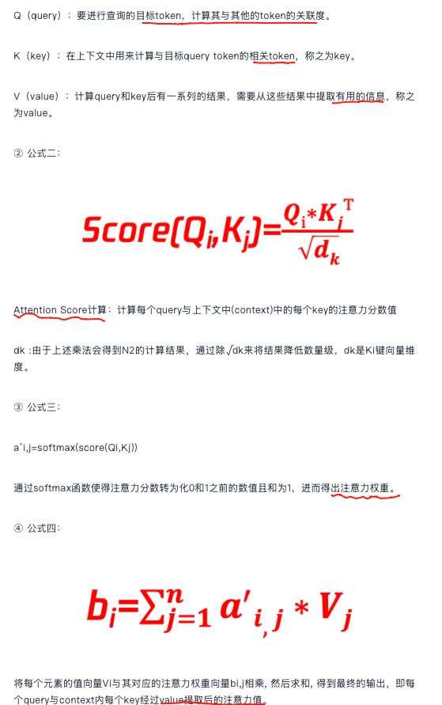

### 原型设计
```shell
·Axure RP：https://www.axure.com，可导出html，30天免费！B站有教程
    Macos管家https://16pan.com/s/share4e512e7cfd；
    github也有教程；
墨刀：纯前端浏览
官网：https://webflow.com/
官网：https://wordpress.org/themes/
```

### ndarry
```bash
l = ['Google', 'woodman', 1987, 2017, 'a', 1, 2, 3]
---
    print(l[:3])  # 从开始到list第3个元素
    print(l[1:])  # 从第二个到list结束
    print(l[:])  # 获得一个与l相同的list
    print(l[-1])  # 取倒数第一个元素
    print(l[::-1])  # list倒叙
    print(l[-3:-1])  # 倒数第三个到第二个
    print(l[-4:-1:2])  # 从倒数第4个每2个取一个，到代数第二个

data[a, b] : a的位置限制第几行，b的位置限制第几列, “ : ”表示全部数据
---
    data[:, 0]      # 取第一列所有行数据
    data[1, :]      # 取第二行所有列数据
    data[:, 1:]     # 取第二列开始所有行数据
    data[:, -1]     # 取所有行最后一列对应的一列数据
    data[:, :-1]    # 取所有行，但不包括最后一列的数据

data = [[1, 2, 3],
        [4, 5, 6],
        [7, 8, 9]]
data = np.array(data)
print(data[:,0]) #[1 4 7]
print(data[1,:]) #[4 5 6]
print(data[:, 1:]) 
# [[2 3]
#  [5 6]
#  [8 9]]
print(data[:, -1]) #[3 6 9]
print(data[:, :-1]) 
# [[1 2]
#  [4 5]
#  [7 8]]
                index  0,  1, 2, 3, 4, 5
                       -6 -5 -4 -3 -2 -1
tensor = torch.tensor([[1, 2, 3, 4, 5, 6],
                       [7, 8, 9, 10, 11, 12]])
print(tensor[..., 4:]) # 从第 4 个索引开始提取后续所有元素。
# tensor([[ 5,  6],
#         [11, 12]])
print(tensor[..., -4:]) # 从倒数第 4 个索引开始提取最后 4 个元素。
# tensor([[ 3,  4,  5,  6],
#         [ 9, 10, 11, 12]])
print(tensor[..., :-4])
# tensor([[1, 2],
#         [7, 8]])
```

### 图像分割
```bash
超像素：一系列像素的集合，这些像素具有类似的颜色、纹理等特征，距离也比较近。tu1
实例分割：类似目标检测 只不过输出mask，且不需要对每个像素进行标记，它只需要找到感兴趣物体的边缘轮廓就行。
        仅关注前景，且区分实例，输出-人1、、人2、车1、车2 tu2
全景分割：区分前景、背景的像素，且区分前景实例，输出-天空、树、人1、、人2、车1、车2 tu3
语义分割：区分前景、背景的像素，为图像中每个像素级的分类，输出-天空、树、车、人 tu4
原值为 png/jpg 形式的二值掩码图像，但可通过脚本转换为 YOLO格式标签，详见 https://docs.ultralytics.com/zh/datasets/segment/#visualize-dataset-annotations
{   
    "id": 16,
    "image_id": 14,
    "category_id": 1,
    "bbox": [239,0,77.829,414.895],
    "area": 32290.851,
    "segmentation": [[253.449,10.958,]],   
    "iscrowd": 0
}
bbox：目标的矩形边界框，格式为 [x, y, width, height]。
area：分割区域的面积（像素个数）。
segmentation：目标的分割信息，多边形格式描述了目标的边界。
iscrowd：
    0 表示该目标是单独的目标。
    1 表示目标为稠密目标（如一群人），通常用 RLE 格式存储分割信息。

## 标注工具，直接终端输入命令
labelImg： 矩形框标注
labelme: 多边形标注
```
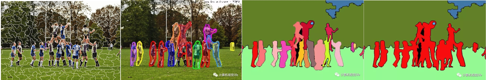

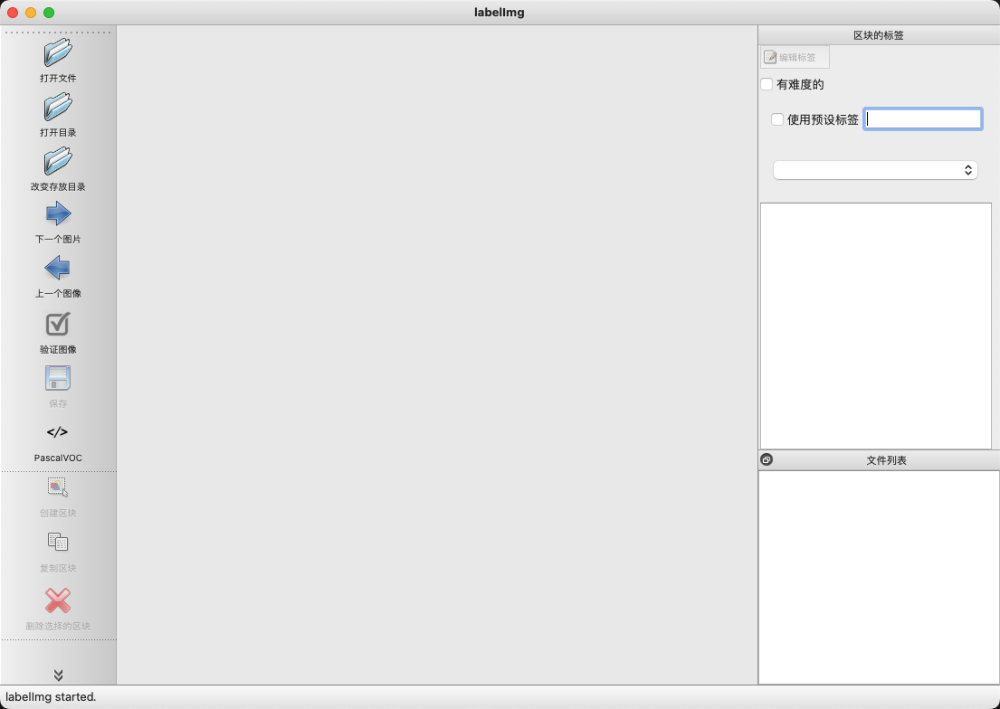

### 《数字图像处理》
```bash
https://www.imageprocessingplace.com/index.htm
```
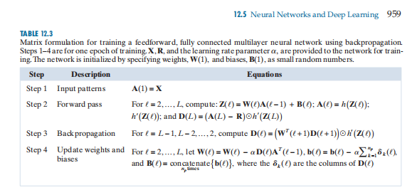
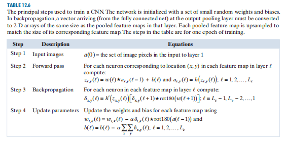

### 时域频域
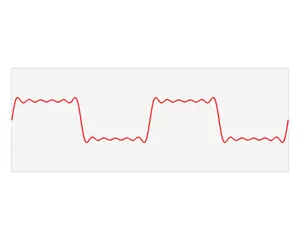
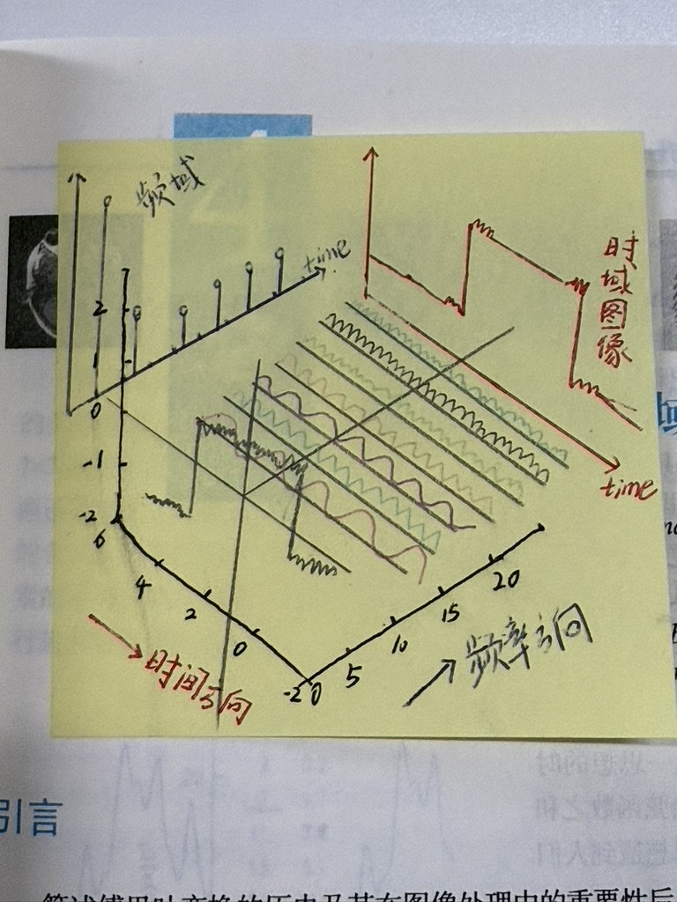


### 基础概念
```shell
单个视频帧：一张图片
    ·分辨率 resolution：
        图像的长宽像素大小，说法各异，视频分辨率一般是16:9，所以1080一般指 1920*1080；
        其他常见的：3840*2140【4K】、 2560*1440【2K】、1920*1080 【1080P 高清】、1280*720【720P】 640*360【360P】
        单位 P 表示逐行扫描(网络视频)，I 表示隔行扫描 （电视节目，节省带宽）
    ·像素 Pixel ：分辨率的长宽相乘，1920*1080=2073600像素
    ·dpi ：每英寸的像素是多少，实际取决于显示设备和视频分辨率，比如海报等印刷品要求300dpi；
    ·色彩空间模型：RGB、HSV、YUV等，表示像素点记录色彩数据的方式，网络视频一般是YUV420，虽然颜色有失真，单数据量少；
多个视频帧
    ·帧率：1秒的视频帧数 FPS，流畅18pfs、电影25fps、游戏>30pfs，很多时候是一个均值；
    ·PTS：播放时间戳（整数），TimeBase-时间基（1秒分成多少份）；
    ·码率：1秒的数据量大小 Mbps，感官上越大越清晰，但实际上限制码率是限制数据量大小，因为会影响网络加载时间，一般直播等流媒体设置 最大码率，防止客户端因宽带不足而卡顿，之后编码器会根据 最大码率 进行有损压缩「压缩也只是可能，重点取决于原始数据量大小」；
*** 一般，1920*108分辨率，30fps，H264编码，最大码率为2或3Mbps时，都是清晰的。
H264 H265，压缩相似帧的手段
    ·I帧：能独立播放的，是完整的视频帧；（数据量大）
    ·P帧：需要根据前一个I帧或P帧计算出最终图像；
    ·B帧：需要根据前一个和后一个I帧或P帧计算最终图像；（数据量小）
    `GOP：一组完整的视频帧，开头必为I帧，一般是对直播等流媒体设置的，缓解网络导致的花屏，大小一般为帧率的1-2倍；

熵的基本性质
香农熵具有几个关键性质，使其成为度量不确定性的理想工具：
1. 非负性：H(X)>=0，等号成立当且仅当 H(X) 是确定性的。
2. 最大熵原理：对于给定取值个数的随机变量，当所有结果等可能（均匀分布）时，熵达到最大值 log2n 。
    这代表着最大无知状态——没有任何偏见或假设，对结果完全开放心态。
3. 信息减少熵：获取关于系统的新信息总会导致熵的减少
    例如，从52张扑克牌中抽一张，初始熵为 log2(52) 。得知“这是一张黑桃”后，可能性空间缩小到13张牌，新熵为log2(13) 。
    你获得的信息量就是不确定性的减少量： log2(52)-log2(13) = log2(52/13) = log2(4) = 2比特。
4. 可加性：对于独立信源，联合熵等于各自熵之和：H(X,Y) = H(X) + H(Y)。这使得我们可以将复杂系统分解为独立部分进行分析。
5. 对称性：熵只关心概率值的集合，与具体事件的标签无关。
    概率分布 (0.5, 0.2, 0.3) 和 (0.3, 0.5, 0.2) 具有相同的熵。
```

### python 运算
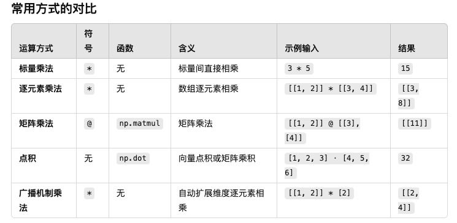

```bash
矩阵：np.dot = np.matmul = @
     * ❍✕  = ☉ Hadamard

1.标量乘法 * ： 对 标量或同类数据类型 的逐元素相乘。
    # 标量乘法
    a = 3
    b = 5
    print(a * b)  # 输出：15
    # 对列表（非 Numpy）进行重复扩展
    lst = [1, 2, 3]
    print(lst * 2)  # 输出：[1, 2, 3, 1, 2, 3]

2.数组逐元素乘法 * ： 对 两个同维度的数组或矩阵 逐元素相乘。  
    # 逐元素相乘
    A = np.array([[1, 2], 
                  [3, 4]])
    B = np.array([[5, 6], 
                  [7, 8]])
    result = A * B
    print(result)
    # 输出：
    # [[ 5 12]
    #  [21 32]]

3.矩阵乘法 @ ：表示矩阵乘法或向量点积（从 Python 3.5 开始支持）。
    # 矩阵乘法
    C = A @ B
    print(C)
    # 矩阵乘法的计算规则：
    # [[1*5 + 2*7, 1*6 + 2*8],
    #  [3*5 + 4*7, 3*6 + 4*8]]
    # 输出：
    # [[19 22]
    #  [43 50]]

4.点积 (np.dot) : 用于计算向量的点积、矩阵乘积或高维数组的缩减操作。
    # 向量点积
    v1 = np.array([1, 2, 3])
    v2 = np.array([4, 5, 6])

    dot_product = np.dot(v1, v2)
    print(dot_product)  # 输出：32
    # 计算过程：1*4 + 2*5 + 3*6 = 32

    # 矩阵乘法（与 @ 等价）
    matrix_product = np.dot(A, B)
    print(matrix_product)

5.矩阵乘积 (np.matmul): 用于矩阵与矩阵、矩阵与向量的乘法，等价于 @ 运算符。
    # 矩阵乘法 A:n*m,B:m*k/1
    matrix_product = np.matmul(A, B)
    print(matrix_product)
    # 等价于：
    print(A @ B)

6.广播机制乘法 (Numpy *) :  数组与标量、数组与低维数组进行逐元素乘法，并自动扩展维度。
    # 数组与标量
    array = np.array([[1, 2], 
                      [3, 4]])
    print(array * 2)
    # 输出：
    # [[2 4]
    #  [6 8]]

    # 数组与一维数组
    row_vector = np.array([1, 2])
    broadcast_result = array * row_vector
    print(broadcast_result)
    # 输出：
    # [[1 4]
    #  [3 8]]

7.Hadamard 乘积: 两个矩阵逐元素乘积（与 * 运算符等价，常用于机器学习）。
    # 两个矩阵逐元素乘积 A:n*m,B:n*m
    hadamard = A * B
    print(hadamard)

总结
    使用场景决定运算方式：
        简单逐元素运算：*
        矩阵操作和点积：@ / np.dot / np.matmul
        广播机制：* 自动扩展。
    推荐习惯：对于矩阵操作，优先使用 @，更符合直观的数学表达方式。

```

### vscode的debug
```bash
python 解释器在右下角；
版本不要变，否则没法breakpoint debug
Extensions 版本问题：
    Vscode: 1.85.2 (Universal)
    python: v2024.2.1
    pylance: v2024.3.2
    python debugger: v2024.0.0
```

### 横纵坐标【铝管压痕检测】
```text
1. 横坐标（X轴）
表示方式：横坐标通常表示图像中的列坐标，即图像从左到右的像素位置。
范围：横坐标的范围从图像的最左边开始（通常为0）到最右边（列数减去1）。
应用场景：在铝管压痕检测中，横坐标可以用来表示压痕在水平方向上的位置。例如，横坐标可以表示压痕沿着铝管的周向位置。
2. 纵坐标（Y轴）
表示方式：纵坐标通常表示图像中的行坐标，即图像从上到下的像素位置。
范围：纵坐标的范围从图像的最上边开始（通常为0）到最下边（行数减去1）。
应用场景：在铝管压痕检测中，纵坐标可以用来表示压痕在垂直方向上的位置。例如，纵坐标可以表示压痕沿着铝管长度方向的位置。
3. 图像矩阵：
    在图像矩阵中，元素的索引通常用 (i, j) 表示，其中 i 代表行（纵坐标），j 代表列（横坐标）。
    例如，矩阵元素 M[i][j] 表示图像中第 i 行、第 j 列的像素值。
```

### [人工智能名词字典](https://zhuanlan.zhihu.com/p/671175717)

### 稠密和稀疏处理
```shell
- 在计算机视觉领域，稠密(dense )和稀疏(sparse)通常用来描述图像处理中的两种不同的数据处理方式。

·稠密处理：指对图像中的每个像素都进行操作，通常用于需要对整个图像进行分析或处理的任务，例如图像识别、图像分割等。在稠密处理中，需要对每个像素进行操作，以获得完整的图像信息。这种方式可以提供更精确的结果，但也需要更多的计算资源和时间。

·稀疏处理：指只对图像中的一部分像素进行操作，通常用于对图像进行特征提取或关键点检测等任务。在稀疏处理中，只对图像中的一部分像素进行操作，通常是具有特定特征或重要性的像素。这种方式可以减少计算量和加快处理速度，但可能会牺牲一些信息的精确度.
```

### yolov8-pyqt
- 与训练环境一致
```bash
conda create -n mmcv python=3.9
conda activate mmcv
pip install torch torchvision torchaudio
conda install -c openmmlab mmcv-full
pip install PyQt5
```

- 开始运行
```bash
把ultralytics目录搬过来，防止找不到包！
cd yolo-pyqt
# yolov8m.yaml : [device :cpu] 
python run_gui.py
```

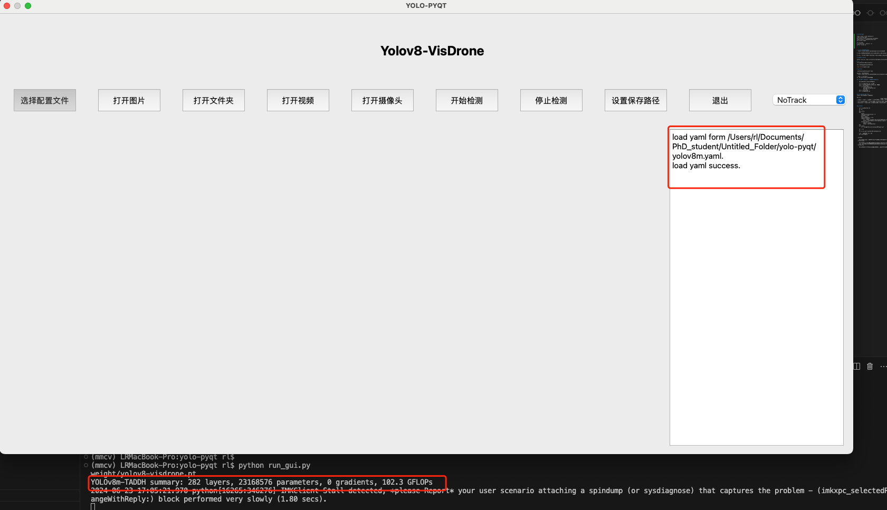
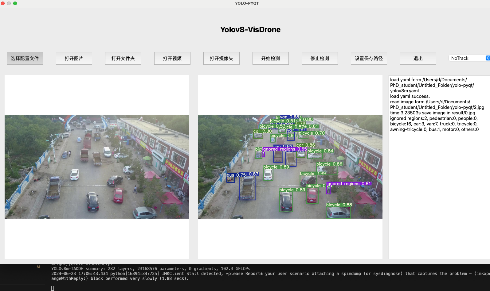

- 登录窗口调用主窗口
    https://blog.csdn.net/qilei2010/article/details/131077794
    ```bash
    run_gui.py
    __init__()
        self.loginW = None # 保存登录对话框
        # self.show() # 主窗口先不显示
    __main__()
        from login import LoginWindow
        w.loginW = LoginWindow(w) # 创建窗体，将主窗口作为参数传入
        w.loginW.show() # 

    login.py
    __init__(self,mainwin)
        self.mainwin = mainwin # 保存主窗口的引用，因为要给主窗口传递信息
    login(self)
        if username == 'user' and password == 'pass':
            # 登录成功后切换到新界面
            self.hide()  # 隐藏当前登录窗口
            self.mainwin.show() # 显示主窗口
            self.close() # 登录使命完成，关闭自己
    ```

### 深度学习-直观表示
```shell
- CNN、Transformer等：https://poloclub.github.io/cnn-explainer/#article-input
- 大模型：https://bbycroft.net/llm
- 这个🎉，https://0809zheng.github.io/tags.html#深度学习，很通俗易懂，
        CNN学习：https://0809zheng.github.io/2020/03/06/CNN.html

```

### 神经网络可视化工具汇总
```shell
- <https://cloud.tencent.com/developer/article/2333299>
· 直接导入权重pt文件即可显示网络结构(网页在线版)，<https://github.com/lutzroeder/Netron?tab=readme-ov-file>
· 自己画图时，可参考的形状：<https://docs.google.com/presentation/d/11mR1nkIR9fbHegFkcFq8z9oDQ5sjv8E3JJp1LfLGKuk/edit#slide=id.g78327f1586_217_712>
· 谷歌研究：https://research.google/blog/
· VOSviewer: https://zhuanlan.zhihu.com/p/6129123772 
    Create a map based on bibliographic data
    Read data from bibliographic database files
        Web Of Science 库 -> Export -> Plain Text File -> Full Record and Cited References -> .txt
    Read data from reference manager files
        知网 -> Export -> Refworks/EndNote  -> .txt /.enw 目前显示不出时间线
    分析网络：https://blog.csdn.net/m0_56184997/article/details/145536215
```
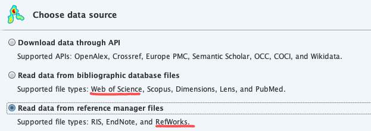

### command useless
```bash
python train.py --yaml ultralytics/cfg/models/v8/yolov8-dyhead.yaml  --info --project runs/train
```

### 目标检测论文发展方向
```text
🙅 backbone、注意力机制、loss

除非是顶会新提的结构，可以结合
```
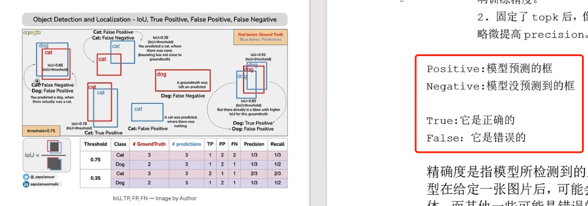


### Linux服务器错误
```bash
1️⃣linux无法进入图形化界面，即使更换密码也是重复登录！（未解决💡）
# 校园网连接
/knowledge/portal 客户端，通过scp传到服务器上
ssh登录
1.将程序包放到linux系统目录下赋予执行权限
    scp -r /Users/rl/Documents/PhD-student/Untitled_Folder/knowledge/portal lenovo@121.195.169.36:~
    chmod +x portal
2.执行程序
    ./portal
3.根据提示输入url
    https://e.ncepu.edu.cn/srun_portal_pc?ac_id=23
4.输入上网账号和密码
测试   ping www.baidu.com

登出
1.执行程序
    执行./portal
2.弹出Do you want to sign out?(y/N)
    选择y退出客户端
测试  ping www.baidu.com

2️⃣ ssh显示错误，突然远程不上
本地ping不通服务器，且服务器ping.www.baidu.com显示DNS解析域名错误！
关机重启📴

3️⃣ 侧边栏的 “文件夹”消失
Command+Shift+p -> View: Reset View Locations
```
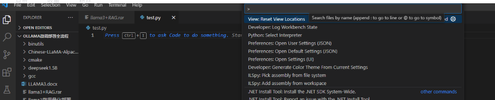


### github🔗
```text
论文双盲评审时，可以匿名github: knowledge/Double-blind Anonymous Github.pdf
```

###### 忽略./DS_Store文件
```text
参考1：https://blog.csdn.net/Happy_lifer/article/details/136062961
参考2：https://retompi.com/archived-blog/posts/2019/12/08/ignore-ds-store-globally.html
```

###### 代码关联github
```bash
Github官网: 手动 new repositories
vscode : new folder
cd XXX-folder
    git init
    # git config --global user.email "you@example.com"
    # git config --global user.name "Your Name"
    git remote add origin https://github.com/Wang-Phil/test.git
    编辑项目文件
    git add . (到源代码管理器下 进行 commit -> publish branch 默认main主分支，)
    git commit -m "add"
    git push origin https://github.com/Wang-Phil/test.git
git status --ignored #查看被忽略的文件
```
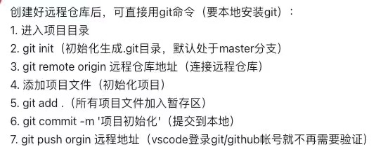

```shell
绿色：已暂存（staged）但未提交。
蓝色：已修改但未暂存。
灰色：被忽略或已提交且无更改。

- A：Added
    表示该文件是新添加的文件，已经被Git跟踪，并且将会包含在下一次的提交中。当使用git add命令将新文件添加到暂存区后，文件的状态会从U（Untracked）变为A（Added）。
- U：Untracked
    表示该文件是未被Git跟踪的文件，Git不会自动将其包含在版本控制中。这意味着该文件不会被提交到版本库中，也不会被包含在Git的快照中。如果希望Git开始跟踪该文件，需要使用git add命令将其添加到暂存区，然后文件的状态会从U（Untracked）变为A（Added）。
- M：Modified
    表示该文件已被修改。当对已跟踪的文件进行了修改后，文件的状态会从A（Added）变为M（Modified）。这意味着该文件在上一次提交之后发生了变化，但尚未被添加到暂存区。
```

###### git-question
```bash
服务器老报错！
** 具体步骤在goodnotes上有标明！

1. fatal: unable to access 'XX': Failed to connect to github.com port 443: 拒绝连接
    sudo vi /etc/hosts
    140.82.112.3 github.com # 服务器查询
    140.82.114.3 github.com # 本地查询
    # 添加了 ping github.com的IP地址 : PING github.com (127.0.0.1)

2. fatal: unable to access 'XX': Failed to connect to github.com port 443: 连接超时
[解决方式参考](https://blog.csdn.net/zpf1813763637/article/details/128340109)
    # 查看代理
    git config --global --get http.proxy
    git config --global --get https.proxy
    # 配置代理
    # ## socks5  Clash Verge
    # git config --global http.proxy socks5 127.0.0.1:7890
    # git config --global https.proxy socks5 127.0.0.1:7890
    ## http
    git config --global http.proxy 127.0.0.1:7890
    git config --global https.proxy 127.0.0.1:7890
    # 取消全局代理 服务器的才能push/pull上去
    git config --global --unset http.proxy
    git config --global --unset https.proxy
    ---------------------------------------------
    ssh -T git@github.com  # 成功，执行下来的步骤
    cd /特定目录下/.git
    ls
    cat config 
    ###
        [core]
        repositoryformatversion = 0
        filemode = true
        bare = false
        logallrefupdates = true
        [remote "origin"]
            url = https://github.com/LiuJiaji1999/power.git
            fetch = +refs/heads/*:refs/remotes/origin/*
        [branch "main"]
            remote = origin
            merge = refs/heads/main
    ###
    vim config 
        url = git@github.com:LiuJiaji1999/power.git

3. ssh: connect to host github.com port 22: Operation timed out , fatal: Could not read from remote repository.
    ssh -T git@github.com  # 报错
    ssh -T -p 443 git@ssh.github.com  #成功
    vim ~/.ssh/config
        <!-- Host github.com 
            Hostname github.com 
            Port 443 -->
    cat ~/.ssh/config
    ssh -T git@github.com

4. Git:execute git fail
commit中存在大文件，出现的错误 
    # 撤销 提交历史 ，回退1次
    git reset HEAD~1 # 这个命令，老bug，网上找就好

5. ssh_exchange_identification: read: Connection reset by peer fatal: 无法读取远程仓库。 请确认您有正确的访问权限并且仓库存在。
    那就是服务器没网了，找空闲账号重新登录！(实习的友友 或者 互助群里 找出租号)
    解决方法在👆

6. fatal: unable to access, Recv failure: Connection reset by peer
    本地vpn断了
```

```bash
cd ~/.ssh
ls
cat id_ras.pub # github设置中的remote-ssh

# 出现分支不同的问题 https://blog.csdn.net/qq_38856939/article/details/123333383
git fetch origin
git rebase origin/main

# 在git那里，右键选择 
```

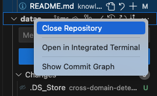
