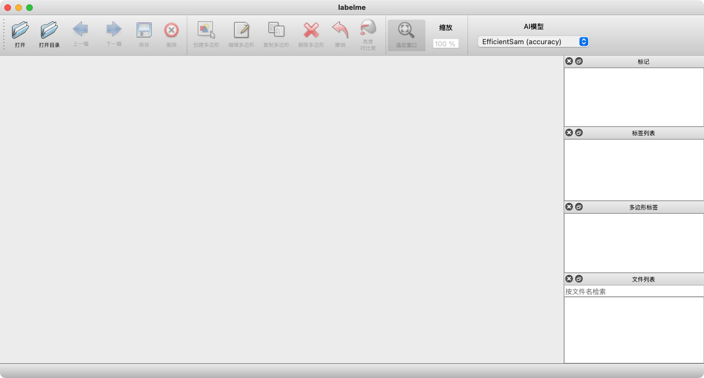

### Transerform OD
```text
《大白话》
```
### 拖拽式界面设计
官网：https://webflow.com/
官网：https://wordpress.org/themes/

### ndarry
```bash
l = ['Google', 'woodman', 1987, 2017, 'a', 1, 2, 3]
---
    print(l[:3])  # 从开始到list第3个元素
    print(l[1:])  # 从第二个到list结束
    print(l[:])  # 获得一个与l相同的list
    print(l[-1])  # 取倒数第一个元素
    print(l[::-1])  # list倒叙
    print(l[-3:-1])  # 倒数第三个到第二个
    print(l[-4:-1:2])  # 从倒数第4个每2个取一个，到代数第二个

data[a, b] : a的位置限制第几行，b的位置限制第几列, “ : ”表示全部数据
---
    data[:, 0]      # 取第一列所有行数据
    data[1, :]      # 取第二行所有列数据
    data[:, 1:]     # 取第二列开始所有列数据
    data[:, -1]     # 取所有行最后一列对应的一列数据
    data[:, :-1]    # 取所有行，但不包括最后一列的数据

data = [[1, 2, 3],
        [4, 5, 6],
        [7, 8, 9]]
data = np.array(data)
print(data[:,0]) #[1 4 7]
print(data[1,:]) #[4 5 6]
print(data[:, 1:]) 
# [[2 3]
#  [5 6]
#  [8 9]]
print(data[:, -1]) #[3 6 9]
print(data[:, :-1]) 
# [[1 2]
#  [4 5]
#  [7 8]]

```

### 图像分割
```bash
{   
    "id": 16,
    "image_id": 14,
    "category_id": 1,
    "bbox": [239,0,77.829,414.895],
    "area": 32290.851,
    "segmentation": [[253.449,10.958,]],   
    "iscrowd": 0
}
bbox：目标的矩形边界框，格式为 [x, y, width, height]。
area：分割区域的面积（像素个数）。
segmentation：目标的分割信息，多边形格式描述了目标的边界。
iscrowd：
    0 表示该目标是单独的目标。
    1 表示目标为稠密目标（如一群人），通常用 RLE 格式存储分割信息。

## 标注工具，直接终端输入命令
labelImg： 矩形框标注
labelme: 多边形标注
```



### 《数字图像处理》
https://www.imageprocessingplace.com/index.htm


### 时域频域


### 基础概念
```text
单个视频帧：一张图片
    ·分辨率 resolution：
        图像的长宽像素大小，说法各异，视频分辨率一般是16:9，所以1080一般指 1920*1080；
        其他常见的：3840*2140【4K】、 2560*1440【2K】、1920*1080 【1080P 高清】、1280*720【720P】 640*360【360P】
        单位 P 表示逐行扫描(网络视频)，I 表示隔行扫描 （电视节目，节省带宽）
    ·像素 Pixel ：分辨率的长宽相乘，1920*1080=2073600像素
    ·dpi ：每英寸的像素是多少，实际取决于显示设备和视频分辨率，比如海报等印刷品要求300dpi；
    ·色彩空间模型：RGB、HSV、YUV等，表示像素点记录色彩数据的方式，网络视频一般是YUV420，虽然颜色有失真，单数据量少；
多个视频帧
    ·帧率：1秒的视频帧数 FPS，流畅18pfs、电影25fps、游戏>30pfs，很多时候是一个均值；
    ·PTS：播放时间戳（整数），TimeBase-时间基（1秒分成多少份）；
    ·码率：1秒的数据量大小 Mbps，感官上越大越清晰，但实际上限制码率是限制数据量大小，因为会影响网络加载时间，一般直播等流媒体设置 最大码率，防止客户端因宽带不足而卡顿，之后编码器会根据 最大码率 进行有损压缩「压缩也只是可能，重点取决于原始数据量大小」；
*** 一般，1920*108分辨率，30fps，H264编码，最大码率为2或3Mbps时，都是清晰的。
H264 H265，压缩相似帧的手段
    ·I帧：能独立播放的，是完整的视频帧；（数据量大）
    ·P帧：需要根据前一个I帧或P帧计算出最终图像；
    ·B帧：需要根据前一个和后一个I帧或P帧计算最终图像；（数据量小）
    `GOP：一组完整的视频帧，开头必为I帧，一般是对直播等流媒体设置的，缓解网络导致的花屏，大小一般为帧率的1-2倍；
```


### python 运算


```bash
矩阵：np.dot = np.matmul = @
     * ❍✕  = ☉ Hadamard

1.标量乘法 * ： 对 标量或同类数据类型 的逐元素相乘。
    # 标量乘法
    a = 3
    b = 5
    print(a * b)  # 输出：15
    # 对列表（非 Numpy）进行重复扩展
    lst = [1, 2, 3]
    print(lst * 2)  # 输出：[1, 2, 3, 1, 2, 3]

2.数组逐元素乘法 * ： 对 两个同维度的数组或矩阵 逐元素相乘。  
    # 逐元素相乘
    A = np.array([[1, 2], 
                  [3, 4]])
    B = np.array([[5, 6], 
                  [7, 8]])
    result = A * B
    print(result)
    # 输出：
    # [[ 5 12]
    #  [21 32]]

3.矩阵乘法 @ ：表示矩阵乘法或向量点积（从 Python 3.5 开始支持）。
    # 矩阵乘法
    C = A @ B
    print(C)
    # 矩阵乘法的计算规则：
    # [[1*5 + 2*7, 1*6 + 2*8],
    #  [3*5 + 4*7, 3*6 + 4*8]]
    # 输出：
    # [[19 22]
    #  [43 50]]

4.点积 (np.dot) : 用于计算向量的点积、矩阵乘积或高维数组的缩减操作。
    # 向量点积
    v1 = np.array([1, 2, 3])
    v2 = np.array([4, 5, 6])

    dot_product = np.dot(v1, v2)
    print(dot_product)  # 输出：32
    # 计算过程：1*4 + 2*5 + 3*6 = 32

    # 矩阵乘法（与 @ 等价）
    matrix_product = np.dot(A, B)
    print(matrix_product)

5.矩阵乘积 (np.matmul): 用于矩阵与矩阵、矩阵与向量的乘法，等价于 @ 运算符。
    # 矩阵乘法
    matrix_product = np.matmul(A, B)
    print(matrix_product)
    # 等价于：
    print(A @ B)

6.广播机制乘法 (Numpy *) :  数组与标量、数组与低维数组进行逐元素乘法，并自动扩展维度。
    # 数组与标量
    array = np.array([[1, 2], 
                      [3, 4]])
    print(array * 2)
    # 输出：
    # [[2 4]
    #  [6 8]]

    # 数组与一维数组
    row_vector = np.array([1, 2])
    broadcast_result = array * row_vector
    print(broadcast_result)
    # 输出：
    # [[1 4]
    #  [3 8]]

7.Hadamard 乘积: 两个矩阵逐元素乘积（与 * 运算符等价，常用于机器学习）。
    # 两个矩阵逐元素乘积
    hadamard = A * B
    print(hadamard)

总结
    使用场景决定运算方式：
        简单逐元素运算：*
        矩阵操作和点积：@ 或 np.dot/np.matmul
        广播机制：* 自动扩展。
    推荐习惯：对于矩阵操作，优先使用 @，更符合直观的数学表达方式。

```


### vscode的debug
```bash
python 解释器在右下角；
版本不要变，否则没法breakpoint debug
Extensions 版本问题：
    Vscode: 1.85.2 (Universal)
    python: v2024.2.1
    pylance: v2024.3.2
    python debugger: v2024.0.0
```


### 横纵坐标【铝管压痕检测】
```text
1. 横坐标（X轴）
表示方式：横坐标通常表示图像中的列坐标，即图像从左到右的像素位置。
范围：横坐标的范围从图像的最左边开始（通常为0）到最右边（列数减去1）。
应用场景：在铝管压痕检测中，横坐标可以用来表示压痕在水平方向上的位置。例如，横坐标可以表示压痕沿着铝管的周向位置。
2. 纵坐标（Y轴）
表示方式：纵坐标通常表示图像中的行坐标，即图像从上到下的像素位置。
范围：纵坐标的范围从图像的最上边开始（通常为0）到最下边（行数减去1）。
应用场景：在铝管压痕检测中，纵坐标可以用来表示压痕在垂直方向上的位置。例如，纵坐标可以表示压痕沿着铝管长度方向的位置。
3. 图像矩阵：
    在图像矩阵中，元素的索引通常用 (i, j) 表示，其中 i 代表行（纵坐标），j 代表列（横坐标）。
    例如，矩阵元素 M[i][j] 表示图像中第 i 行、第 j 列的像素值。
```

### [人工智能名词字典](https://zhuanlan.zhihu.com/p/671175717)

### 稠密和稀疏处理
```text
- 在计算机视觉领域，稠密(dense )和稀疏(sparse)通常用来描述图像处理中的两种不同的数据处理方式。

·稠密处理：指对图像中的每个像素都进行操作，通常用于需要对整个图像进行分析或处理的任务，例如图像识别、图像分割等。在稠密处理中，需要对每个像素进行操作，以获得完整的图像信息。这种方式可以提供更精确的结果，但也需要更多的计算资源和时间。

·稀疏处理：指只对图像中的一部分像素进行操作，通常用于对图像进行特征提取或关键点检测等任务。在稀疏处理中，只对图像中的一部分像素进行操作，通常是具有特定特征或重要性的像素。这种方式可以减少计算量和加快处理速度，但可能会牺牲一些信息的精确度.
```

### yolov8-pyqt
- 与训练环境一致
```bash
conda create -n mmcv python=3.9
conda activate mmcv
pip install torch torchvision torchaudio
conda install -c openmmlab mmcv-full
pip install PyQt5
```

- 开始运行
```bash
把ultralytics目录搬过来，防止找不到包！
cd yolo-pyqt
# yolov8m.yaml : [device :cpu] 
python run_gui.py
```


- 登录窗口调用主窗口
    https://blog.csdn.net/qilei2010/article/details/131077794
    ```bash
    run_gui.py
    __init__()
        self.loginW = None # 保存登录对话框
        # self.show() # 主窗口先不显示
    __main__()
        from login import LoginWindow
        w.loginW = LoginWindow(w) # 创建窗体，将主窗口作为参数传入
        w.loginW.show() # 

    login.py
    __init__(self,mainwin)
        self.mainwin = mainwin # 保存主窗口的引用，因为要给主窗口传递信息
    login(self)
        if username == 'user' and password == 'pass':
            # 登录成功后切换到新界面
            self.hide()  # 隐藏当前登录窗口
            self.mainwin.show() # 显示主窗口
            self.close() # 登录使命完成，关闭自己
    ```

### 深度学习-直观表示
```text
- CNN、Transformer等：https://poloclub.github.io/cnn-explainer/#article-input
- 大模型：https://bbycroft.net/llm
```

### 神经网络可视化工具汇总
```text
- <https://cloud.tencent.com/developer/article/2333299>

· 直接导入权重pt文件即可显示网络结构(网页在线版)，<https://github.com/lutzroeder/Netron?tab=readme-ov-file>

· 自己画图时，可参考的形状：<https://docs.google.com/presentation/d/11mR1nkIR9fbHegFkcFq8z9oDQ5sjv8E3JJp1LfLGKuk/edit#slide=id.g78327f1586_217_712>
```

### command useless
```bash
python train.py --yaml ultralytics/cfg/models/v8/yolov8-dyhead.yaml  --info --project runs/train
```

### 目标检测论文发展方向
```text
🙅 backbone、注意力机制、loss

除非是顶会新提的结构，可以结合
```


### git-test
```bash
** 具体步骤在goodnotes上有标明！
- fatal: unable to access 'XX': Failed to connect to github.com port 443: 连接超时
[解决方式参考](https://blog.csdn.net/zpf1813763637/article/details/128340109)

git config --global --get http.proxy
git config --global --get https.proxy

sudo vi /etc/hosts
添加了 ping github.com的IP地址
```

```bash
- 提示22端口不能用了 , 连接失败，没有仓库

ssh -T git@github.com  # 报错
ssh -T -p 443 git@ssh.github.com  #成功
vim ~/.ssh/config
    <!-- Host github.com 
        Hostname ssh.github.com 
        Port 443 -->
cat ~/.ssh/config
ssh -T git@github.com
```

```text
- Git:execute git fail

commit中存在大文件，出现的错误
```

### github🔗
```text
忽略./DS_Store文件
参考1：https://blog.csdn.net/Happy_lifer/article/details/136062961
参考2：https://retompi.com/archived-blog/posts/2019/12/08/ignore-ds-store-globally.html
```

```bash
git init
git add README.md
git config --global user.email "you@example.com"
git config --global user.name "Your Name"
git commit -m "first commit"
git branch -M main
git remote add origin https://github.com/Wang-Phil/test.git
git push -u origin main
```

```bash
ssh -T git@github.com
cd .git
ls
cat config 
###
    [core]
    repositoryformatversion = 0
    filemode = true
    bare = false
    logallrefupdates = true
    [remote "origin"]
        url = https://github.com/LiuJiaji1999/power.git
        fetch = +refs/heads/*:refs/remotes/origin/*
    [branch "main"]
        remote = origin
        merge = refs/heads/main
###
vim config 
    url = git@github.com:LiuJiaji1999/power.git

cd ~/.ssh
ls
cat id_ras.pub # github设置中的remote-ssh

# 撤销 提交历史 ，回退2次
git reset HEAD~2

# 出现分支不同的问题 https://blog.csdn.net/qq_38856939/article/details/123333383
git fetch origin
git rebase origin/main

# 在git那里，右键选择 
```


```text
- A：Added
    表示该文件是新添加的文件，已经被Git跟踪，并且将会包含在下一次的提交中。当使用git add命令将新文件添加到暂存区后，文件的状态会从U（Untracked）变为A（Added）。
- U：Untracked
    表示该文件是未被Git跟踪的文件，Git不会自动将其包含在版本控制中。这意味着该文件不会被提交到版本库中，也不会被包含在Git的快照中。如果希望Git开始跟踪该文件，需要使用git add命令将其添加到暂存区，然后文件的状态会从U（Untracked）变为A（Added）。
- M：Modified
    表示该文件已被修改。当对已跟踪的文件进行了修改后，文件的状态会从A（Added）变为M（Modified）。这意味着该文件在上一次提交之后发生了变化，但尚未被添加到暂存区。
```

· 表格制作示例
                                        
| sample | clsId- | clsName- | instanceNum | train | test | val |
| :----: | :----: | :----: | :----: | :----: | :----: | :----: |
| pin| 0-defect-6011 | 1-rust-2000 |2-uninstal-1832| 6579 | 1880 | 940 |
| Einsulator | 3-burn-475 | 4-defect-508 | 5-dirty-440 | 951 | 272 | 137 |
