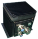
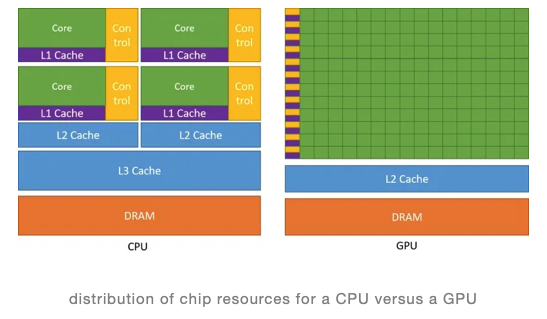
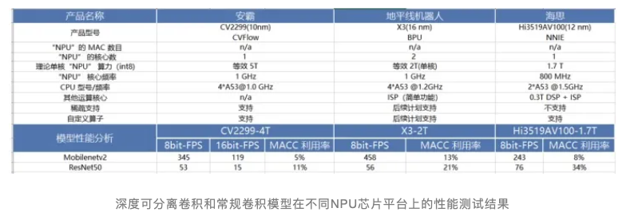

### 轻量级模型设计与部署总结


##### 实际应用 
```bash
VITA设备
整机重量：常规款2.4KG，无人机减重款1.2KG
CPU单元：瑞芯微RK3588 （8核处理器+6TOPS NPU）
‌GPU‌：内置ARM Mali-G610 MP4 3D GPU，支持OpenGL ES 1.1/2.0/3.2、OpenCL 2.2和Vulkan 1.2，
NPU单元：华为Atlas200IA2 （2核处理器+20TOPS NPU）
FPGA单元：复旦微 JFM7K325T
INT8算力：26TOPS
网络接口：千兆以太网 RJ45 x1 (军标圆形连接器)
电源接口：Y50EA-0804(军标圆形连接器)
IO接口：Y50EA-1222(军标圆形连接器) 包含 CAN、串口、485各1路
设备图片：
```


#####  公众号知识
```bash
knowledge/AI模型大小与推理速度的深度分析研究.pdf
knowledge/AI项目开发流程及边缘设备部署经验.pdf
```

#####  关键词
```bash
出自 https://mp.weixin.qq.com/s/iGplKYgUfjt5V-1TcNpDuA

1. 计算量
FLOPs： floating point operations 指的是浮点运算次数，理解为计算量，可以用来衡量算法/模型时间的复杂度。
FLOPS：（全部大写），Floating-point Operations Per Second，每秒所执行的浮点运算次数，理解为计算速度, 是一个衡量硬件性能/模型速度的指标，即一个芯片的算力。
MACCs： multiply-accumulate operations，乘-加操作次数，MACCs 大约是 FLOPs 的一半。将 w[0]∗x[0]+... 视为一个乘法累加或 1 个 MACC。
    
2. 内存访问代价 MAC
MAC: Memory Access Cost 内存访问代价。指的是输入单个样本（一张图像），模型/卷积层完成一次前向传播所发生的内存交换总量，即模型的空间复杂度，单位是 Byte。

3. GPU内存带宽
·GPU 的内存带宽决定了它将数据从内存 (vRAM) 移动到计算核心的速度，是比 GPU 内存速度更具代表性的指标。
·GPU 的内存带宽的值取决于内存和计算核心之间的数据传输速度，以及这两个部分之间总线中单独并行链路的数量。
英伟达 RTX A4000 芯片规格:A4000 芯片配备 16 GB 的 GDDR6 显存、256 位显存接口（GPU 和 VRAM 之间总线上的独立链路数量），因为这些与显存相关的特性，所以A4000 内存带宽可以达到 448 GB/s。

4. Latency and Throughput 延迟和吞吐量
深度学习领域延迟 Latency 和吞吐量 Throughput的一般解释,CPU 是低延迟低吞吐量处理器；GPU 是高延迟高吞吐量处理器。   
>延迟 (Latency): 人和机器做决策或采取行动时都需要反应时间。延迟是指提出请求与收到反应之间经过的时间。大部分人性化软件系统（不只是 AI 系统），延迟都是以毫秒来计量的。
>吞吐量 (Throughput): 在给定创建或部署的深度学习网络规模的情况下，可以传递多少推断结果。简单理解就是在一个时间单元（如：一秒）内网络能处理的最大输入样例数。
       
5. Volatile GPU Util
一般，很多人通过 nvidia-smi 命令查看 Volatile GPU Util 数据来得出 GPU 利用率，但是！关于这个利用率(GPU Util)，容易产生两个误区：
*误区一: GPU 的利用率 = GPU 内计算单元干活的比例。利用率越高，算力就必然发挥得越充分。
*误区二: 同条件下，利用率越高，耗时一定越短。
但实际上，GPU Util 的本质只是反应了，在采样时间段内，一个或多个内核（kernel）在 GPU 上执行的时间百分比，采样时间段取值 1/6s~1s。通俗来讲，就是，在一段时间范围内， GPU 内核运行的时间占总时间的比例。
比如 GPU Util 是 69%，时间段是 1s，那么在过去的 1s 中内，GPU 内核运行的时间是 0.69s。如果 GPU Util 是 0%，则说明 GPU 没有被使用，处于空闲中。也就是说它并没有告诉我们使用了多少个 SM 做计算，或者程序有多“忙”，或者内存使用方式是什么样的，简而言之即不能体现出算力的发挥情况。

6. 英伟达 GPU 架构
GPU 设计了更多的晶体管（transistors）用于数据处理（data process）而不是数据缓冲（data caching）和流控（flow control），因此 GPU 很适合做高度并行计算（highly parallel computations）。同时，GPU 提供比 CPU 更高的指令吞吐量和内存带宽（instruction throughput and memory bandwidth）。
CPU 和 GPU 的直观对比图如下所示：
```



```bash
最后简单总结下英伟达 GPU 架构的一些特点:
· SIMT (Single Instruction Multiple Threads) 模式，即多个 Core 同一时刻只能执行同样的指令。虽然看起来与现代 CPU 的 SIMD（单指令多数据）有些相似，但实际上有着根本差别。
· 更适合计算密集与数据并行的程序，原因是缺少 Cache 和 Control。

#### CNN 架构的理解
在一定的程度上，网络越深越宽，性能越好。宽度，即通道(channel)的数量; 网络深度，及 layer 的层数，如 resnet18 有 18 层网络。注意我们这里说的和宽度学习一类的模型没有关系，而是特指深度卷积神经网络的（通道）宽度。
    网络深度的意义：CNN 的网络层能够对输入图像数据进行逐层抽象，比如第一层学习到了图像边缘特征，第二层学习到了简单形状特征，第三层学习到了目标形状的特征，网络深度增加也提高了模型的抽象能力。
    网络宽度的意义：网络的宽度（通道数）代表了滤波器（3 维）的数量，滤波器越多，对目标特征的提取能力越强，即让每一层网络学习到更加丰富的特征，比如不同方向、不同频率的纹理特征等。

#### 手动设计高效 CNN 架构建议
1. 一些结论
` 分析模型的推理性能得结合具体的推理平台（常见如：英伟达 GPU、移动端 ARM CPU、端侧 NPU 芯片等）；目前已知影响 CNN 模型推理性能的因素包括: 算子计算量 FLOPs（参数量 Params）、卷积 block 的内存访问代价（访存带宽）、网络并行度等。但相同硬件平台、相同网络架构条件下， FLOPs 加速比与推理时间加速比成正比。
` 建议对于轻量级网络设计应该考虑直接 metric（例如速度 speed），而不是间接 metric（例如 FLOPs）。
` FLOPs 低不等于 latency 低，尤其是在有加速功能的硬体 (GPU、DSP 与 TPU)上不成立，得结合具硬件架构具体分析。
` 不同网络架构的 CNN 模型，即使是 FLOPs 相同，但其 MAC 也可能差异巨大。
` 大部分时候，对于 GPU 芯片，Depthwise 卷积算子实际上是使用了大量的低 FLOPs、高数据读写量的操作。这些具有高数据读写量的操作，加上多数时候 GPU芯片算力的瓶颈在于访存带宽，使得模型把大量的时间浪费在了从显存中读写数据上，导致 GPU 的算力没有得到“充分利用”。

2. 一些建议
` 在大多数的硬件上，channel 数为 16 的倍数比较有利高效计算。如海思 351x 系列芯片，当输入通道为 4 倍数和输出通道数为 16 倍数时，时间加速比会近似等于 FLOPs 加速比，有利于提供 NNIE 硬件计算利用率。
` 低 channel 数的情况下 (如网路的前几层)，在有加速功能的硬件（NPU 芯片）上使用普通 convolution 通常会比 separable convolution 有效率。（来源 MobileDets论文 https://arxiv.org/pdf/2004.14525.pdf )
` shufflenetv2 论文(https://arxiv.org/pdf/1807.11164.pdf) 提出的四个高效网络设计的实用指导思想: G1同样大小的通道数可以最小化 MAC、G2-分组数太多的卷积会增加 MAC、G3-网络碎片化会降低并行度、G4-逐元素的操作不可忽视。
` GPU 芯片上 3\times 33\times 3 卷积非常快，其计算密度（理论运算量除以所用时间）可达 1\times 11\times 1 和 5\times 55\times 5 卷积的四倍。（来源 RepVGG 论文(https://zhuanlan.zhihu.com/p/344324470)）
` 从解决梯度信息冗余问题入手，提高模型推理效率。比如 CSPNet(https://arxiv.org/pdf/1911.11929.pdf) 网络。
` 从解决 DenseNet 的密集连接带来的高内存访问成本和能耗问题入手，如 VoVNet(https://arxiv.org/pdf/1904.09730.pdf) 网络，其由 OSA（One-Shot Aggregation，一次聚合）模块组成。

#### 轻量级网络模型部署总结
* 在阅读和理解经典的轻量级网络 mobilenet 系列、MobileDets、shufflenet 系列、cspnet、vovnet、repvgg 等论文的基础上，做了以下总结：
* 低算力设备-手机移动端 cpu 硬件，考虑 mobilenetv1(深度可分离卷机架构-低 FLOPs)、低 FLOPs 和 低MAC的shuffletnetv2（channel_shuffle 算子在推理框架上可能不支持）。
* 专用 asic 硬件设备-npu 芯片（地平线 x3/x4 等、海思 3519、安霸cv22 等），目标检测问题考虑 cspnet 网络(减少重复梯度信息)、repvgg（直连架构-部署简单，网络并行度高有利于发挥 GPU 算力，量化后有掉点风险） 。
* 英伟达 gpu 硬件-t4 芯片，考虑 repvgg 网络（类 vgg 卷积架构-高并行度带来高速度、单路架构省显存/内存）。
* MobileNet block (深度可分离卷积 block, depthwise separable convolution block)在有加速功能的硬件（专用硬件设计-NPU 芯片）上比较没有效率。
* 除非芯片厂商做了定制优化来提高深度可分离卷积 block 的计算效率，比如地平线机器人 x3 芯片对深度可分离卷积 block 做了定制优化。
下表是 MobileNetv2 和 ResNet50 在一些常见 NPU 芯片平台上做的性能测试结果。
```

