## 具身智能 Embodied AI

### 自动驾驶 Autonomous Driving
```bash
🚗 ➡️ 理解道路+作出驾驶动作

Paper：A Survey on Vision-Language-Action Models for Autonomous Driving （清华、小米、麦吉尔大学等），202506预印版
Code：https://github.com/JohnsonJiang1996/Awesome-VLA4AD?tab=readme-ov-file

1. AD技术发展路线
·端到端自动驾驶 (End-to-End AD): 这种模式将传感器输入直接映射到驾驶动作，省去了复杂的中间模块。虽然高效，但其“黑箱”特性导致可解释性差，难以处理需要高级推理的“长尾”场景。数据驱动是端到端自动驾驶的核心支撑力量，根据学习原理划分，可分为：
    强化学习方法： 依赖在数以百万计的试错场景中训练模型，使其自主学习并掌握加减速、转向、变道等驾驶技能，对数据规模与计算能力的要求极高。
    模仿学习方法： 则通过大规模标注数据和真实驾驶样本对模型进行监督训练，让算法快速学习人类驾驶经验，更适合在量产车场景中快速迭代。
# 架构： 环境信息输入 → 端到端网络 → 驾驶动作。

·用于自动驾驶的视觉语言模型 (VLMs for AD): 随着大语言模型（LLM）的兴起，研究者开始将语言的理解和推理能力引入自动驾驶。VLM能够解释复杂的交通场景、回答相关问题，显著提升了系统的可解释性和对罕见事件的泛化能力。然而，这些模型主要停留在“感知和理解”，语言输出与车辆的实际控制脱节，存在“行动鸿沟”。
# 架构： 环境信息输入 → VLM → 推理链/多任务 → 输出（非直接控制）。

·用于自动驾驶的视觉-语言-行动模型 (VLA for AD): VLA模型是当前最前沿的范式。它在一个统一的策略中融合了视觉感知、语言理解和动作执行。VLA旨在打造能够理解高级指令、推理复杂场景并自主决策的智能车辆。VLA模型不仅能遵循“让行救护车”这类自然语言指令，还能用语言解释其决策原因，实现了感知、推理和行动的闭环。
# 架构： 环境信息输入 → 多模态编码器 → LLM/VLM → 动作解码器 → 驾驶动作。👇
```
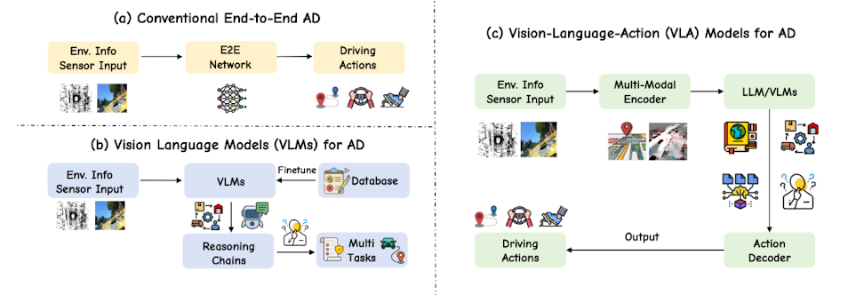

```bash
2. 当前智能驾驶已分化出两条路径。2024 年夏季以来，End-to-End 智能驾驶技术格局发生显著变化，从 2023年“一家独大” 的单一技术路径，正式演进为两大核心路线并行发展的态势。VLA 和世界模型并不是完全对立，而是两条目前并行发展的技术路线。其中，

1️⃣ 第一条路线为以“视觉 - 语言 - 行为”(Visual-Language-Action,VLA)链路为核心的架构体系，VLA 适合快速选代兼容现有量产平台，短期内易于落地。
1）VLA架构的技术逻辑遵循 “感知-理解-决策-控制” 的全链路语义化转化，其核心流程可拆解为四步:
  ·首先通过图像传感器完成环境感知与图像识别；
  ·其次将视觉感知结果转化为可被大语言模型理解的语言 Token(如“前方 50 米有静止车辆”“当前车道为潮汐车道”);
  ·再由大模型基于语言 Token 生成符合人类驾驶逻辑的驾驶建议；
  ·最后将抽象建议转化为 具体的车辆控制轨迹，并通过实时反馈机制进行动态校正。
```
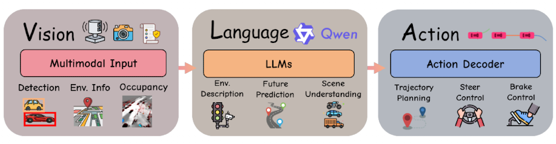
```bash
# 架构： 环境信息输入 → 多模态编码器 → LLM/VLM → 动作解码器 → 驾驶动作。
a.多模态输入与语言指令 (Multimodal Inputs and Language Commands)
    视觉数据 (Visual Data)： 视觉是自动驾驶系统的核心输入。技术已从早期的单前视摄像头发展到如今的多摄像头环视系统。原始图像可以被直接处理，或转换为鸟瞰图（BEV）等结构化表示，以辅助空间推理。
    其他传感器数据 (Other Sensor Data)： 为增强空间感知能力，系统还融合了多种传感器。包括用于精确3D结构的激光雷达（LiDAR）、用于速度估计的雷达（RADAR）、用于运动追踪的惯性测量单元（IMU）以及用于全局定位的GPS。方向盘转角、油门等本体感知数据也愈发重要。
    语言输入 (Language Inputs)： 语言输入的形式日趋丰富，其演进路径如下：
        直接导航指令：例如“在下一个路口左转”。
        环境查询：例如“现在变道安全吗？”。
        任务级指令：例如，用自然语言解析交通规则或高阶目标。
        对话式推理：最新的研究已支持多轮对话和基于思维链（CoT）的复杂推理，甚至包括语音指令输入。
b.核心架构模块 (Core Architectural Modules)
    视觉编码器 (Vision Encoder)： 该模块负责将原始图像和传感器数据转换为潜在表征。
        通常使用如 DINOv2 或 CLIP 等大型自监督模型作为骨干网络。🚩<Model1> 
        许多系统采用 BEV投影技术，或通过 点云编码器（如PointVLA）来融合3D信息。🚩<Model2>
    语言处理器 (Language Processor)： 该模块使用预训练的语言模型（如LLaMA2或GPT系列）来处理自然语言指令。
        通过 指令微调 或 低秩适应LoRA 等轻量化微调策略，可以高效地让模型适应自动驾驶领域的特定知识。🚩<Model3>
    动作解码器 (Action Decoder)： 该模块负责生成最终的控制输出。其实现方式主要有三种：
        自回归令牌器：将连续的轨迹点或离散的动作（如“加速”、“左转”）作为Token，并依次生成。
        扩散模型头 (Diffusion heads)：基于融合后的特征，通过采样生成连续的控制信号。🚩<Model4>
        分层控制器：由一个高阶的语言规划器生成子目标（如“超车”），再由一个低阶的比例-积分-微分控制器（Proportion Integral Differential，PID）、 模型预测控制（MPC）等车辆控制器来执行具体轨迹。
        【多Model的输出 -> controler的输入-> 👇】
c.驾驶输出 (Driving Outputs), VLA模型的输出形式反映了其抽象层次和操作目标
    低阶动作 (Low-Level Actions)： 一部分VLA4AD系统直接预测原始控制信号，如方向盘转角、油门和刹车。
        这种方式优点是可以输出更精细的控制，但对感知误差敏感，且缺乏长远规划能力，并且不同车型的可拓展性较差。
    轨迹规划 (Trajectory Planning)： 另一些VLA自动驾驶研究输出预测轨迹或路径点。
        这种方式具有更好的可解释性和拓展能力，可以由下游的MPC等规划器灵活执行。它使得VLA模型能够进行更长时程的推理，并更有效地整合多模态信息。
d.代表性工作、数据基准
    📑《A Survey on Vision-Language-Action Models for Autonomous Driving》

2）技术路线核心特征和痛点问题
技术落地：3D中间表征、长时序记忆、多模态融合（视觉、运动、语义等多源信息
Q1 多源数据的时序同步与时空一致性: VLA模型的有效运行依赖多源信息(如摄像头、雷达、语音指令)的时序同步与时空对齐。
    但在实际工程中，不同传感器的采集频率和延迟存在天然差异，如视觉帧率高、语音输入低频，导致特征对齐时易出现时间错位和空间漂移，严重时可能干扰下游决策逻辑。
    为此，产业界正在探索基于时空对齐优化的跨模态特征融合策略，如引入动态缓存机制、模态对齐层或中间对齐表征，以缓解多源异步问题。但这一过程对系统架构设计、算力调度和算法鲁棒性均提出更高要求。
Q2 极端工况下的模型稳定性: 在暴雨、强光、隧道明暗突变等极端环境下，感知模块性能普遍出现显著衰减。
    其技术难点在于如何实现模态间的动态互补机制？
        例如在视觉传感受限时通过雷达与语言引导实现信息补强，
        或在语音识别不稳定时通过视觉和地图信息反向约束决策逻辑；
        同时，如何在复杂工况下保证模态间的置信度判断与自适应权重调整；
Q3 长尾场景的泛化能力: 对长尾低频场景的泛化，例如夜间施工、动物横穿马路等，这些情境往往样本稀缺且分布复杂。
    当前业界普遍通过预训练与迁移学习、语义分解等方式实现视觉一语言的动态耦合，以提高语义映射的准确性与泛化性。
    然而在实际工程落地中仍面临标注噪声、语义漂移和场景偏移等系统性挑战，成为制约大规模落地的核心痛点之一。

2️⃣ 第二条路线则是以物理推演为核心驱动力的世界模型(World Model)路线，世界模型则代表了更底层的认知方式，强调物理规律和空间理解力，适合长期演进。
1) 与VLA架构依赖“语言中间层”的技术逻辑不同，世界模型路线通过绕开语言转化环节，直接将 3D高斯表征、点云等空间感知教据输入大模型，在模型潜空间内完成物理规律推演(如车辆碰撞风险预判、行人运动轨迹预测)，并直接输出车辆控制指令，形成 云端世界引擎 + 车端世界行为模型 的技术架构:
    ·云端世界引擎负责大规模场景的物理规律建模与预训练，
    ·车端世界行为模型则基于实时感知数据进行快速决策。

2）技术研究：
🔔Marble渲染「世界长什么样」，Genie3展示「世界怎么变」，JEPA则探究「世界的结构是什么」。
Li Fei-Fei, 世界模型即界面
    以Marble 为代表，它让人们能够从文字或二维素材，直接生成可编辑、可分享的三维环境。
    这种模式下，「世界」是呈现在VR头显、显示器或电脑屏幕上的那片可供人观看与游走的空间。 3D高斯泼溅
Google, 世界模型即模拟器
    以Genie3 为代表，这类模型能生成连续、可控制的视频式世界，让智能体在其中反复尝试、失败、再尝试。
    像SIMA2 这样的智能体，便可把这类世界当作「虚拟健身房」。
Yann LeCun, 世界模型即认知框架
    以JEPA 为代表，这是一种高度抽象的形式，没有像前两种一样可供人欣赏的画面。
    在这里，关注点不在于渲染，「世界」以潜在变量和状态转移函数的形式呈现，可以说是机器人完美的训练基地。

📑 Yann LeCun, Li Fei-Fei, Saining Xie 等《Cambrian-S Towards Spatial Supersensing in Video》2511
📑 

```

### (人形)机器人 (Humanoid) Robot
```bash
🤖 ➡️ 理解世界+执行复杂操作动作

1️⃣ knowledge/PRCV2024-大模型驱动的具身智能人形机器人-湖南大学王耀南院士.pdf

2️⃣ 技术发展
·VLA技术的应用，同上👆
·与AD的区别：
  控制难度：机器人的行走、保持平衡等动作，控制难度高于汽车；
  感知：主要为RGB、深度、触觉、力矩、指尖传感器等特殊传感器，需要更强的几何和物理理解；
  执行任务类型：抓取、灭火等复杂任务，强依赖物理交互，侧重“操作与交互”；
  语言能力：精准理解指令，意图推理，多步规划；
  实时：容错率略高；
  数据来源：仿真模拟器大规模生成，Sim2Real难；👇
🚩<Data1>
·可自建的仿真模拟器: Unity3D引擎  -https://unity.cn
                  Blender -https://www.blender.org/download/, 
·已有的仿真/Control平台:
a.无人机飞行 
    AirSim -https://microsoft.github.io/AirSim/ 
    PX4_Gazebo -https://zhuanlan.zhihu.com/p/337919677
b.机器人控制系统 
    ROS2: https://www.ros.org/blog/getting-started/#  可模拟navigation stack、move_base、collision avoidance等
·其他关于Vision-language的公开研究数据集
    EGO-EXO4D：https://ego-exo4d-data.org/#
    LEMMA：https://sites.google.com/view/lemma-activity

3️⃣ knowledge/具身智能与自主测图-华东师范大学李军院士.pdf，20251203

4️⃣ 20251106CCF会议：TF73 具身智能机器人的大模型与应用研发，20251220
1.机器人及行业应用最新事件-联想研究院副总裁毛世杰
    图灵在70多年以前就已经洞见；
    GPT通过图灵测试、自动驾驶、具身智能投资热点
    机器人的发展： 产线机械臂- 扫地机器人- 泛化Robot3.0 开放环境和多任务 -> Robot4.0通用任务（正在ing
    传统AI驱动（CNN、SLAM）-> 基础大模型（RL、LLM、VLA。。)-> 世界模型
    ·本体： 机器人
        轮足、六足（稳定性和负载，极端地形和超级负重）、人形（可控环境下的交流互动）
        设备适配：人机协同、多机协同
    ·AI： 模仿学习、强化学习
        小脑-RL 自主运动控制
        大脑-三维空间，自主任务学习与规划，分割与识别、SLAM建图与定位、实时构建地图 -> VLN级别的任务规划
        数据-行业数据：海量缺陷数据（大小模型融合）、正样本数据（开放环境的异常检测）、扫描三维模型（困难场景的定位导航，如长廊、管道）
    ·应用： 眼睛、脚、手
        巡检巡逻、应急救援的及时任务、教育实训
        🔧Daystar World deploy：基于空间智能的部署工具（仿真搭建工具）
            例如，变电站Daystar Inception：三维建模-地图-虚拟环境中 完成机器人部署 
                南极科考、公安巡逻
    挑战：跨界努力、泛化工作、鲁棒性、世界模型

2.神经符号推动工业机器人的具身实践-Intel中国研究院王志刚研究员
    落地阻碍： 可靠性不足、数据稀缺
    方法： 神经+逻辑符号，取长补短的来解决上述阻碍
    应用背景： 移动单臂机器人完成废旧电池的拆解
    大脑自主规划：任务规划，PDDL（规划域定义语言）来定义机器人技能，借助LLM完成
        感知-规划-执行，验证和持续学习
    小脑运动规划：MPC、NN，encoder-decoder架构，知识注入NN
        见下图1，静力学、动力学、臂力角等运动控制的知识注入NN，能更有效，或跟VLA、RL等结合
    机器人本体：目前的机器人都是先知后行而非知行合一，因此会产生sim2real的gap。所以应该追求‘现场学习’！
        安全机制、闭环反馈、灵活切换/扩展
    瑞士军刀虽然很酷，集成了剪刀✂️、螺丝刀🪛等，但某些程度上还是选择使用单🔧！

3.具身智能机器人落地挑战-银河通用机器人公司合伙人史雪松博士
    落地困难： 实验室demo(单一场景、单次任务)、真实需要多样化和长期运行
        本质上还是缺：机器人数据-三维场景、动作轨迹（关节控制指令等）等数据非常稀缺；
            花钱采数据可行？Telsa-上百人遥操团队、𝞹0-超一万小时的训练数据
            另辟蹊径 Sim to Real: 合成-训练-应用，gap太多了，阅读论文吧
            如果有10亿条数据会怎样？光照、平面位置、高度、背景、类别泛化的能力非常重要！不会overfitting到某一场景。
               Scaling Law 真需要这么多数据？实验结果确实是这样，1B数据才够
            GraspVLA 基础大模型举一反三，后训练事半功倍，就100条数据
        机器人实战路线，见下图2
    走向真实世界，双臂操作，银河太空舱
```
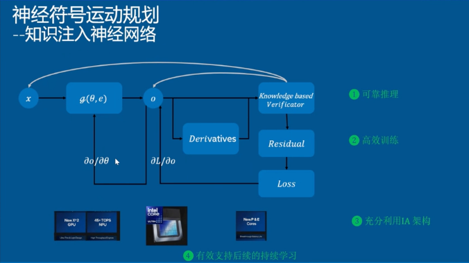
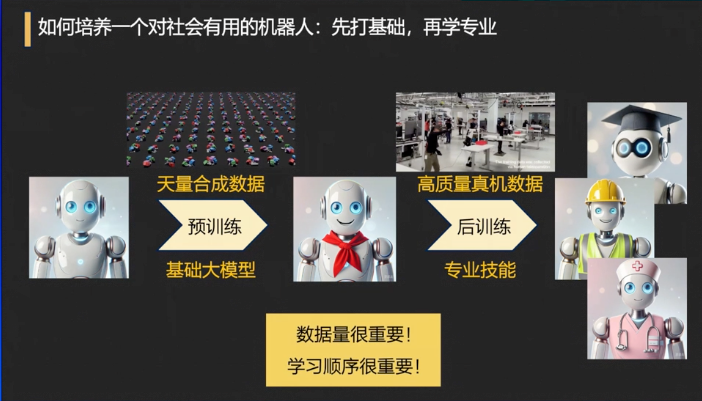

```bash
5️⃣ 市面机器人
小尺寸：
首选：宇树 G1，https://www.unitree.com/cn, 价格区间17W左右 
    开源平台：https://www.unitree.com/cn/opensource （github社区活跃 
    案例：人形机器人盲走和奔跑-https://www.bilibili.com/video/BV1mzigBAELZ/?share_source=copy_web&spm_id_from=333.788.comment.all.click&vd_source=2e19e27822584d7184e3aae2a14bc040
        导航-https://github.com/AnjieCheng/NaVILA
        VLP动作-https://vlp-humanoid.github.io/
    部署流程：https://blog.csdn.net/qq_28912651/category_12994324.html

次选：加速进化，https://www.booster.tech/zh/,价格区间9W左右
    开源平台： https://github.com/BoosterRobotics （github社区活跃 
    论文研究有室内活动如打乒乓球、游戏、行走、足球

全尺寸：
首选：逐际动力, https://www.limxdynamics.com, 不同型号价格区间为16W、30W、70W左右
    开源平台：https://github.com/limxdynamics/
    案例：爬楼梯-https://www.bilibili.com/video/BV1UdiEBWEGg/?spm_id_from=333.1387.homepage.video_card.click&vd_source=8f43c3a38f673faa87fc5770fa2e2e30

次选：天工 , https://x-humanoid.com/detail/jstg.html, 不同型号价格区间为40W、80W左右
    开源平台：https://github.com/Open-X-Humanoid/  （github社区活跃
    案例：电控柜质检操作-https://x-humanoid.com/yncj.html

再选：智元 ,https://www.zhiyuan-robot.com, 不同型号价格区间为10W、20W、45W
    案例：零部件产线部署-https://www.zhiyuan-robot.com/article/188/detail/119.html

其他国产机器人：
松延动力: https://noetixrobotics.com
星海图机器人:https://galaxea-ai.com/cn/products/R1-Lite


6️⃣20250714CCF会议 ADL159：具身智能 20260114

20251205CCF会议： ADL166 世界模型基础与应用
1.世界模型的基础问题
2.世界模型驱动的具身智能系统
构建世界模型的几何表征方法
世界模型的3D感知与生成、面向自动驾驶的可量产解决方案、通用人形角色的运动与交互控制策略


7️⃣ 机器人开发技术栈 20250115
来自 星海图联合创始人-许华哲
1.具身智能包含边界，从 底 到 上：
    核心零部件层：电机、本体结构件等
    整机层：拼接零部件，保证重心稳定、耐久度等
        -> 机械工程师
    系统HADAS层：感知模块、运控模块等模块的接入
    ROS层：收发信息
    软件与智能模块层：传统运控（使手臂丝滑，比如给予模仿学习/强化学习的智能模块。这些模块输入-图像、触觉等感知输入，输出-抓取水杯，捡东西等动作；
    大脑规划层：之前基于rule，现在一般为VLM，负责任务的分拆和规划等长程任务
    外接：数据采集的遥操系统
最后构成数据驱动的智能系统

2.具身智能技术栈
    技术方案：多模态大模型VLA+动作模块，常用的为 Transformer架构+diffusion/auto regressive 目标函数
    数据：最难采集

3. 人形机器人
    适合探索的具身通用形态之一，但激进（难做）又保守（能行）
    适合场景：需要劳动力，人可做但不想做

4.一脑多形？一脑一形？
    终局为：一脑多形，1m2,1m6,1m8
    起点为：一脑一形

------

具身智能 = 视觉/触觉感知输入 + 算法决策（大模型/世界模型/强化学习） + 物理机械反馈执行
《Aligning Cyber Space with Physical World- A Comprehensive Survey on Embodied AI》
感知：交互感知 + 决策：大脑处理  + 执行：控制指令，协调部件运动
其中使用大模型，表示为：具身大模型

1.具身感知:理解场景、预测和执行
    传统机器人的模式识别主要识别图像中的目标。具身感知的智体必须在物理世界中移动并与环境互动，需要对 3D 空间和动态环境有更透彻的理解。
    具身感知需要具备视觉感知和推理能力，理解场景中的三维关系，并基于视觉信息预测和执行复杂任务。
        主动感知：visual SLAM（3D建模）- 主动探索 - 数据
        被动感知：
                3D视觉 grounding 
                VLN
2.具身决策/智体：（一个/多个大模型）
    智体被定义为能够感知环境并采取行动以实现特定目标的自主实体。大模型进一步扩大了智体在实际场景中的应用。
    多模态大模型的智体被具身化为物理实体时，能够有效地将大模型能力从虚拟空间转移到物理世界，从而成为具身智体。
    为了完成任务，具身智体通常涉及以下过程，
        1）将抽象而复杂的任务分解为具体子任务，即高层具身任务规划。
        2）利用具身感知和具身交互模型，逐步实施子任务，即低层具身行动规划，
3.具身交互/执行
    任务回答：
        ·智体在物理或模拟空间中与人类和环境互动的场景。e.g. 具身问答任务中，智体需要从第一人称视角探索环境，收集回答问题所需的信息；
        ·具有自主探索和决策能力的智体，不仅要考虑采取哪些行动来探索环境，还需决定何时停止探索以回答问题。
    具身抓取：
        ·根据人类指令执行操作，如抓取、放置目标；需要语义理解、场景感知、决策和鲁棒控制规划。
        ·具身抓取方法将传统机器人运动学抓取与 LLM/VLM/MLM 等大模型结合，使智体能够在多感知器下执行抓取任务。

4.主要的技术路线
# OpenAI分层决策，例如Figures
    ·high-level planer 多模态大模型感知决策同时实现，模型整合任务、环境和本体感知信息；
    ·low-level policy 使用 RL 模型作为具身模型，实现从大模型的环境感知到动作的规划；
    ·最后，传统运动控制算法 whole body controller 输出机器人控制的力矩实现最终动作。
优点为逻辑清晰；
缺点为不同步骤融合不一致
```


```bash
# Google 端到端 ，PaLM-E:
    ·先在大规模互联网数据上预训练 VLMs，然后在机器人任务上微调。
    ·输入是任务和对象的组合，输出是一系列动作。
    ·利用大模型完成从输入到感知、推理、决策和行为指令输出的全过程。
优点为减少误差传递，能力涌现；
缺点为海量数据，调用大模型资源消耗

硬件、算法、数据
```

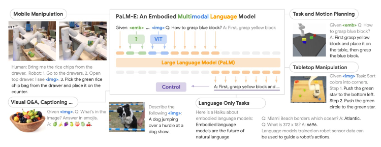
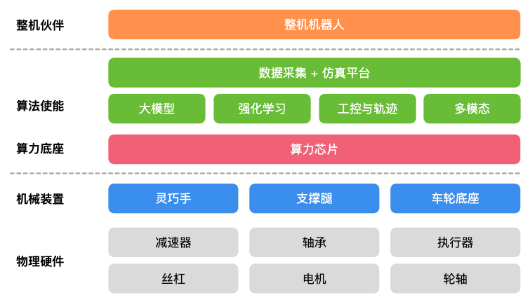


```bash
💡电力巡检项目

📑/paper/5.《电力具身智能机器人发展白皮书》、《国电南瑞抱臂式输电线路巡检机器人介绍》
1. 现状机遇
Q:可靠性、通过性、通用性、协同性
O:内生需求、技术发展、政策引领、市场规模
2. 关键技术体系
围绕：模型赋予本体智能、本体与环境交互产生数据、数据用于模型训练，
～机器人本体：
    大量通用+少量专用
    突破复杂环境下长期稳定生存的本体、仿生机器人（耐高温可灵活）、步态规划、多模态传感器等
～数据：
    专用真机数据+通用数据，虚实结合具身数据
    ①穿戴设备采集大量人体作业数据，完成对任务执行流程的理解；
    ②构造适量的仿真合成数据，模拟场景作业中的长尾任务；
    ③利用少量的真机数据，用于模型微调。
～模型：
    专用小模型+通用大模型 
    突破多模态感知、异构协同、云-网-端通信等
3. 典型应用
    电力专用机器人、输电线路上塔作业机器人、空地协同异构智能勘灾抢修集群等

相关论文：
📑《DetectiumFire： A Comprehensive Multi-modal Dataset for Fire Understanding》NeurIPS2025
📑

```


### SLAM （Simultaneous Localization and Mapping）
```bash
使得机器人能够在未知环境中导航，同时构建环境的地图。这一过程中，机器人需要解决 
    “我在哪儿”-定位 和 “我周围是什么”-建图 的问题。
简而言之，SLAM技术就是让机器人在探索未知环境的同时，进行自我定位并构建环境地图。

1. SLAM技术主要包括两大部分：定位（Localization）和地图构建（Mapping）。
定位：指在已知或未知地图中确定机器人的位置和姿态。
    常用的定位技术有：
        基于滤波的方法（如卡尔曼滤波、粒子滤波）通过不断更新机器人的状态估计来实现定位，
        基于图优化的方法则是通过最小化所有测量值与估计值之间的误差来优化机器人的轨迹。
地图构建：指利用机器人的感知信息（如雷达、相机等传感器信息）来构建环境的地图。
    根据地图的类型不同，可以分为：
        特征地图通过提取环境中的关键特征（如角点、边缘等）来构建地图
        栅格地图则是将环境划分为多个小栅格，并标记每个栅格的状态（如占用、空闲）。

2. SLAM技术流程
2.1 算法的基本流程可以分为以下几个步骤：闭环流程 -> 数据采集-特征提取-位姿估计-地图更新
    感知环境：机器人通过搭载的传感器（如雷达、摄像头）感知周围环境。
    提取特征：从感知到的数据中提取出有用的信息，如特征点、边缘等。
    数据关联：将提取出的特征与已知的地图或之前的观测进行匹配，以确定自身的位置。
    状态估计：利用滤波器或图优化方法对机器人的位置和地图进行估计和更新。
    地图更新：根据最新的位置估计，更新地图信息。
2.2 技术实现
·Gmapping算法
    适用于：它在处理小规模环境时表现出色，能够快速构建出较为准确的地图。
    核心思想：基于粒子滤波器，通过对粒子的不断更新和重采样来估计机器人的位姿和构建地图。
    在工程实现中，Gmapping需要对传感器数据进行预处理，去除噪声和异常值，然后利用粒子滤波器进行位姿估计和地图更新。
·LOAM系列方法 Lidar Odometry and Mapping
    一种高效的实时激光雷达SLAM技术。它通过分离定位（Odometry）和地图构建（Mapping）的过程，以达到既高效又精确的目的。
    适用：针对户外大范围环境的实时三维地图构建和定位，广泛应用于无人驾驶汽车、无人机等领域。
    核心思想：将环境特征分为平面特征和边缘特征，然后独立处理这两类特征来分别估计机器人的平移和旋转。这种方法有效降低了计算复杂度，提高了处理速度。
        特征提取：LOAM首先从激光雷达的点云数据中提取边缘特征点和平面特征点。
        里程计估计：通过比较连续帧之间的特征点，估计机器人的短期运动（即里程计），实现快速定位。
        地图优化：然后，利用提取的特征点对局部地图进行优化，以提高长期定位的精度和地图的准确性。
·Google Cartographer 
    Google发布的一款开源的二维和三维SLAM库，它能够提供实时的地图构建服务。
    适用：具有丰富传感器的移动机器人，如自动驾驶车辆和服务机器人。包括室内机器人导航、自动仓储管理等。
    核心思想：采用了一种基于图优化的SLAM方法，它通过构建一个包含节点（代表传感器数据）和边（代表节点之间的相对位移）的图。通过优化这个图，Cartographer可以同时改进所有节点的位置估计，实现精确的地图构建和定位。
        传感器融合：支持多种传感器数据输入，如激光雷达、IMU（惯性测量单元）、里程计等，能够实现传感器数据的有效融合。
        实时闭环检测：能够实时进行闭环检测，即识别并纠正历史数据中的位置估计误差，保证长时间运行的精度。
        自适应地图构建：根据环境的不同，可以调整地图的分辨率，实现更高效的地图构建。

3. SLAM类型
《LiDAR, IMU, and camera fusion for simultaneous localization and mapping: a systematic review》
传感器类型 -- SLAM
    2D 激光雷达、3D 激光雷达 -- 激光 SLAM，应用eg.扫地机器人
    单目相机、双目相机、RGB-D相机 -- 视觉 SLAM
    相机+IMU -- 视觉惯导 SLAM(VLO)
    激光雷达+IMU -- 激光惯导 SLAM(LIO)

硬件选型：https://zhuanlan.zhihu.com/p/1899828540989510765
    对于对精度要求较高、环境较为复杂的场景，如无人驾驶、机器人导航等，可以选择激光雷达作为主要传感器；
    对于成本敏感、对环境感知要求不高的场景，如智能家居、消费级机器人等，视觉传感器是一个不错的选择；
    但目前，激光 - 视觉 - IMU 多传感器融合是技术的研究热点，技术路线有紧耦合【将激光雷达、视觉传感器和IMU的数据在底层进行融合，共同参与位姿估计和地图构建】和松耦合【将各传感器的数据分别进行处理，然后在高层进行融合】
        例如，自动驾驶场景中，多源数据互补优势明显：
            激光雷达能够提供高精度的距离信息，适合用于构建地图和检测障碍物；
            视觉传感器可以提供丰富的纹理和语义信息，有助于识别交通标志和行人；
            IMU能够提供实时的运动信息，在传感器数据丢失或不准确时，辅助进行位姿估计。
        通过将这三种传感器的数据进行融合，可以提高自动驾驶系统的环境感知能力和定位精度，确保行车安全。


算法框架介绍：以 视觉SLAM 为例，如下图所示，主要包括：
    传感器信息读取、*前端（里程计）*、*后端*、回环检测、建图。
    需要说明的是，不同类型的SLAM技术仅在前端的处理有所不同，后端所采用的优化算法都是通用的。
    主要技术：ORB-SLAM3、VINS-Fusion等
```

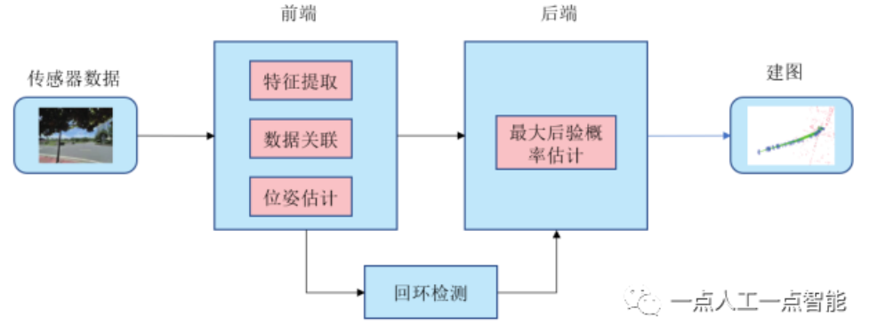

```bash
闭环流程 -> 数据采集-特征提取-位姿估计-地图更新
输入
    采集相机图像，并进行预处理。
*前端（视觉里程计）*
    根据短时间内采集到的相机图像，计算相机的在移动机器人坐标系中的位置和姿态，也就是位姿，并建立局部地图。
    前端的主流方法有特征点法（间接法）和直接法两种。
        特征点由关键点和描述子两部分组成，关键点是指该特征点在图像中的位置，它可以在多帧图像中被检测到，并通过比较描述子来建立配对关系，通过最小化重投影误差来优化相机位姿，最经典的间接法是orb-SLAM2。
        直接法没有特征提取的步骤，直接利用像素的灰度信息，通过最小化像素的光度误差来优化位姿，最经典的直接法是DSO。
    间接法和直接法的理论基础已经较为完善，目前的改进方向就是在已有的理论框架中增加先验约束如：尺度约束，平面特征约束，平行线特征约束等，例如2022年美团《EDPLVO：Efficient Direct Point-Line Visual Odometry》ICRA学术会议上的工作，即对前端做了改进，将线特征扩展到直接法中。
*后端 （定位优化）*
    根据不同时刻视觉里程计计算的相机位姿，３维地图点和回环检测信息，对位姿和３维地图点进行全局的优化，后端处理的是SLAM过程中的噪声问题，在数学上被建模为最大后验概率估计问题来解决，主流的方法有以扩展卡尔曼滤波为代表的滤波器方法和非线性优化方法。
        滤波器方法形式更简洁，适用于计算资源受限的场景。
        非线性优化方法能更精确的优化相机位姿和地图点位置，但计算时间更长，所需计算资源更多。
回环检测
    判断机器人是否到达过先前的位置，如果检测到回环，可以提供时隔更加久远的约束，可以消除累积误差，主要是通过图像之间的相似性来判断。最经典的方法是
        词袋模型：将图像中的特征点表示为一个词袋，通过比较不同图像的词袋向量来判断是否存在回环。当两个图像的词袋向量相似度较高时，认为它们可能是同一位置的图像，从而检测到回环。
        后续的基于CNN和RNN的方法：
    闭环修正的数学建模可以通过图优化的方法来实现。在检测到回环后，将回环信息作为一个新的约束添加到图中，然后通过最小化图中所有约束的误差，对地图和位姿进行全局优化。具体来说，设机器人的位姿为 x ，地图点为 y ，回环约束为 z ，则闭环修正的目标是最小化误差函数 E(x,y,z) ，通过求解这个优化问题，得到最优的位姿和地图。
建图
    根据估计的轨迹，建立与任务要求对应的地图。对于SLAM来说，地图是用来辅助定位的，但对于导航、避障和三维重建等任务来说，地图在其中扮演着更重要的角色，为了完成不同的任务，地图的形式也是不同的，常见的地图类型包括占据网格地图、八叉树地图、语义地图等

🔔除了SLAM，目前主流的移动机器人定位技术还有
·组合导航 （GNSS／INS），常见于自动驾驶
    GNSS技术是指通过观测GNSS卫星获得坐标系内绝对定位坐标的测量技术，中国的北斗导航系统和美国的GPS都属于GNSS技术，在空旷处单一的GNSS的定位误差小于5米，在城市环境下GNSS信号易被遮挡，此时GNSS的定位误差可能会达到几十米。因此现在大多采用组合导航（GNSS/INS）的方式，能极大的提高组合导航的鲁棒性，当然其应用场景主要还是 在空旷的室外。

·二维码导航/磁导航 （Automated Guided Vehicle），常见于物流仓储
    AGV最初是用来运输港口的集装箱，AGV最初是采用磁导航的，这种方式需要按照一定的间隔，在机器人行驶道路上提前埋上磁钉，AGV小车通过自身安装的磁导航传感器接收磁钉信息，从而完成自身的定位，其运动路径也就是由磁钉的布置决定，降低了路径规划技术的要求，该技术适用于港口，工厂自动搬运这类封闭且有固定行驶路径的机器人。而这种技术的缺点在于：磁钉会出现老化的问题，更换磁钉的代价很大，不能轻易变更机器人运营路线，这个缺点很大程度上制约了AGV技术更大范围的运用。当然AGV发展到现在，也出现了采用二维码导航的方式，通过AGV小车扫描天花板或者地板上二维码的方式获取当前位置信息，在仓储物流行业和服务送餐机器人都有运用。
下图 GNSS定位（左），无人码头AGV（右）

·室内场景的三维重建（AR技术等）
    通过图像和其他传感器信息计算相机的位置和三维环境结构，并结合3D渲染提供更自然的人机交互能力。
    自我定位和环境感知：具体需要的是视觉惯导SLAM技术，作为当前实现AR的主流方案，它通过从相机输入的图像信息和IMU的速度、加速度信息完成更准确的定位，同时图像信息能提供更丰富的环境信息，更有利于后续算法理解环境，以完成人机交互。再加上由于制造工艺的成熟，MIU和相机设备体积更小重量更轻，价格也相对便宜，综合以上因素考虑，视觉惯导SLAM技术要更为契合AR设备的需求。
    最为经典的视觉惯导SLAM算法是vins-mono算法。

```
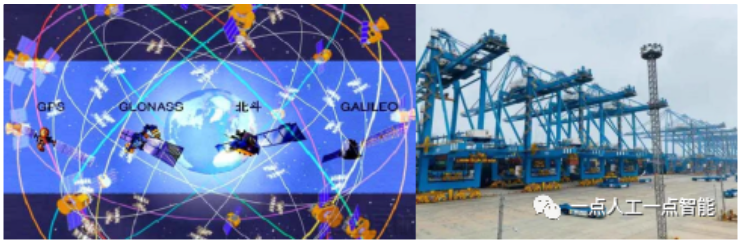

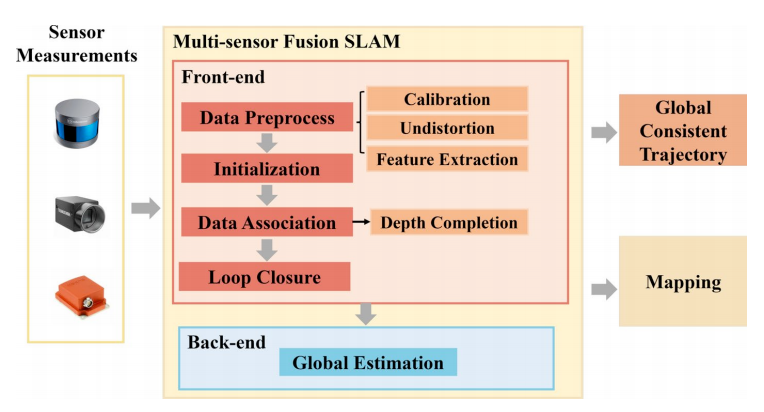


----------------------------------------------------------------

### 强化学习 Reinforcement Learning
```bash
mathworks公司：https://www.mathworks.com/videos/series/reinforcement-learning.html

agent-> reward action observation-> environment
Agents学习：https://datawhalechina.github.io/hello-agents/#/

RL理解：https://mp.weixin.qq.com/s/Ukt2a1IC4sVbsGCLemk3xQ，https://lei-kun.github.io/blogs/rl.html
可通过两个问题理解：
1.数据从哪里来？
    RL本质上是智能体不断收集经验、并用这些经验改进策略的循环。不同算法的差异，很大程度上取决于它们依赖什么样的数据。
    ·最直接：在线策略学习。在这种模式下，智能体一边与环境交互，一边学习。
            每一个动作都带来新的数据，立刻被用于更新模型。这类方法像是不断在现场实践的学生，代表算法包括 PPO、SAC 等。
            在线学习的优点是灵活、适应性强，但也意味着代价高昂，每次试错都可能耗费时间、能量，甚至造成损失。
    ·相对保守：离线策略学习。它允许智能体反复使用过去的经验，而不必每次都重新与环境交互。
            算法会把这些经验保存下来，在需要时反复采样学习。DQN、TD3、DDPG 都属于这一类。
            离策略学习提高了样本利用率，也让学习过程更稳定，是许多实际应用中的主流方案。
    ·极端方法：离线学习。智能体完全依赖一个固定的数据集进行训练，不能再与环境交互。这种方法看似受限，但在高风险场景中却尤为重要，比如医疗、自动驾驶或机器人控制。
                算法必须在不试错的情况下，从既有数据中学会尽可能好的决策，CQL、IQL 就是这类方法的代表。
&& 从在线到离线，数据的获取方式逐渐从主动探索转向被动利用。算法的选择往往反映了任务的现实约束：能否安全地试错？能否持续获得新数据？试错的代价是否可承受？这便是强化学习的第一个维度：数据从哪里来。
2.策略怎么更新？
    学习更新的节奏。简单来说，就是智能体多久评估一次策略，又多久调整一次行为。
    ·最简单：一步式学习。智能体在一个固定的数据集上训练一次，学到一个策略后就不再改进。
            模仿学习就是典型例子。它速度快、风险低，适合那些对安全性要求高或数据有限的任务。
    ·另一种：多步式学习。算法在一批数据上多次更新，直到性能收敛，再重新收集新的数据。
            这是一种折中策略，既避免了频繁交互的高成本，又能比一次性训练获得更好的表现。
    ·最具代表：迭代式学习。这类算法不断在“收集数据—更新模型—再收集数据”的循环中进化，每一次交互都推动性能提升。
            它们像一个永不停歇的学习者，不断探索未知、修正自身。PPO 和 SAC 就是这种方式的代表。
&& 从一步到多步，再到迭代，算法的更新节奏越来越密集，也意味着从静态到动态的转变。不同节奏之间，其实反映的是对稳定性和适应性的权衡。
3.所有RL都在做上述两件事，就像一个反复自我练习的过程
    先评估，看看自己目前的策略表现得怎样，哪些动作好、哪些不好；
        评估阶段（Policy Evaluation） 就是去衡量“这套策略到底值不值”。
        算法会让模型预测某个状态下采取某个动作能得到多大的回报，然后和实际反馈进行比较。如果误差太大，就调整模型，让它的预期更接近现实。
        比如在线算法直接用新数据计算，离线或离策略算法则要通过重要性采样、加权平均等方式修正旧数据的偏差。
    后改进，根据评估结果，调整策略，让下一次决策更聪明一点。
        改进阶段（Policy Improvement） 是在得到新的评估结果后，优化策略本身。
        模型会倾向于选择那些带来更高期望回报的动作。但为了避免一下子“改过头”，很多算法会加上约束或正则项，
        比如让新策略不能偏离旧策略太多（这就是 PPO 的思想），或者在策略里保留一定的探索性（这就是 SAC 中熵正则的作用）。
&& Q-learning、PPO、SAC……看起来名字各不相同，其实都在重复这两个动作。唯一的区别，只是它们评估得方式不同、改进的速度不同、或者用到的数据不同。
```
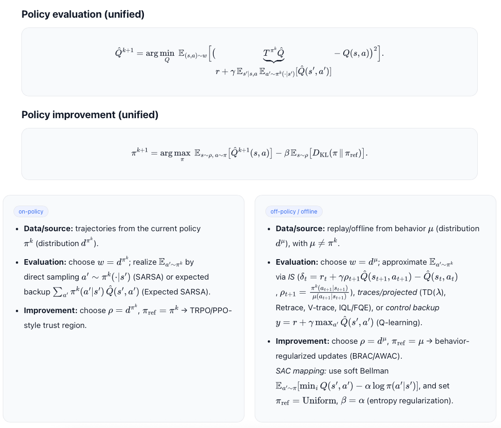
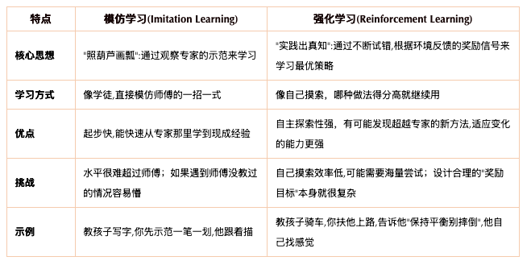