## 具身智能 Embodied AI

### 自动驾驶 Autonomous Driving
```bash
🚗 ➡️ 理解道路+作出驾驶动作

Paper：A Survey on Vision-Language-Action Models for Autonomous Driving （清华、小米、麦吉尔大学等），202506预印版
Code：https://github.com/JohnsonJiang1996/Awesome-VLA4AD?tab=readme-ov-file

1. AD技术发展路线
·端到端自动驾驶 (End-to-End AD): 这种模式将传感器输入直接映射到驾驶动作，省去了复杂的中间模块。虽然高效，但其“黑箱”特性导致可解释性差，难以处理需要高级推理的“长尾”场景。数据驱动是端到端自动驾驶的核心支撑力量，根据学习原理划分，可分为：
    强化学习方法： 依赖在数以百万计的试错场景中训练模型，使其自主学习并掌握加减速、转向、变道等驾驶技能，对数据规模与计算能力的要求极高。
    模仿学习方法： 则通过大规模标注数据和真实驾驶样本对模型进行监督训练，让算法快速学习人类驾驶经验，更适合在量产车场景中快速迭代。
# 架构： 环境信息输入 → 端到端网络 → 驾驶动作。

·用于自动驾驶的视觉语言模型 (VLMs for AD): 随着大语言模型（LLM）的兴起，研究者开始将语言的理解和推理能力引入自动驾驶。VLM能够解释复杂的交通场景、回答相关问题，显著提升了系统的可解释性和对罕见事件的泛化能力。然而，这些模型主要停留在“感知和理解”，语言输出与车辆的实际控制脱节，存在“行动鸿沟”。
# 架构： 环境信息输入 → VLM → 推理链/多任务 → 输出（非直接控制）。

·用于自动驾驶的视觉-语言-行动模型 (VLA for AD): VLA模型是当前最前沿的范式。它在一个统一的策略中融合了视觉感知、语言理解和动作执行。VLA旨在打造能够理解高级指令、推理复杂场景并自主决策的智能车辆。VLA模型不仅能遵循“让行救护车”这类自然语言指令，还能用语言解释其决策原因，实现了感知、推理和行动的闭环。
# 架构： 环境信息输入 → 多模态编码器 → LLM/VLM → 动作解码器 → 驾驶动作。👇
```
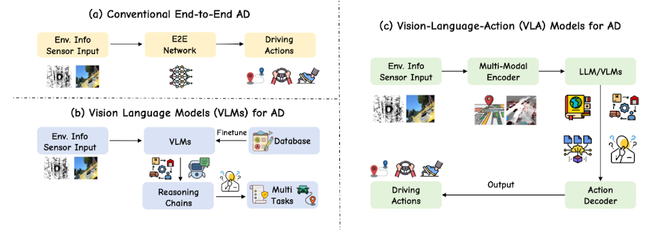

```bash
2. 当前智能驾驶已分化出两条路径。2024 年夏季以来，End-to-End 智能驾驶技术格局发生显著变化，从 2023年“一家独大” 的单一技术路径，正式演进为两大核心路线并行发展的态势。VLA 和世界模型并不是完全对立，而是两条目前并行发展的技术路线。其中，

1️⃣ 第一条路线为以“视觉 - 语言 - 行为”(Visual-Language-Action,VLA)链路为核心的架构体系，VLA 适合快速选代兼容现有量产平台，短期内易于落地。
1）VLA架构的技术逻辑遵循 “感知-理解-决策-控制” 的全链路语义化转化，其核心流程可拆解为四步:
  ·首先通过图像传感器完成环境感知与图像识别；
  ·其次将视觉感知结果转化为可被大语言模型理解的语言 Token(如“前方 50 米有静止车辆”“当前车道为潮汐车道”);
  ·再由大模型基于语言 Token 生成符合人类驾驶逻辑的驾驶建议；
  ·最后将抽象建议转化为 具体的车辆控制轨迹，并通过实时反馈机制进行动态校正。
```
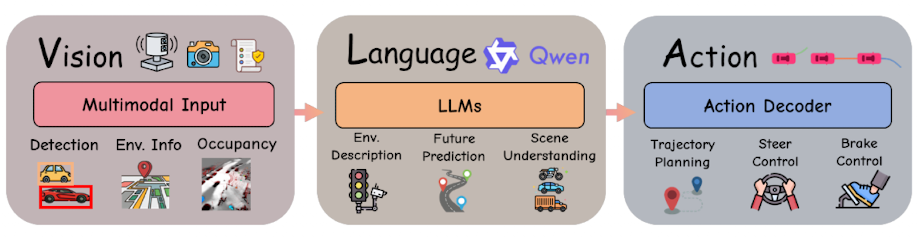
```bash
# 架构： 环境信息输入 → 多模态编码器 → LLM/VLM → 动作解码器 → 驾驶动作。
a.多模态输入与语言指令 (Multimodal Inputs and Language Commands)
    视觉数据 (Visual Data)： 视觉是自动驾驶系统的核心输入。技术已从早期的单前视摄像头发展到如今的多摄像头环视系统。原始图像可以被直接处理，或转换为鸟瞰图（BEV）等结构化表示，以辅助空间推理。
    其他传感器数据 (Other Sensor Data)： 为增强空间感知能力，系统还融合了多种传感器。包括用于精确3D结构的激光雷达（LiDAR）、用于速度估计的雷达（RADAR）、用于运动追踪的惯性测量单元（IMU）以及用于全局定位的GPS。方向盘转角、油门等本体感知数据也愈发重要。
    语言输入 (Language Inputs)： 语言输入的形式日趋丰富，其演进路径如下：
        直接导航指令：例如“在下一个路口左转”。
        环境查询：例如“现在变道安全吗？”。
        任务级指令：例如，用自然语言解析交通规则或高阶目标。
        对话式推理：最新的研究已支持多轮对话和基于思维链（CoT）的复杂推理，甚至包括语音指令输入。
b.核心架构模块 (Core Architectural Modules)
    视觉编码器 (Vision Encoder)： 该模块负责将原始图像和传感器数据转换为潜在表征。
        通常使用如 DINOv2 或 CLIP 等大型自监督模型作为骨干网络。🚩<Model1> 
        许多系统采用 BEV投影技术，或通过 点云编码器（如PointVLA）来融合3D信息。🚩<Model2>
    语言处理器 (Language Processor)： 该模块使用预训练的语言模型（如LLaMA2或GPT系列）来处理自然语言指令。
        通过 指令微调 或 低秩适应LoRA 等轻量化微调策略，可以高效地让模型适应自动驾驶领域的特定知识。🚩<Model3>
    动作解码器 (Action Decoder)： 该模块负责生成最终的控制输出。其实现方式主要有三种：
        自回归令牌器：将连续的轨迹点或离散的动作（如“加速”、“左转”）作为Token，并依次生成。
        扩散模型头 (Diffusion heads)：基于融合后的特征，通过采样生成连续的控制信号。🚩<Model4>
        分层控制器：由一个高阶的语言规划器生成子目标（如“超车”），再由一个低阶的比例-积分-微分控制器（Proportion Integral Differential，PID）、 模型预测控制（MPC）等车辆控制器来执行具体轨迹。
        【多Model的输出 -> controler的输入-> 👇】
c.驾驶输出 (Driving Outputs), VLA模型的输出形式反映了其抽象层次和操作目标
    低阶动作 (Low-Level Actions)： 一部分VLA4AD系统直接预测原始控制信号，如方向盘转角、油门和刹车。
        这种方式优点是可以输出更精细的控制，但对感知误差敏感，且缺乏长远规划能力，并且不同车型的可拓展性较差。
    轨迹规划 (Trajectory Planning)： 另一些VLA自动驾驶研究输出预测轨迹或路径点。
        这种方式具有更好的可解释性和拓展能力，可以由下游的MPC等规划器灵活执行。它使得VLA模型能够进行更长时程的推理，并更有效地整合多模态信息。
d.代表性工作、数据基准
    📑《A Survey on Vision-Language-Action Models for Autonomous Driving》

2）技术路线核心特征和痛点问题
技术落地：3D中间表征、长时序记忆、多模态融合（视觉、运动、语义等多源信息
Q1 多源数据的时序同步与时空一致性: VLA模型的有效运行依赖多源信息(如摄像头、雷达、语音指令)的时序同步与时空对齐。
    但在实际工程中，不同传感器的采集频率和延迟存在天然差异，如视觉帧率高、语音输入低频，导致特征对齐时易出现时间错位和空间漂移，严重时可能干扰下游决策逻辑。
    为此，产业界正在探索基于时空对齐优化的跨模态特征融合策略，如引入动态缓存机制、模态对齐层或中间对齐表征，以缓解多源异步问题。但这一过程对系统架构设计、算力调度和算法鲁棒性均提出更高要求。
Q2 极端工况下的模型稳定性: 在暴雨、强光、隧道明暗突变等极端环境下，感知模块性能普遍出现显著衰减。
    其技术难点在于如何实现模态间的动态互补机制？
        例如在视觉传感受限时通过雷达与语言引导实现信息补强，
        或在语音识别不稳定时通过视觉和地图信息反向约束决策逻辑；
        同时，如何在复杂工况下保证模态间的置信度判断与自适应权重调整；
Q3 长尾场景的泛化能力: 对长尾低频场景的泛化，例如夜间施工、动物横穿马路等，这些情境往往样本稀缺且分布复杂。
    当前业界普遍通过预训练与迁移学习、语义分解等方式实现视觉一语言的动态耦合，以提高语义映射的准确性与泛化性。
    然而在实际工程落地中仍面临标注噪声、语义漂移和场景偏移等系统性挑战，成为制约大规模落地的核心痛点之一。

2️⃣ 第二条路线则是以物理推演为核心驱动力的世界模型(World Model)路线，世界模型则代表了更底层的认知方式，强调物理规律和空间理解力，适合长期演进。
1) 与VLA架构依赖“语言中间层”的技术逻辑不同，世界模型路线通过绕开语言转化环节，直接将 3D高斯表征、点云等空间感知教据输入大模型，在模型潜空间内完成物理规律推演(如车辆碰撞风险预判、行人运动轨迹预测)，并直接输出车辆控制指令，形成 云端世界引擎 + 车端世界行为模型 的技术架构:
    ·云端世界引擎负责大规模场景的物理规律建模与预训练，
    ·车端世界行为模型则基于实时感知数据进行快速决策。

2）技术研究：
🔔Marble渲染「世界长什么样」，Genie3展示「世界怎么变」，JEPA则探究「世界的结构是什么」。
Li Fei-Fei, 世界模型即界面
    以Marble 为代表，它让人们能够从文字或二维素材，直接生成可编辑、可分享的三维环境。
    这种模式下，「世界」是呈现在VR头显、显示器或电脑屏幕上的那片可供人观看与游走的空间。 3D高斯泼溅
Google, 世界模型即模拟器
    以Genie3 为代表，这类模型能生成连续、可控制的视频式世界，让智能体在其中反复尝试、失败、再尝试。
    像SIMA2 这样的智能体，便可把这类世界当作「虚拟健身房」。
Yann LeCun, 世界模型即认知框架
    以JEPA 为代表，这是一种高度抽象的形式，没有像前两种一样可供人欣赏的画面。
    在这里，关注点不在于渲染，「世界」以潜在变量和状态转移函数的形式呈现，可以说是机器人完美的训练基地。
📑 Yann LeCun, Li Fei-Fei, Saining Xie 等《Cambrian-S Towards Spatial Supersensing in Video》2511

如果你关心的是如何大规模训练机器人，看英伟达；
如果你关心的是如何让AI真正理解并进入我们的3D生活空间，看李飞飞；
如果你关心的是AI什么时候能拥有像人一样的逻辑推理和规划能力，看杨立昆。

## 机器人技术研究
《具身智能基础学习》https://mp.weixin.qq.com/s/P5Jm7bMhaTHsytHStFbbLg
# 一、三维世界坐标转换
世界坐标系是整个系统的绝对参考基准，通常设定在机器人工作环境中的某个固定点，比如机器人底座的中心或地面上的某个角落。
相机坐标系以相机镜头的中心（光心）为原点，相机的拍摄方向为 Z 轴，X 轴和 Y 轴平行于成像平面。
#### 图像坐标系和像素坐标系都位于二维的成像平面上，但原点位置不同：
图像坐标系的原点在成像平面的中心（即主点/光轴与成像平面的交点），以物理长度（毫米）为单位；
像素坐标系的原点在图像的左上角，以像素（pixel）为单位。
    内参矩阵：3d->2d，由相机物理属性决定；
    外参矩阵：世界坐标系->相机坐标系,描述了相机在世界的位置和姿态；
将前面两步串联起来，就得到了“从世界坐标到像素坐标”的完整投影链路：
    世界坐标 → 外参矩阵 [R|t] → 相机坐标 → 内参矩阵 K → 像素坐标
用矩阵形式表达为：
    深度值 Zc 乘以像素坐标 (u,v,1)T，等于内参矩阵 K 乘以外参矩阵 [R|t] 再乘以世界坐标(Xw,Yw,Zw,1)T,这个公式是整个相机成像模型的核心。
🚩逆向问题：机器人通过相机拍到了一张二维照片，如何推算出物体在三维世界中的实际位置？
    因为在从三维投影到二维的过程中，丢失了一个非常重要的信息：深度（Depth）。仅凭一张普通的 RGB 照片，无法唯一确定物体的三维位置。
    为了恢复深度信息，机器人通常需要借助特殊的硬件或算法：
        双目相机（Stereo Camera）：通过计算两个相机视角的视差（Disparity）来估算深度。
        深度相机（RGB-D Camera）：直接测量相机到物体的距离。常见技术包括：
            结构光（Structured Light）：向场景投射已知图案，通过图案变形计算深度；
            飞行时间（ToF, Time-of-Flight）：发射激光脉冲，通过测量光的往返时间计算距离；
🚩手眼标定问题：相机坐标系和机器人坐标系的相对位置，即相机的外参。
    只有完成了手眼标定，机器人才能将视觉系统识别到的物体位置，准确地转换成机械臂能够执行的运动指令。
    根据相机安装位置的不同，手眼标定分为两种主要模式：
        眼在手上（Eye-in-Hand）： 相机安装在机械臂的末端执行器上，随机械臂一起运动。
            这种方式的优点是相机可以从不同角度观察目标，但相机与基座之间的变换关系会随机械臂的运动而变化。
        眼在手外（Eye-to-Hand）： 相机固定安装在机械臂之外（如天花板或支架上），不随机械臂运动。
            这种方式的优点是相机与基座之间的变换关系固定不变，标定一次即可长期使用。
👀案例：机器人要拿起桌上的水杯。
系统判断水杯位置的过程是一条可以被精确描述、分步验证的坐标变换链：
    首先，世界坐标系里的水杯，经过外参矩阵的旋转与平移，进入相机的视野，这是一个视角转换的过程；
    接着，相机坐标系下的三维点，经过内参矩阵的透视投影，被“压扁”成像素坐标系里的二维坐标
        ——这是正向的感知链路。（至此，机器人完成了“看见”）
    但看见不等于理解。要从二维图像恢复三维信息，必须借助深度相机或双目相机提供的深度值，结合内参矩阵进行反投影，将像素重新升维成相机坐标系下的三维点云
        ——这是逆向的理解链路。
    最后，通过手眼标定，将相机坐标系与机器人坐标系统一，点云中的每一个三维点，被翻译成机械臂基座能够执行的坐标
        ——这是应用的操作链路。
三条链路首尾相接，构成一个完整的闭环。
所以说，当机械臂稳稳抓起水杯的那一刻，本质上是一个坐标，经历了三次精确变换，终于被另一个坐标系下的执行器接住。
```
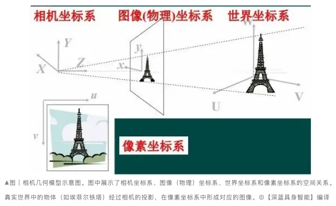

```shell
## 二、李群、李代数、四元数
李群：三维空间中‘合法运动集合；
核心作用，是描述三维空间中物体的“姿态”和“刚体运动”，我们最常用的就是李群中的两个核心成员：
SO(3)（三维特殊正交群，Special Orthogonal Group 3）：
    核心是“纯旋转”，完全不涉及平移，是李群中描述三维空间旋转的核心集合。
    是所有3×3正交矩阵的集合，且每个矩阵的行列式为1，这两个约束条件确保了旋转的合法性：旋转后物体的形状、大小不变，不会出现扭曲、拉伸等不符合物理规律的情况。
SE(3)（三维特殊欧氏群，Special Euclidean Group 3）
    核心是“全套刚体运动”，即“旋转+平移”的组合，是 SO(3)的拓展与延伸，也是描述三维空间中刚体运动最全面的李群。
    用于描述三维空间中刚体的完整运动，如自动驾驶汽车行驶+转向、机器人手臂移动+调整角度。
    例如：机械臂的末端位姿、无人机的空间位置与姿态、相机的外参……所有这些，都是 SE(3) 中的点。

李代数：把“弯曲运动”掰平的“计算工具”
李代数是李群的“配套工具”，对应SO(3)的李代数是so(3)，对应SE(3)的李代数是se(3)。
我们可以用一个生活化的比喻理解二者的关系：
    把李群（SO(3)/SE(3)）比作“球形地球”，地球表面是弯曲的，就像李群中物体的姿态的运动轨迹是非线性的，无法直接用简单的加减、求导来计算；
    而李代数（so(3)/se(3)）就是“平面地图”，它把弯曲的球面（李群）摊平成平面（线性空间），让我们可以用简单的数学运算（加减、求导）来处理姿态和运动。
核心价值的是“线性化”：李群中的运动是非线性的（比如旋转不能直接相加），无法直接用于深度学习的梯度下降、反向传播；而李代数把这种非线性运动转化为线性向量，让智能体的大脑（神经网络）可以轻松计算、优化动作。

👀案例：
比如在自动驾驶的轨迹优化中：
    智能体需要根据路况调整行驶轨迹。轨迹的本质是SE(3)的序列，我们可以通过对数映射将SE(3)转化为se(3)，通过梯度下降优化se(3)向量，再通过指数映射转化回SE(3)，得到符合物理规律的最优轨迹；
比如在人形机器人的运动控制中：
    关节姿态的优化也是通过“李群（姿态表示）→李代数（线性优化）→李群（动作执行）”的链路实现的，确保机器人的动作顺畅、稳定，同时具备自主学习能力。

四元数
是李群（SO(3)）的“便捷存储格式”，李代数（so(3)）是四元数的“优化工具”。
是李群SO(3)的“表达形式之一”（李群里面最常用、最好用的一种姿态写法），用4个数字（1个实部+3个虚部）表示一个三维旋转，是工程实践中最常用的“姿态存储格式”。

👀案例：
在具身智能的实际应用中，三者的转换是高频操作，操作路线非常清晰，我们用通俗的流程来描述：
    1.智能体感知到当前姿态，比如相机拍摄方向、机器人手臂朝向，用四元数存储这个姿态；
    2.当需要优化姿态，比如调整相机角度、修正机器人手臂位置时，先将四元数通过对数映射转化为so(3)（线性向量），在so(3)空间中做梯度下降、误差计算，完成优化；
    3.优化完成后，将so(3)（旋转增量）转化为四元数，更新智能体的姿态，确保姿态符合SO(3)的规则（合法旋转）。这一步需先通过so(3)的指数映射将ω转化为旋转矩阵R，再结合四元数与旋转矩阵的转化公式，得到对应的单位四元数。
    4.智能体执行动作时，四元数对应的姿态就是SO(3)中的一个合法旋转，保证动作符合物理规律。
在自动驾驶中，
    汽车的姿态用四元数存储，避免万向锁【传统姿态表示方法，如欧拉角】和存储冗余；
    当需要优化行驶轨迹、修正车头方向时，将四元数转化为so(3)，通过梯度下降优化旋转增量，再转化回四元数更新姿态，确保姿态符合SO(3)的规则，既保证了计算高效，又保证了物理合理。

只有让智能体既“符合物理”（遵循李群规则），又“会学习”（借助李代数优化），才能真正实现从“虚拟智能”到“行动智能”的跨越。

## 三、黎曼流形和切空间下的运动
# 黎曼流形：自带物理约束、局部平直、整体弯曲的状态空间
黎曼流形：负责存储智能体的绝对状态（当前位姿、关节角度、动作状态）；
切空间：负责计算智能体的相对变化（下一时刻的增量、运动速度、优化梯度）。
更底层的真相：任何一台智能体的合法状态，都天然落在一个弯曲的流形上，无一例外。
当我们把物理约束当成优化问题的“附加条件”时：在平直空间里算，算完了再打补丁，补丁不够再加
    ——这是“欧式补丁思维”。
而如果我们把物理约束变成空间的“内建结构”：流形定义即合法性边界，切空间计算即保约束更新
    ——这是“流形原生计算”。

## 四、跑通具身控制的最小闭环
强化学习的几个核心特质：
    没有人工标注的标准答案，智能体仅依赖环境反馈自主迭代；
    行为选择与奖励结果之间存在延迟因果链；
    持续探索与利用已学知识的动态平衡。
强化学习提供了“在试错中学习”的计算框架，
    MDP与策略梯度为这一框架赋予了数学可解性；
    PPO通过截断机制解决训练稳定性问题;
    SAC通过最大熵原则赋予策略环境鲁棒性。
事实上，RL的理论框架已建立数十年，至今仍是“首选”，并且已从单一算法迭代走向多技术融合：
    大模型+强化学习，由LLM完成高层任务语义分析，RL负责底层硬件精准控制，实现复杂语义到物理动作的落地；
    多任务统一策略训练，单个模型可同时适配行走、抓取、避障等多元任务；
    无奖励自驱动学习，依托内在好奇心奖励实现智能体自主探索，摆脱人工设计奖励的局限。

## 五、齐次坐标与齐次变换 
具身智能的本质，是让AI智能体扎根三维物理世界，完成感知、定位、规划、控制的全闭环。
不管是自动驾驶车辆的行驶轨迹、人形机器人的肢体运动，还是无人机的空间姿态调控、机械臂的抓取作业，背后都在重复一件事：
    三维空间刚体的坐标变换。
核心工程结论：具身智能、机器人、自动驾驶算法中，位置点固定 w=1，方向向量固定 w=0，严格区分两类物理量的变换特性。
```

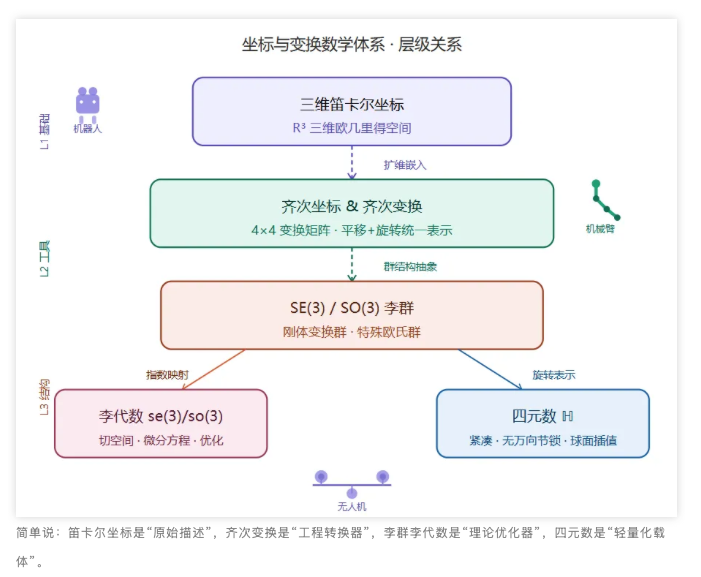

```shell
## 六、机器人运动控制完整pipiline
强化学习闭环。
把强化学习想象成训练一只小狗，你不会告诉小狗“先抬左前腿 30 度，再收缩右后腿肌肉”，而是给它一个指令，当它做对了，你就给一块肉干（奖励）；做错了，你就轻轻拍它一下（惩罚）。
在机器人领域，这个过程被抽象成了四个核心要素：
    1. 观测 o_t（Observation）：智能体传感器采集的局部状态观测，包含关节角度、角速度、机身倾角、地形高度图、相机视觉等，对应 POMDP 局部观测空间；
    2. 动作 a_t（Action）：策略网络输出的控制指令，具身场景多为连续动作空间；
    3. 环境E（Environment）：物理仿真引擎 / 真实物理系统，依据机器人动作求解动力学方程，输出下一时刻观测o_t+1；
    4. 即时奖励 r_t （Reward）：基于任务指标量化的单步收益，用于指导策略迭代优化。
智能体核心载体为深度神经网络参数化策略pai(at|ot)，训练目标为最大化折扣累积回报lambd·r_t+k，lambd 属于[0,1]为折扣因子。
完整训练过程为循环执行交互采样、梯度更新，通过大量试错迭代收敛至最优策略
    ——这个过程，就是策略（Policy）的训练。
机器人强化学习的pipeline为分层控制，如下图所示：
    高层：DRL 策略网络（大脑）
        输入传感器观测o_t，输出目标关节位置q_t
        这是通过强化学习训练出来的神经网络。它的运行频率通常是 50 Hz（每秒做 50 次决策）。
        它根据传感器传来的数据，思考一下，然后给出一个宏观的指令，比如：“所有关节移动到这个新的目标角度”。
    低层：PD 控制器（小脑/脊髓）    
        如果让神经网络直接控制电机输出多大的力矩（扭矩），不仅训练难度极高，而且一旦遇到突发干扰，机器人很容易失控摔倒。
        因此，主流的做法是让神经网络只输出“目标位置”，然后交给底层的 PD 控制器（比例-微分控制器）去执行。
        PD控制器运行频率极高（通常在 200 Hz 到 1000 Hz 之间）。它就像机器人的脊髓反射一样，实时对比“当前关节角度”和“目标关节角度”，然后计算出电机需要输出多大的力矩。
```


```shell
# PPO：PPO(Proximal Policy Optimization，近端策略优化) 
    在每次更新神经网络时，都会把“新策略”和“旧策略”做个对比。
    如果它发现新策略相比旧策略变化太剧烈，它就会强行把更新幅度“截断”，限制在一个安全的范围内。
这就好比教练在教运动员，每次只允许纠正一点点动作细节，绝不允许推翻重来。
重点解决了：机器人仿真内的训练稳定性。
# 教师-学生（师生蒸馏）架构
仿真世界中：
    机器人可以轻易知道地形的确切高度、地面的摩擦系数、甚至自己重心的精确位置。
    我们把这些真实世界中很难获取的数据，称为特权信息（Privileged Information）。
真实世界中：
    机器人只能靠自己身上的相机和惯性传感器（IMU），不仅视野有限，数据还充满了噪点。
# 奖励函数，调教机器人
算法是引擎，奖励就是方向盘，机器人最终走成什么样，全看你奖励什么、惩罚什么。
    以四足机器人为例，早期研究中，工程师们为了让机器人走得像狗，会把狗的动作录下来，强迫机器人去模仿（也就是模仿学习）。


《跨本体泛化的核心挑战》
    跨本体泛化之难，本质上在于"任务目标相同"与"控制实现相同"之间，并不存在天然的一一对应关系。
·形态与动力学差异是最直观的挑战：
    不同机器人的关节数量、自由度、末端执行器结构各不相同，质量分布与控制频率的差异意味着即使是相同的运动轨迹，在不同本体上产生的物理效果也大相径庭。
·动作与观测空间的不一致则更为深层：
    不同厂商的控制接口（关节位置、速度、末端位姿）和传感器配置千差万别，哪怕相机安装位置偏移几厘米，对依赖视觉的策略来说都可能是灾难性的。
    任务可行域的根本变化意味着同一指令在不同本体上可能对应完全不同的动作序列：灵巧手可以捏取细小物体，而简单夹爪只能推挤或侧面夹取。
    某些任务对特定本体而言在物理上根本无解。
·数据分布的严重不均衡则是长期被忽视的结构性问题：
    现有训练数据高度集中在少数主流平台上，大量长尾本体的数据极为稀缺，导致模型在非主流本体上的泛化能力往往大打折扣。

面对挑战，学术界和工业界目前形成了三条主流技术路线，分别从不同的抽象层次尝试解决这一问题。
·隐空间对齐-在抽象层寻找共性
    不同机器人虽然形态各异，但它们与物理世界的交互在更抽象的表示层面上是共通的。
    代表性工作： 银河通用机器人（Galbot）联合北京大学等机构提出的 LDA-1B（Latent Dynamics Action Model）。
        ～该模型构建多模态扩散框架，在语义一致性较强的视觉特征空间（如 DINO 隐空间）中联合建模策略、正向动力学、逆动力学和视觉预测。
        ～DINO 特征能够过滤掉不同本体外观上的冗余差异，让模型更聚焦于任务相关的物理规律，而不是被外观差异所干扰。
        ～低质量数据主要参与动力学预测，高质量数据才参与策略学习。
    局限在于：
        隐空间的对齐效果高度依赖预训练数据的覆盖广度；
        一旦新本体形态与预训练数据差异过大，对齐效果可能大幅下降；
        隐空间的黑箱特性也使得调试和理解模型失败原因变得更加困难。
·视频模型统一-用世界预测指导动作，即备受关注的世界动作模型（World Action Model, WAM）路线。
    不同机器人的动作接口千差万别，但它们完成任务时世界的视觉变化是共通的。
    这类方法通常将动作学习从密集状态-动作模仿转变为逆动力学范式：先预测未来的视觉变化，再从中反推应执行的动作。这使得模型能够从非重复性的异构轨迹中有效学习，而无需大量针对特定任务的重复演示。
    代表性工作例如 NVIDIA 等机构推出的DreamZero，蚂蚁集团提出的 LingBot-VA，走向更大规模的预训练。
        DreamZero：WAM模型以 语言指令和当前观测 为条件，通过自回归扩散Transformer联合生成未来帧序列与动作块，并通过解耦视频/动作去噪调度、系统级并行与缓存等推理优化实现约7Hz的闭环控制
        LingBot-VA：其核心设计是通过混合专家 Transformer 架构将视频和动作 token 交织在同一自回归序列中，并结合因果注意力掩码、KV 缓存持久化和异步协调推理，实现因果一致的长时程闭环控制
    局限在于：
        视觉上相似的动作结果，在底层可能需要完全不同的力矩控制；
        高频视频-动作联合生成对推理延迟提出了极高的工程挑战；
        视频生成模型在高精度操作（如毫米级精度的插拔任务）上的控制精度，目前仍有待进一步验证。
·动作空间标准化-从基础设施做起
    通过统一数据格式和动作表达，从根本上解决数据碎片化问题；
    代表性工作：Google DeepMind 牵头、联合多家机构发起的 Open X-Embodiment 项目。
    局限在于：
        不可避免地丢失各机器人独有的控制细节和动力学特性。
        数据分布的严重不均衡也使得模型对长尾本体的泛化能力有限。
        它解决的是"能不能一起训练"的问题，并不等同于完全解决了"能不能自然泛化"的问题。
@@ 未来：
    以动作空间标准化构建统一的数据协议，以视频模型统一路线提供丰富的视觉世界先验，再以隐空间对齐实现精细的动力学建模。
    操控策略逐步习得形态共通的物理规律，并借由结构化先验与快速微调，持续逼近形态无关的操控能力。
```

### (人形)机器人 (Humanoid) Robot
```bash
🤖 ➡️ 理解世界+执行复杂操作动作

1️⃣ knowledge/PRCV2024-大模型驱动的具身智能人形机器人-湖南大学王耀南院士.pdf

2️⃣ 技术发展
·VLA技术的应用，同上👆
·与AD的区别：
  控制难度：机器人的行走、保持平衡等动作，控制难度高于汽车；
  感知：主要为RGB、深度、触觉、力矩、指尖传感器等特殊传感器，需要更强的几何和物理理解；
  执行任务类型：抓取、灭火等复杂任务，强依赖物理交互，侧重“操作与交互”；
  语言能力：精准理解指令，意图推理，多步规划；
  实时：容错率略高；
  数据来源：仿真模拟器大规模生成，Sim2Real难；👇
🚩<Data1>
·可自建的仿真模拟器: Unity3D引擎  -https://unity.cn
                  Blender -https://www.blender.org/download/, 
·已有的仿真/Control平台:
a.无人机飞行 
    AirSim -https://microsoft.github.io/AirSim/ 
    PX4_Gazebo -https://zhuanlan.zhihu.com/p/337919677
b.机器人控制系统 
    ROS2: https://www.ros.org/blog/getting-started/#  可模拟navigation stack、move_base、collision avoidance等
·其他关于Vision-language的公开研究数据集
    EGO-EXO4D：https://ego-exo4d-data.org/#
    LEMMA：https://sites.google.com/view/lemma-activity

3️⃣ knowledge/具身智能与自主测图-华东师范大学李军院士.pdf，20251203

4️⃣ 20251106CCF会议：TF73 具身智能机器人的大模型与应用研发，20251220
1.机器人及行业应用最新事件-联想研究院副总裁毛世杰
    图灵在70多年以前就已经洞见；
    GPT通过图灵测试、自动驾驶、具身智能投资热点
    机器人的发展： 产线机械臂- 扫地机器人- 泛化Robot3.0 开放环境和多任务 -> Robot4.0通用任务（正在ing
    传统AI驱动（CNN、SLAM）-> 基础大模型（RL、LLM、VLA。。)-> 世界模型
    ·本体： 机器人
        轮足、六足（稳定性和负载，极端地形和超级负重）、人形（可控环境下的交流互动）
        设备适配：人机协同、多机协同
    ·AI： 模仿学习、强化学习
        小脑-RL 自主运动控制
        大脑-三维空间，自主任务学习与规划，分割与识别、SLAM建图与定位、实时构建地图 -> VLN级别的任务规划
        数据-行业数据：海量缺陷数据（大小模型融合）、正样本数据（开放环境的异常检测）、扫描三维模型（困难场景的定位导航，如长廊、管道）
    ·应用： 眼睛、脚、手
        巡检巡逻、应急救援的及时任务、教育实训
        🔧Daystar World deploy：基于空间智能的部署工具（仿真搭建工具）
            例如，变电站Daystar Inception：三维建模-地图-虚拟环境中 完成机器人部署 
                南极科考、公安巡逻
    挑战：跨界努力、泛化工作、鲁棒性、世界模型

2.神经符号推动工业机器人的具身实践-Intel中国研究院王志刚研究员
    落地阻碍： 可靠性不足、数据稀缺
    方法： 神经+逻辑符号，取长补短的来解决上述阻碍
    应用背景： 移动单臂机器人完成废旧电池的拆解
    大脑自主规划：任务规划，PDDL（规划域定义语言）来定义机器人技能，借助LLM完成
        感知-规划-执行，验证和持续学习
    小脑运动规划：MPC、NN，encoder-decoder架构，知识注入NN
        见下图1，静力学、动力学、臂力角等运动控制的知识注入NN，能更有效，或跟VLA、RL等结合
    机器人本体：目前的机器人都是先知后行而非知行合一，因此会产生sim2real的gap。所以应该追求‘现场学习’！
        安全机制、闭环反馈、灵活切换/扩展
    瑞士军刀虽然很酷，集成了剪刀✂️、螺丝刀🪛等，但某些程度上还是选择使用单🔧！

3.具身智能机器人落地挑战-银河通用机器人公司合伙人史雪松博士
    落地困难： 实验室demo(单一场景、单次任务)、真实需要多样化和长期运行
        本质上还是缺：机器人数据-三维场景、动作轨迹（关节控制指令等）等数据非常稀缺；
            花钱采数据可行？Telsa-上百人遥操团队、𝞹0-超一万小时的训练数据
            另辟蹊径 Sim to Real: 合成-训练-应用，gap太多了，阅读论文吧
            如果有10亿条数据会怎样？光照、平面位置、高度、背景、类别泛化的能力非常重要！不会overfitting到某一场景。
               Scaling Law 真需要这么多数据？实验结果确实是这样，1B数据才够
            GraspVLA 基础大模型举一反三，后训练事半功倍，就100条数据
        机器人实战路线，见下图2
    走向真实世界，双臂操作，银河太空舱
```
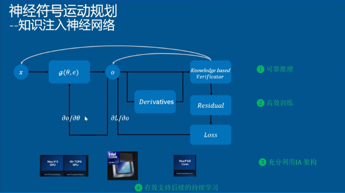
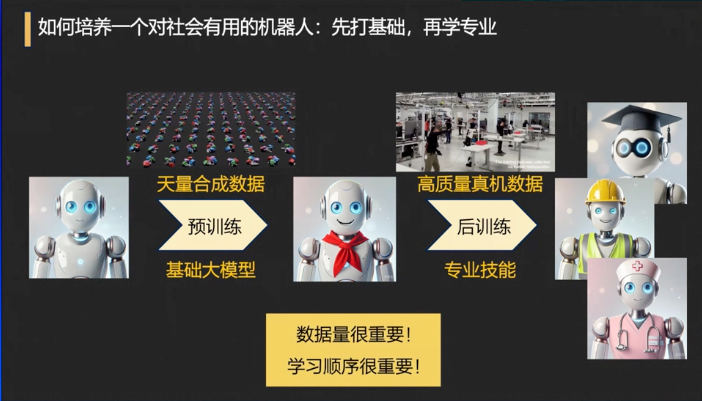

```bash
5️⃣ 市面机器人
小尺寸：
首选：宇树 G1，https://www.unitree.com/cn, 价格区间17W左右 
    开源平台：https://www.unitree.com/cn/opensource （github社区活跃 
    案例：人形机器人盲走和奔跑-https://www.bilibili.com/video/BV1mzigBAELZ/?share_source=copy_web&spm_id_from=333.788.comment.all.click&vd_source=2e19e27822584d7184e3aae2a14bc040
        导航-https://github.com/AnjieCheng/NaVILA
        VLP动作-https://vlp-humanoid.github.io/
    部署流程：https://blog.csdn.net/qq_28912651/category_12994324.html

次选：加速进化，https://www.booster.tech/zh/,价格区间9W左右
    开源平台： https://github.com/BoosterRobotics （github社区活跃 
    论文研究有室内活动如打乒乓球、游戏、行走、足球

全尺寸：
首选：逐际动力, https://www.limxdynamics.com, 不同型号价格区间为16W、30W、70W左右
    开源平台：https://github.com/limxdynamics/
    案例：爬楼梯-https://www.bilibili.com/video/BV1UdiEBWEGg/?spm_id_from=333.1387.homepage.video_card.click&vd_source=8f43c3a38f673faa87fc5770fa2e2e30

次选：天工 , https://x-humanoid.com/detail/jstg.html, 不同型号价格区间为40W、80W左右
    开源平台：https://github.com/Open-X-Humanoid/  （github社区活跃
    案例：电控柜质检操作-https://x-humanoid.com/yncj.html

再选：智元 ,https://www.zhiyuan-robot.com, 不同型号价格区间为10W、20W、45W
    案例：零部件产线部署-https://www.zhiyuan-robot.com/article/188/detail/119.html

其他国产机器人：
松延动力: https://noetixrobotics.com
星海图机器人:https://galaxea-ai.com/cn/products/R1-Lite
```

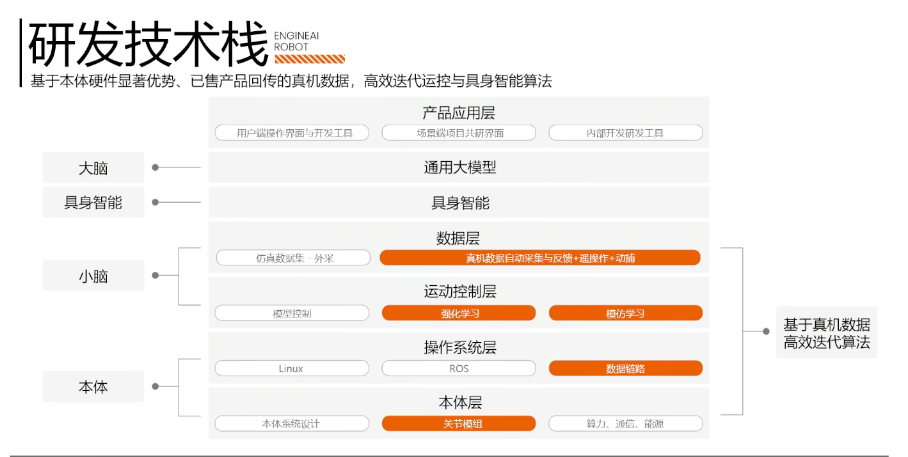

```bash
6️⃣机器人开发技术栈 20250115
来自 星海图联合创始人-许华哲
1.具身智能包含边界，从 底 到 上：
    核心零部件层：电机、本体结构件等
    整机层：拼接零部件，保证重心稳定、耐久度等
        -> 机械工程师
    系统HADAS层：感知模块、运控模块等模块的接入
    ROS层：收发信息
    软件与智能模块层：传统运控（使手臂丝滑，比如给予模仿学习/强化学习的智能模块。这些模块输入-图像、触觉等感知输入，输出-抓取水杯，捡东西等动作；
    大脑规划层：之前基于rule，现在一般为VLM，负责任务的分拆和规划等长程任务
    外接：数据采集的遥操系统   
最后构成数据驱动的智能系统
2.具身智能技术栈
    技术方案：多模态大模型VLA+动作模块，常用的为 Transformer架构+diffusion/auto regressive 目标函数
    数据：最难采集
3. 人形机器人
    适合探索的具身通用形态之一，但激进（难做）又保守（能行）
    适合场景：需要劳动力，人可做但不想做
4.一脑多形？一脑一形？
    终局为：一脑多形，1m2,1m6,1m8
    起点为：一脑一形

------

具身智能 = 视觉/触觉感知输入 + 算法决策（大模型/世界模型/强化学习） + 物理机械反馈执行
《Aligning Cyber Space with Physical World- A Comprehensive Survey on Embodied AI》
感知：交互感知 + 决策：大脑处理  + 执行：控制指令，协调部件运动
业界具身智能大模型在实验室研发阶段，
    机器人通过视觉大模型对环境理解，
    语言大模型对任务进行分解，
    具身大模型生成机器人可执行的行为轨迹及代码。
大模型让机器人在环境交互感知、自主规划、决策、行动方面有质的飞跃。

1.具身感知:理解场景、预测和执行
    传统机器人的模式识别主要识别图像中的目标。具身感知的智体必须在物理世界中移动并与环境互动，需要对 3D 空间和动态环境有更透彻的理解。
    具身感知需要具备视觉感知和推理能力，理解场景中的三维关系，并基于视觉信息预测和执行复杂任务。
        主动感知：具备基本能力，如状态估计、场景感知以及环境探索。这些能力在 
                Visual SLAM（定位、建图）、3D场景理解（区分目标语义，确定其位置，并从3D场景数据中推断出几何属性）、主动探索（与环境交互、改变观察方向） 的领域中进行研究。
        被动感知：
                3D视觉定位 （visual grounding） ：方法分为 两阶段（检测后匹配）、单阶段（整合目标检测和特征提取，并由语言查询引导）
                VLN：要求机器人理解复杂多样的视觉观察，同时解析不同粒度的指令。
                    输入：视觉信息、自然语言指令。
                        视觉信息：可以是历史轨迹视频，也可以是一组历史-当前观测图像。
                        自然语言指令：则包括智能体需要抵达的目标位置，或预期完成的任务要求。
                    输出：Action=M(O,H,I) Action是所选动作或一组候选动作，O表示当前观察值，H表示历史信息，I表示自然语言指令。
                    方法：记忆理解（主流）、未来预测（世界模型多用）
2.具身决策/智体：（一个/多个大模型）
    智体被定义为能够感知环境并采取行动以实现特定目标的自主实体。大模型进一步扩大了智体在实际场景中的应用。
    多模态大模型的智体被具身化为物理实体时，能够有效地将大模型能力从虚拟空间转移到物理世界，从而成为具身智体。
    为了完成任务，具身智体通常涉及以下过程，
        1）将抽象而复杂的任务分解为具体子任务，即高层具身任务规划。
        2）利用具身感知和具身交互模型，逐步实施子任务，即低层具身行动规划，
3.具身交互/执行
    任务回答：
        ·智体在物理或模拟空间中与人类和环境互动的场景。e.g. 具身问答任务中，智体需要从第一人称视角探索环境，收集回答问题所需的信息；
        ·具有自主探索和决策能力的智体，不仅要考虑采取哪些行动来探索环境，还需决定何时停止探索以回答问题。
        指标：导航、问题回答
    具身抓取：
        ·根据人类指令执行操作，如抓取、放置目标；需要语义理解、场景感知、决策执行、控制规划。
        ·具身抓取方法将传统机器人运动学抓取与 LLM/VLM/MLM 等大模型结合，使智体能够在多感知器下执行抓取任务。
4.主要的技术路线
# OpenAI分层决策，例如Figures AI （Physical intelegence）
    ·high-level planer 多模态大模型感知决策同时实现，模型整合任务、环境和本体感知信息；
    ·low-level policy 使用 RL 模型作为具身模型，实现从大模型的环境感知到动作的规划；
    ·最后，传统运动控制算法 whole body controller 输出机器人控制的力矩实现最终动作。
优点为逻辑清晰；
缺点为不同步骤融合不一致
```
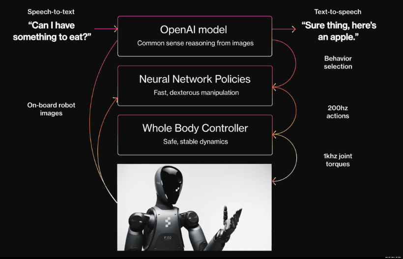

```bash
# Google 端到端 ，PaLM-E:
    ·先在大规模互联网数据上预训练 VLMs，然后在机器人任务上微调。
    ·输入是任务和对象的组合，输出是一系列动作。
    ·利用大模型完成从输入到感知、推理、决策和行为指令输出的全过程。
优点为减少误差传递，能力涌现；
缺点为海量数据，调用大模型资源消耗

硬件、算法、数据
```

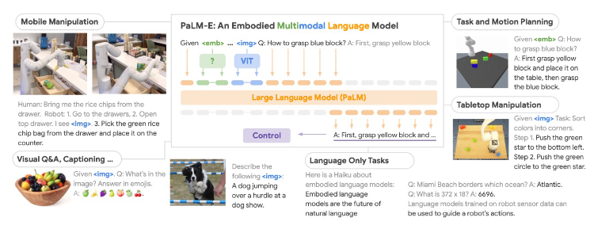
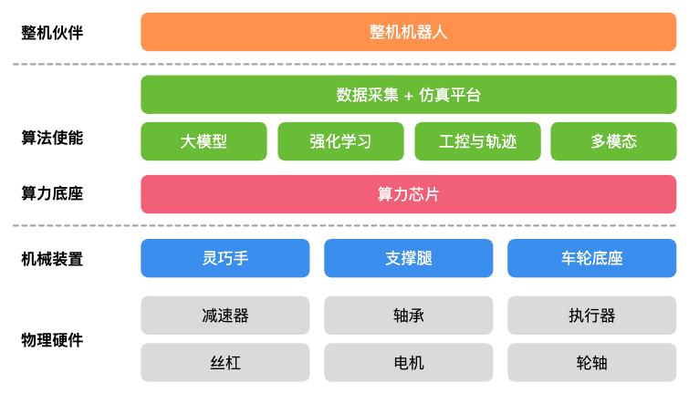


```bash 
B站视频解析
1. 投研部杨摸鱼 机器人解析 -《机器人产业链研究.PDF》
# 运动系统：身体结构件、关节、电机、减速器、丝杆等组成自由度(DOF,Degree of Freedom,表示活动关节）
`旋转关节=电机+减速器，完成旋转运动 ，比如特斯拉有14个
`线性关节=电机+丝杆，完成直线运动，比如特斯拉有14个
`灵巧手，比如特斯拉有12个（人手有27个自由度）
    电机：电能->动能，定子+转子
        有刷直流电机 = 定子磁场恒定 + 转子磁场变化、无刷直流电机 = 转子磁场恒定 + 定子磁场变化
        同步交流电机，异步交流电机，
        伺服
    减速器：调节转速和扭矩的齿轮组⚙️，方向和力道
        行星减速器、谐波减速器、RV减速器
    丝杆：拧螺丝钉就是 旋转->直线
        滑动丝杠、行星滚珠丝杠
# 感知系统：机器视觉、传感器、激光雷达等
成像原理： 光学系统对图像采集 -> 光信号转换为电信号/数字信号 -> 计算单元对图形进行处理 👇
光学下的三维信息的感知：飞行时间法（Time of Flight，TOF）、激光雷达、多目立体视觉
    本质 计算传感器到物体表面的距离，大量距离信息形成‘点云’
    缺点：大雾天、大雨天下，测算不准确
因此会借助其他传感器，毫米波雷达/超声波雷达 ～= 飞行时间法
商业价值： 镜头清晰度或激光发射光源密度 -> 图像传感器像素 -> 算法算力 👆 比如：
    车企中，毫米波雷达 成熟但不准，500-1k < 激光雷达 好且精准, 但5K-1W ,so马斯克说 傻子才会搞激光雷达，多装摄像头就行。但最近 4D毫米波雷达、激光雷达的迭代🔁 逐渐出现
    机器人中，大家基本五花大门，
        特斯拉有能力搞纯视觉，得力于自研算法和自驾的积累；
        波士顿动力-激光雷达+TOF；稚晖君智元-激光雷达+TOF；小米铁大-iTOF+RGB-D视觉模组；优必选-1个多目视觉+2个RGB+4个超声波传感器
内部传感器：六维力矩传感器 和 IMU惯性测量单元
    算法：大脑 
    IMU：小脑，控制平衡，包括加速度计、陀螺仪、磁力计等。常作为导航系统的补充，提高定位精度
        难点：误差、精度
# 思考系统：AI、算法
# 能源系统：续航问题

# TO, MPC, WBC在机器人控制中的作用和区别
https://zhuanlan.zhihu.com/p/31836362145

2. 硅谷101
人手的反馈闭环，前馈控制+反馈控制：视觉预估重量》初始抓力》触觉检测》是否滑动》调整力度
    大脑：基于视觉、经验、推理，负责规划动作和高层决策
    小脑：基于触觉、力反馈、平衡调整，负责动态微调和协调
六大门派：直驱-简单粗暴、绳驱-接近人体的仿生学、液压-高负载极致力量、连杠-机械美学、混合-学术研究、开源-技术开源
```

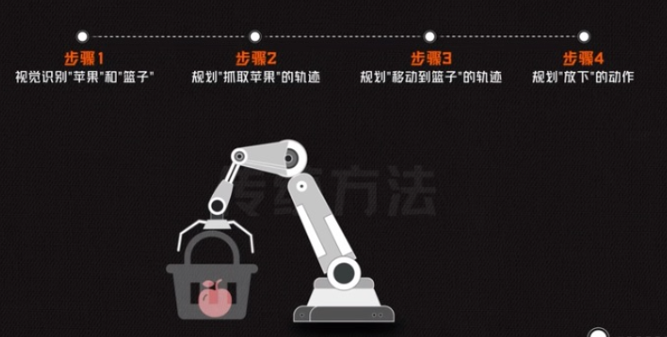
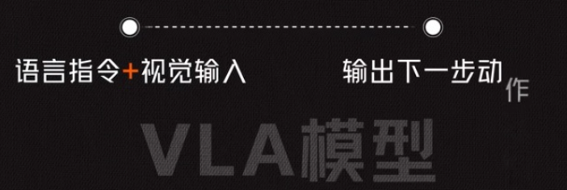

```bash
7️⃣ 近期会议学习
# 2025北京智源大会- 具身智能与人形机器人 0607
1.《世界模型驱动的具身智能研究》 from 清华孙富春
    空间智能，VoxPoser: 视觉 - 语言
    物理规律的理解？应用？
    世界模型为全要素建模：构建内部表征、预测未来状态、反事实推理（相关关系-因果关系
    视觉+听觉+触觉
    沉浸式感知：URDFormer、UniDexGrasp等工作，非常重要‼️
    可研究点：3D感知与建模（NeRF、3D Gaussian)、空间推理与决策、动态交互与操作、移动操作
2.《人形机器人仿生从控制到具身智能》 from 清华赵明国
    被动行走、控制（Model Predictive C、Whole-Body C）
    使 中枢神经系统的运动控制（大脑、小脑、丘脑、脑干、脊髓） 趋于人类的运动控制
    元器件和控制层面可研究优化，VLA等具身智能研究目前还在探索
    智能水平的提升：L0:blinding-locomotion(现阶段大部分), L1:locomotion+SLAM(小部分), L2:locomotion+SLAM+WM, L3 behavior+team work, L4:team+competition
3.《合成数据驱动的具身VLA大模型》 from 北大/银河王鹤
    VLA:端到端多模态大语言模型
    input:language\vision 占比80%\other sensor   output:action（顺时平移动作
    （大脑）实时控制轨迹，反馈回路
    难点1：如何训练？具身大模型可能需要数百亿数据才可以通用和泛化！
        合成仿真数据+Sim2Real
    GraspVLA  基于 1B 穷尽可能性构建合成数据 + 100M web data
        输出标签：2D BBox -> 6D Grasp Pose -> Action
    Uni-NaVid，导航
    OpenWBT：全遥操系统
4.《可泛化操作与运动智能》 from 上海人工智能实验室庞江淼
    合成数据适合：本体泛化、场景泛化；真是数据适合：任务泛化
    数据：SimBox、RoboSplat等具身数据合成，
    模型：
        导航大模型 NavDP、StreamVLN
        操作大模型 Seer（视觉预测指导动作执行）、InstructVLA（保留VLM在机器人操作中的多模态推理能力）
    评测：rank级别的客观评测，GenMani 仿真训测基准
5.《Scaling up Humanoid Robot Learning with internet Videos》 from 北大卢宗青
    互联网视频有人类运动先验，3D pose estimation -> retargeting to robot
    action level必须给到机器人
    MotionLab、HuMo100M, motion tracking policy
    MegoHand、OpenMMEgo（第一人称视角
6.《开放世界具身多模态基础模型与系统》 from 北大zhang仉尚航
    VLA端到端、分层、世界模型
    快慢系统的长程闭关系统：任务规划VLM、区域感知、轨迹预测
    分层：ShareRobot，RoboBrain，RoboBrain2.0、RoboOS、RoboBench(大脑+小脑)、RealBench
    端到端：自回归预测、回归式拟合、扩散头生成，例如HybridVLA、FiS-VLA
7.《视触觉感知的具身智能操作》 from 北邮方斌
    VTLA将为研究爆发点
8.《人形机器人规模化落地的机遇与挑战》from 众擎创始人赵同阳
    有灵魂的机器人
9.《解决具身智能的数据瓶颈》from 清华高阳 
    理解物理世界并与之产生交互
    落地核心为：智能化
10.《慧思开物，通往通用具身智能之路》 from 北京人形机器人创新中心首席技术官CTO 唐剑
    场景泛化能力差、任务泛化能力差、本体泛化能力差
    传统的机器人控制：MPC
    端到端的AI控制：模仿学习、强化学习、VLA实现skill
    具身大脑：自然交互、空间感知、意图理解、**任务规划**、错误反思、记忆管理...
        自主探索：蒙特卡洛树搜索-每条路径对应plan，有得分
            VLM（任务规划的核心） 、世界模型（模拟物理规律）、奖励模型
    具身小脑：具身操作子平台（元技能库、视觉感知、技能调用...）、
            具身运控子平台（全身控制WBC、双臂协作、稳定移动、定位导航...）
    比如：少量真机+比例仿真数据，算法成功性很大(RoboMind )，多任务VLA(Discrete policy)、利用失败轨迹（loss function 权值较低）、三维语义占用感知(RoboOCC)
```

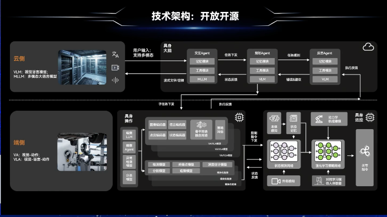
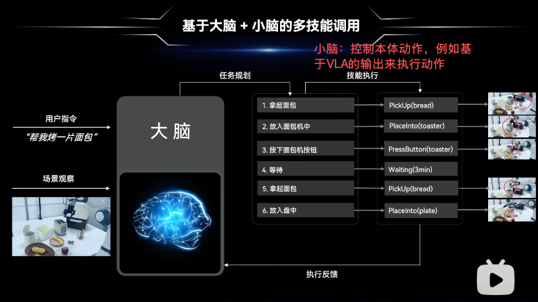

```bash
    技术发展：具身大脑的自主探索与学习、强泛化的全身控制VLA模型、通用泛化的WBC、人形机器人全自主导航（传感器多少个？如何部署？物体重叠？路径规划完的control，如何folw 轨迹？）、移动操作（移动中操作/操作移动物体）、针对柔性/流体/弹性/铰链等物体的物理引擎
11.《圆桌会议》
Q1痛点和解决？
    （高）数据获取方式，比如互联网数据、遥操数据、真机数据等，以及数据质量如何把控？
    （卢） action space的维度统一，比如第一视角下的操作，第三视角下的运动，
    （方）操作，末端智能的通用性，类人？自适应性
    （赵）硬件：问题更明显，因为无法统一，但应该会收敛，比如灵巧手的工作量占一半。且手脑如何协同？低自由度即可。算法：
    （王鹤）以货架为例的grasp，复杂密集任务还是难的。mobile peak palce
    （庞）数据的使用方式，如何学习？自监督？，评测体系
Q2人形机器人，目前还是locomotion和桌面操作为主，移动操作如何做好：
    sim2real难，
    simlutor里做任务、全身遥操也很难，
    落地可能性较大的还是轮式、上肢式， 双足式的短期内还是可能性不大
    人脑手的联动
    还是难的，目前从OpenWBT到更freestyle的活动
    VLA、人形运控、本体（全尺寸就是不灵敏
Q3具身大模型 和 强化学习的结合？
    VLA+RL
    pre-train model必须power
Q4仿真？
    类脑、交互中的进化能力
Q5落地场景
    体力活儿的替代，危险⚠️、岗位竞争问题
Q6仿真数据
    仿真：真机，有recipe吗？本质physical GAP还是大。导航任务里感觉仿真数据足够！
    导航-零样本泛化，确实完全可以！
        ·真实数据有哪些reference? 仿真进行扩增
        ·仿真：真机 基本维持在 1:5 或 1:10的比例下
Q7from新能源工作人员：学术的VLA上泛化可以？工业上VLA是否可支撑？
    车厂为高节拍、高可靠性。所以必须保证 VLA的成功率必须在99.99%以上，先用合成干到99.9，然后真机在干到99.99
    短时间VLA还是不可行，但像低节拍的工作流水线还是可行。必须有反馈！必须有机器人错误的recovery机制！
12.闭幕致辞，from 北大黄铁军
    2045年可能实现 人类守望地球家园，具身AGI探索星辰大海

# 20250714CCF会议 ADL159：具身智能 20260114
听起来有点卡

# 20251205CCF会议： ADL166 世界模型基础与应用
# 1.世界模型的基础问题
# 2.世界模型驱动的具身智能系统
# 构建世界模型的几何表征方法
# 世界模型的3D感知与生成、面向自动驾驶的可量产解决方案、通用人形角色的运动与交互控制策略

# 2025中国具身智能机器人大会EAIRCon 1205
1.数据：仿真、遥操真机、真人数据
2.类人操作：强本体（绳驱）、领先遥操、高效模型（力触、任务规划）-> 场景应用
    B端buisness, C端consumer
3.开源->标准，863计划《考工记》，'天有时、地有气、材有美、工有巧'，OpenLoong
    目前 感知-执行 VLM、VLA等｜ 认知-/执行 ｜ 决策-/执行
4.感知/语义： 专家学习->视觉基础模型 -》VLM+VLA的端到端模型
  规划/决策： 基于模型的控制 MPC->LLM  -》
  操作技能： 专业技能->行为克隆、操作强化学习  -》全身灵巧强化学习
  全身控制： 基于模型的控制 WBC ->全身强化学习  -》
5.灵心-灵巧手，已经实现 ‘一人遥操多机’
6.‘书不尽言，言不尽意’-易经。目标：通用+性能+自主，10-20年内遥操为主，人机比降低
   ** 将知识内嵌到被学习的对象中（引入先验知识、结构）**
7.ALOHA（2023），可作为具身智能的发展开端，预计<=5年（2028）达到成熟期
8.优必选可以实现自主充电；
9.云天励飞是一家芯片企业，参考海外企业的头部做法，例如特斯拉的Otmasta
    大脑：主导语义理解和任务规划
        算法- 负责任务的定义与行为决策，理解物理世界中的关键特征要素，对外界环境和任务需求进行分析和拆解，并将其转化为具体行动指令；
        硬件- SoC芯片（CPU、GPNPU、NPU、GPU、存储芯片，通信芯片等）
    小脑：控制聚焦高频率、高精度的运动执行
        算法- 负责操作执行与运动控制，涵盖目标运动规划、末端执行器控制及全身协调控制等，具有较高的控制频率和严格的实时性要求；
        硬件- 处理器、存储单元、通信接口、传感器接口、执行器接口、电源模块等
    云端、边缘侧、异构SoC
10.赛博格机器人-ToB，重点在于工业负载（腿部电机）， 可持续化部署
    30年后可能实现一人3台：1台家庭照顾，1台出去打工，1台日常出行
    泛化能力：可持续化学习
11.VLA技术路线  👇图
    离散动作表征：机械臂
        将连续动作空间离散化为有限的词元(tokens)，其原理类似于深度学习模型量化，模型能够以自回归方式生成动作序列；
        特点:简单操控、实时性高，兼容LLM序列建模，但引入量化误差
        代表模型:RT-1、RT-2、OpenVLA
    连续动作表征：更多会在人形上体现
        VLA并不是生成token，而是一些列连续的值，比如关节的位置x、y、z
        特点:生成高精度、平滑的动作轨迹(一系列连续动作值)，支持精细控制，但训练复杂
        代表模型:ACT、Octo、π。
    VLA开源数据集：
        Open X-Embodiment(谷歌DeepMind联合全球21家损尖研究机构联合发布)
        AgiBot WorldDataset(智元)
        Galaxea Open-World Dataset(星海图)
    NVIDIA Cosmos： 【https://gallery.pai-ml.com/#/preview/deepLearning/cv/isaac_sim】
        是一个用于加速物理 AI 开发平台，推出系列世界基础模型(可以预测和生成虚拟环境未来状态且具有物理感知视频的神经网络)帮助构建机器人和自动驾驶，为训练下游特定任务的物理Al模型奠定基础。
        Cosmos Reason:实现智能感知与推理
            专为理解运动、物体交互和时空关系而设计的多模态AI推理模型。它根据于物理规律，基于思维链(Chain-of-Thought)推理，根据视频和文本输入，生成清晰、符合上下文的响应
        Cosmos Predict:生成未来世界状态
            基于Transformer架构的模型，专注于根据文本、视频等多种输入来预测未来的世界状态。它能够生成时间上连贯的视频序列，或在给定的起始和结束帧之间进行平滑播值
        Cosmos Transfer:生成基于物理的逼真视频
            核心功能是将结构化的模拟输入(如分割图、深度图)转换为照片级真实感的视频。它采用ControlNet架构，能够在保留预训练知识的同时，通过时空控制图精确控制场景构成、物体放置和运动动态，从而生成与真实世界物理规律对齐的逼真合成数据

12.诺亦腾机器人
    遥操的动作捕捉、数据金字塔（真机少、人类交互、合成多）

8️⃣ 具身智能变革
1.端到端、VLA、世界模型等核心技术的落地现状
    快速迭代阶段 pick and place，自驾技术是有兜底方案，但机器人。。。
    L 其实用处不大，视觉->action
   
```
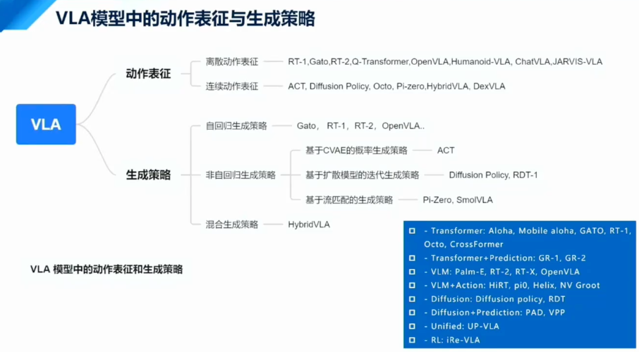
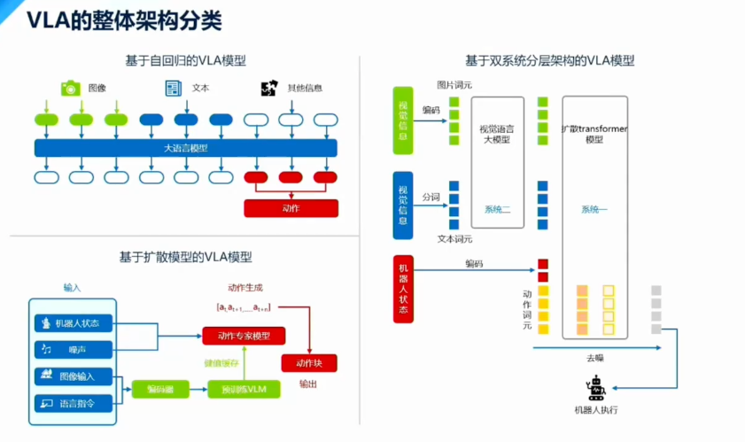

```bash
9️⃣ https://huggingface.co/learn/robotics-course, 
Francesco Capuano, Caroline Pascal, Adil Zouitine, Thomas Wolf, Michel Aractingi (2026). "Robot Learning: A Tutorial".[https://huggingface.co/spaces/lerobot/robot-learning-tutorial]
1.StreamingLeRobotDataset VS LeRobotDataset : 
    StreamingLeRobotDataset allows you to process large datasets without downloading them locally.
    Data is streamed from the Hugging Face Hub without downloading, saving storage space.
2. 数据加载方式：
Basic Behavioral Cloning (learn current action from current observation):
    # Simple: current observation → current action
    delta_timestamps = {
        "observation.images.up": [0.0],  # Just current frame
        "action": [0.0]  # Just current action
    }
    dataset = LeRobotDataset(
        "lerobot/svla_so101_pickplace", 
        delta_timestamps=delta_timestamps
    )

History-Based BC (use observation history for better decisions):
    # Use observation history for context
    delta_timestamps = {
        "observation.images.up": [-0.2, -0.1, 0.0],  # 200ms history
        "action": [0.0]  # Current action
    }
    dataset = LeRobotDataset(
        "lerobot/svla_so101_pickplace",
        delta_timestamps=delta_timestamps
    )
    sample = dataset[100]
    # Images shape: [3, C, H, W] - 3 historical frames
    # Action shape: [action_dim] - single current action

Action Chunking (predict action sequences for smoother control):
    # Predict multiple future actions at once
    delta_timestamps = {
        "observation.images.up": [-0.1, 0.0],  # Recent + current
        "action": [0.0, 0.1, 0.2, 0.3]  # Current + 3 future actions
    }
    dataset = LeRobotDataset(
        "lerobot/svla_so101_pickplace",
        delta_timestamps=delta_timestamps
    )
    sample = dataset[100] 
    # Images shape: [2, C, H, W] - 2 observation frames
    # Action shape: [4, action_dim] - 4 action predictions
3. 大多数机器人技术都涉及通过 ‘控制连接刚性连杆的关节’ 来产生运动。不同机器人领域之间的关键区别在于机器人试图改变的是什么。一个简单的经验法则：问问自己“什么变化最大？”
    如果主要是环境（物体姿态/状态）发生变化，那就是操控。
    如果主要是机器人姿态发生变化，那就是移动。
    如果两者变化紧密相关，那就是移动操控。利用这一点来确定要记录的传感器以及要预测的动作空间。
4. 正向运动学 (Forward Kinematics) ：从关节空间到任务空间的映射（q → p），直接计算比较容易；
   反向运动学 (Inverse Kinematics) ：（反转映射）给定一个期望的手部位置，什么样的关节构型可以实现该位置？一种搜索（p → q），一旦引入工作空间限制、障碍物或关节约束，就会变得复杂。因此当IK难以处理时，我们将转向微分推理（速度）。
5. 经典机器方法 🆚 基于学习的方法
Classical Robotics Approach: Perception → State Estimation → Planning → Control → Actuation
    挑战：每个模块都需要专家进行调优、误差会在流程中累积、难以适应新的任务/机器人、需要精确的世界模型
Learning-Based Approach: Raw Sensors → Neural Network → Actions
    优势：从数据中学习（利用演示和经验）、端到端训练（协同优化整个流程）、跨任务通用化（在不同目标之间共享知识）、适应新的机器人（跨平台迁移洞察）
·强化学习——机器人如何通过试错学习最优行为；
·模仿学习——机器人如何通过观察人类演示进行学习；
·基础模型——大规模模型如何构建通用机器人智能


```
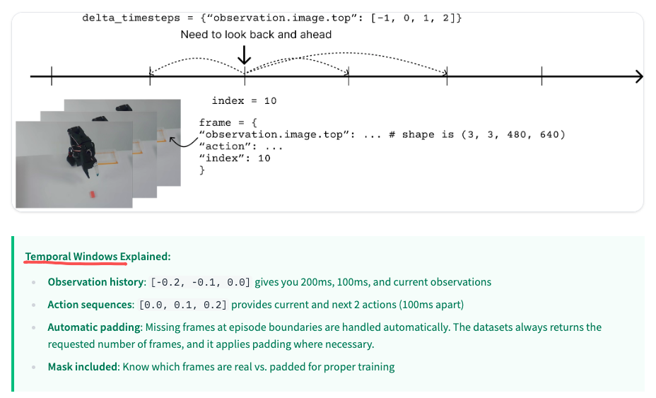
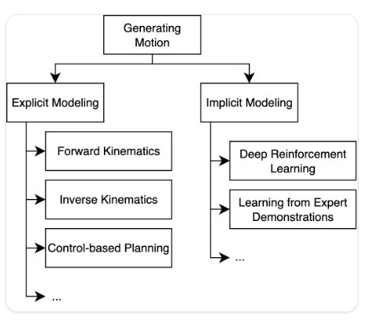


#### 学习
```bash
### 机器人学习
关注的团队，足式：UC Berkly、[mit cheettach](https://biomimetics.mit.edu/)、苏黎世理工、[xbpeng.github.com](https://xbpeng.github.io)、 [Pieter Abbeel](https://people.eecs.berkeley.edu/-pabbeel/)

让大模型去理解世界，让控制理论去丈量世界。这种深度的融合，或许才是通往通用机器人的必经之路

### 论文学习
`PaLM-E: an embodied multimodal language model- ICLR 2023
    https://palm-e.github.io/#demo
`pi_0: A Vision-Language-Action Flow Model for General Robot Control - RSS 2025
    混合数据：pi自己灵巧的操作数据集、网络数据、OXE开源数据。
    流动匹配VLM模型由：组成
        一个较大的VLM主干：由PaliGemma初始化，用于处理图像和文本的输入输出。
        一个较小的动作专家：用于处理机器人的状态和动作。（损失权重称为动作专家）
    优化损失：
        Token相关的连续输出通过‘流匹配损失’监督(P5)
        Token相关的离散输出通过‘交叉熵损失’监督
`pi_0.6: a VLA That Learns From Experience - arXiv 2511
    https://www.pi.website/blog/pistar06
    ** https://github.com/Physical-Intelligence/openpi **
`Mimickit: A Reinforcement Learning Framework for Motion lmitationand Control - arXiv 2510
`AMP`:https://zhuanlan.zhihu.com/p/1933832618782221857
# code
https://github.com/roboterax/models.git
https://github.com/unitreerobotics/unitree_rl_gym.git
https://github.com/leggedrobotics/rsl_rl.git

NVIDIA Physical AI系列 ： https://gallery.pai-ml.com/#/preview/deepLearning/cv/isaac_sim
PAI Physical AI 系列 ：https://blog.csdn.net/weixin_48534929/article/details/160375274 阿里云大数据AI平台


```

### 💡电力巡检项目
```bash
📑/paper/5.《电力具身智能机器人发展白皮书》、《国电南瑞抱臂式输电线路巡检机器人介绍》
1. 现状机遇
Q:可靠性、通过性、通用性、协同性
O:内生需求、技术发展、政策引领、市场规模
1. 关键技术体系
围绕：模型赋予本体智能、本体与环境交互产生数据、数据用于模型训练，
～机器人本体：
    大量通用+少量专用
    突破复杂环境下长期稳定生存的本体、仿生机器人（耐高温可灵活）、步态规划、多模态传感器等
～数据：
    专用真机数据+通用数据，虚实结合具身数据
    ①穿戴设备采集大量人体作业数据，完成对任务执行流程的理解；
    ②构造适量的仿真合成数据，模拟场景作业中的长尾任务；
    ③利用少量的真机数据，用于模型微调。
～模型：
    专用小模型+通用大模型 
    突破多模态感知、异构协同、云-网-端通信等
1. 典型应用
    电力专用机器人、输电线路上塔作业机器人、空地协同异构智能勘灾抢修集群等

相关论文：
📑《DetectiumFire： A Comprehensive Multi-modal Dataset for Fire Understanding》NeurIPS2025
📑

VLA+世界模型：https://mp.weixin.qq.com/s/kv7J95lcyjccJJq9JWZ8SQ?scene=0&subscene=90
```


### SLAM （Simultaneous Localization and Mapping）
```bash
使得机器人能够在未知环境中导航，同时构建环境的地图。这一过程中，机器人需要解决 
    “我在哪儿”-定位 和 “我周围是什么”-建图 的问题。
简而言之，SLAM技术就是让机器人在探索未知环境的同时，进行自我定位并构建环境地图。

1. SLAM技术主要包括两大部分：定位（Localization）和地图构建（Mapping）。
定位：指在已知或未知地图中确定机器人的位置和姿态。
    常用的定位技术有：
        基于滤波的方法（如卡尔曼滤波、粒子滤波）通过不断更新机器人的状态估计来实现定位，
        基于图优化的方法则是通过最小化所有测量值与估计值之间的误差来优化机器人的轨迹。
地图构建：指利用机器人的感知信息（如雷达、相机等传感器信息）来构建环境的地图。
    根据地图的类型不同，可以分为：
        特征地图通过提取环境中的关键特征（如角点、边缘等）来构建地图
        栅格地图则是将环境划分为多个小栅格，并标记每个栅格的状态（如占用、空闲）。

2. SLAM技术流程
2.1 算法的基本流程可以分为以下几个步骤：闭环流程 -> 数据采集-特征提取-位姿估计-地图更新
    感知环境：机器人通过搭载的传感器（如雷达、摄像头）感知周围环境。
    提取特征：从感知到的数据中提取出有用的信息，如特征点、边缘等。
    数据关联：将提取出的特征与已知的地图或之前的观测进行匹配，以确定自身的位置。
    状态估计：利用滤波器或图优化方法对机器人的位置和地图进行估计和更新。
    地图更新：根据最新的位置估计，更新地图信息。
2.2 技术实现
·Gmapping算法
    适用于：它在处理小规模环境时表现出色，能够快速构建出较为准确的地图。
    核心思想：基于粒子滤波器，通过对粒子的不断更新和重采样来估计机器人的位姿和构建地图。
    在工程实现中，Gmapping需要对传感器数据进行预处理，去除噪声和异常值，然后利用粒子滤波器进行位姿估计和地图更新。
·LOAM系列方法 Lidar Odometry and Mapping
    一种高效的实时激光雷达SLAM技术。它通过分离定位（Odometry）和地图构建（Mapping）的过程，以达到既高效又精确的目的。
    适用：针对户外大范围环境的实时三维地图构建和定位，广泛应用于无人驾驶汽车、无人机等领域。
    核心思想：将环境特征分为平面特征和边缘特征，然后独立处理这两类特征来分别估计机器人的平移和旋转。这种方法有效降低了计算复杂度，提高了处理速度。
        特征提取：LOAM首先从激光雷达的点云数据中提取边缘特征点和平面特征点。
        里程计估计：通过比较连续帧之间的特征点，估计机器人的短期运动（即里程计），实现快速定位。
        地图优化：然后，利用提取的特征点对局部地图进行优化，以提高长期定位的精度和地图的准确性。
·Google Cartographer 
    Google发布的一款开源的二维和三维SLAM库，它能够提供实时的地图构建服务。
    适用：具有丰富传感器的移动机器人，如自动驾驶车辆和服务机器人。包括室内机器人导航、自动仓储管理等。
    核心思想：采用了一种基于图优化的SLAM方法，它通过构建一个包含节点（代表传感器数据）和边（代表节点之间的相对位移）的图。通过优化这个图，Cartographer可以同时改进所有节点的位置估计，实现精确的地图构建和定位。
        传感器融合：支持多种传感器数据输入，如激光雷达、IMU（惯性测量单元）、里程计等，能够实现传感器数据的有效融合。
        实时闭环检测：能够实时进行闭环检测，即识别并纠正历史数据中的位置估计误差，保证长时间运行的精度。
        自适应地图构建：根据环境的不同，可以调整地图的分辨率，实现更高效的地图构建。

3. SLAM类型
《LiDAR, IMU, and camera fusion for simultaneous localization and mapping: a systematic review》
传感器类型 -- SLAM
    2D 激光雷达、3D 激光雷达 -- 激光 SLAM，应用eg.扫地机器人
    单目相机、双目相机、RGB-D相机 -- 视觉 SLAM
    相机+IMU -- 视觉惯导 SLAM(VLO)
    激光雷达+IMU -- 激光惯导 SLAM(LIO)

硬件选型：https://zhuanlan.zhihu.com/p/1899828540989510765
    对于对精度要求较高、环境较为复杂的场景，如无人驾驶、机器人导航等，可以选择激光雷达作为主要传感器；
    对于成本敏感、对环境感知要求不高的场景，如智能家居、消费级机器人等，视觉传感器是一个不错的选择；
    但目前，激光 - 视觉 - IMU 多传感器融合是技术的研究热点，技术路线有紧耦合【将激光雷达、视觉传感器和IMU的数据在底层进行融合，共同参与位姿估计和地图构建】和松耦合【将各传感器的数据分别进行处理，然后在高层进行融合】
        例如，自动驾驶场景中，多源数据互补优势明显：
            激光雷达能够提供高精度的距离信息，适合用于构建地图和检测障碍物；
            视觉传感器可以提供丰富的纹理和语义信息，有助于识别交通标志和行人；
            IMU能够提供实时的运动信息，在传感器数据丢失或不准确时，辅助进行位姿估计。
        通过将这三种传感器的数据进行融合，可以提高自动驾驶系统的环境感知能力和定位精度，确保行车安全。


算法框架介绍：以 视觉SLAM 为例，如下图所示，主要包括：
    传感器信息读取、*前端（里程计）*、*后端*、回环检测、建图。
    需要说明的是，不同类型的SLAM技术仅在前端的处理有所不同，后端所采用的优化算法都是通用的。
    主要技术：ORB-SLAM3、VINS-Fusion等
```

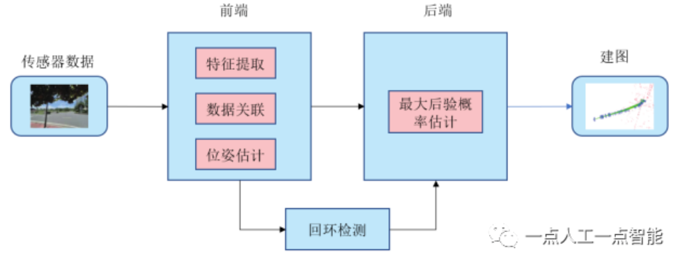

```bash
闭环流程 -> 数据采集-特征提取-位姿估计-地图更新
输入
    采集相机图像，并进行预处理。
*前端（视觉里程计）*
    根据短时间内采集到的相机图像，计算相机的在移动机器人坐标系中的位置和姿态，也就是位姿，并建立局部地图。
    前端的主流方法有特征点法（间接法）和直接法两种。
        特征点由关键点和描述子两部分组成，关键点是指该特征点在图像中的位置，它可以在多帧图像中被检测到，并通过比较描述子来建立配对关系，通过最小化重投影误差来优化相机位姿，最经典的间接法是orb-SLAM2。
        直接法没有特征提取的步骤，直接利用像素的灰度信息，通过最小化像素的光度误差来优化位姿，最经典的直接法是DSO。
    间接法和直接法的理论基础已经较为完善，目前的改进方向就是在已有的理论框架中增加先验约束如：尺度约束，平面特征约束，平行线特征约束等，例如2022年美团《EDPLVO：Efficient Direct Point-Line Visual Odometry》ICRA学术会议上的工作，即对前端做了改进，将线特征扩展到直接法中。
*后端 （定位优化）*
    根据不同时刻视觉里程计计算的相机位姿，３维地图点和回环检测信息，对位姿和３维地图点进行全局的优化，后端处理的是SLAM过程中的噪声问题，在数学上被建模为最大后验概率估计问题来解决，主流的方法有以扩展卡尔曼滤波为代表的滤波器方法和非线性优化方法。
        滤波器方法形式更简洁，适用于计算资源受限的场景。
        非线性优化方法能更精确的优化相机位姿和地图点位置，但计算时间更长，所需计算资源更多。
回环检测
    判断机器人是否到达过先前的位置，如果检测到回环，可以提供时隔更加久远的约束，可以消除累积误差，主要是通过图像之间的相似性来判断。最经典的方法是
        词袋模型：将图像中的特征点表示为一个词袋，通过比较不同图像的词袋向量来判断是否存在回环。当两个图像的词袋向量相似度较高时，认为它们可能是同一位置的图像，从而检测到回环。
        后续的基于CNN和RNN的方法：
    闭环修正的数学建模可以通过图优化的方法来实现。在检测到回环后，将回环信息作为一个新的约束添加到图中，然后通过最小化图中所有约束的误差，对地图和位姿进行全局优化。具体来说，设机器人的位姿为 x ，地图点为 y ，回环约束为 z ，则闭环修正的目标是最小化误差函数 E(x,y,z) ，通过求解这个优化问题，得到最优的位姿和地图。
建图
    根据估计的轨迹，建立与任务要求对应的地图。对于SLAM来说，地图是用来辅助定位的，但对于导航、避障和三维重建等任务来说，地图在其中扮演着更重要的角色，为了完成不同的任务，地图的形式也是不同的，常见的地图类型包括占据网格地图、八叉树地图、语义地图等

🔔除了SLAM，目前主流的移动机器人定位技术还有
·组合导航 （GNSS／INS），常见于自动驾驶
    GNSS技术是指通过观测GNSS卫星获得坐标系内绝对定位坐标的测量技术，中国的北斗导航系统和美国的GPS都属于GNSS技术，在空旷处单一的GNSS的定位误差小于5米，在城市环境下GNSS信号易被遮挡，此时GNSS的定位误差可能会达到几十米。因此现在大多采用组合导航（GNSS/INS）的方式，能极大的提高组合导航的鲁棒性，当然其应用场景主要还是 在空旷的室外。

·二维码导航/磁导航 （Automated Guided Vehicle），常见于物流仓储
    AGV最初是用来运输港口的集装箱，AGV最初是采用磁导航的，这种方式需要按照一定的间隔，在机器人行驶道路上提前埋上磁钉，AGV小车通过自身安装的磁导航传感器接收磁钉信息，从而完成自身的定位，其运动路径也就是由磁钉的布置决定，降低了路径规划技术的要求，该技术适用于港口，工厂自动搬运这类封闭且有固定行驶路径的机器人。而这种技术的缺点在于：磁钉会出现老化的问题，更换磁钉的代价很大，不能轻易变更机器人运营路线，这个缺点很大程度上制约了AGV技术更大范围的运用。当然AGV发展到现在，也出现了采用二维码导航的方式，通过AGV小车扫描天花板或者地板上二维码的方式获取当前位置信息，在仓储物流行业和服务送餐机器人都有运用。
下图 GNSS定位（左），无人码头AGV（右）

·室内场景的三维重建（AR技术等）
    通过图像和其他传感器信息计算相机的位置和三维环境结构，并结合3D渲染提供更自然的人机交互能力。
    自我定位和环境感知：具体需要的是视觉惯导SLAM技术，作为当前实现AR的主流方案，它通过从相机输入的图像信息和IMU的速度、加速度信息完成更准确的定位，同时图像信息能提供更丰富的环境信息，更有利于后续算法理解环境，以完成人机交互。再加上由于制造工艺的成熟，MIU和相机设备体积更小重量更轻，价格也相对便宜，综合以上因素考虑，视觉惯导SLAM技术要更为契合AR设备的需求。
    最为经典的视觉惯导SLAM算法是vins-mono算法。

```
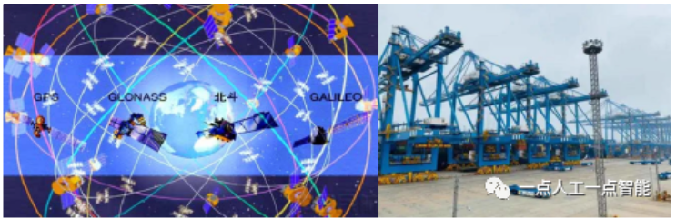


----------------------------------------------------------------

### 强化学习 Reinforcement Learning
```bash
智能体：做选择的人或系统；
环境：智能体面对的现实条件；
状态：某一时刻环境的描述，当前的局面；
动作：智能体当前可做的决策；
奖励：系统对动作好坏的反馈，做的好不好的一次打分；
    ⚠️RL的目标是：让智能体学会选择能获得长期奖励（回报）的动作；
策略：在某个状态下，智能体该如何选择动作？可以是规则，也可以是NN学习出来的决策函数，即遇到某种情况该怎么做？
----
策略网络：用NN表示‘怎么选择动作’，input-状态，output-动作/动作概率
价值网络：用NN判断当前状态好不好，判断现在这个局面对未来有多少？
    Q值网络：评估的是 在某个状态下，执行某个动作，未来能获得多少总收益？
目标网络：DQN，作用是让训练稳定。为什么需要呢？因为训练时Q网络 一边学习，一边用自己结果当目标，这就像学生一边答题一边改答案，容易不稳定。
    一个更新较慢的参考老师，用来稳定训练过程。
经验回放：把过去发生过的‘状态-动作-奖励-下一状态’存起来。训练时，会随机抽取历史经验一起训练，避免模型只记住最近的情况。
探索与利用：矛盾=利用-选择当前看起来最好的动作，探索-尝试一些不确定但可能更好的动作；
```

| 概念    | 通俗解释          | 巡检场景例子            |
| ----- | ------------- | ----------------- |
| 智能体   | 做决策的系统        | 智能巡检调度系统          |
| 环境    | 外部条件          | 线路、机巢、天气、无人机状态    |
| 状态    | 当前局面          | 哪些任务未完成、天气如何、电量多少 |
| 动作    | 可选决策          | 派哪架无人机、巡哪条线路      |
| 奖励    | 对动作的打分        | 按时完成加分，航线冲突扣分     |
| 策略    | 决策规则          | 高风险线路优先巡检         |
| 策略网络  | 输出该怎么做        | 推荐下一步任务分配         |
| 价值网络  | 判断当前局面好不好     | 当前计划未来是否容易完成      |
| Q值网络  | 判断某动作值不值得做    | 当前状态下先巡线路价值多少分    |
| 目标网络  | 稳定训练的参考网络     | 给Q网络提供稳定学习目标      |
| 经验回放  | 复盘历史经验        | 用历史巡检案例训练模型       |
| 探索与利用 | 尝试新方案与使用已知好方案 | 尝试任务合并或采用成熟路线     |


```bash
mathworks公司：https://www.mathworks.com/videos/series/reinforcement-learning.html

agent-> reward action observation-> environment
Agents学习：https://datawhalechina.github.io/hello-agents/#/

RL理解：https://mp.weixin.qq.com/s/Ukt2a1IC4sVbsGCLemk3xQ，https://lei-kun.github.io/blogs/rl.html
可通过两个问题理解：
1.数据从哪里来？
    RL本质上是智能体不断收集经验、并用这些经验改进策略的循环。不同算法的差异，很大程度上取决于它们依赖什么样的数据。
    ·最直接：在线策略学习。在这种模式下，智能体一边与环境交互，一边学习。
            每一个动作都带来新的数据，立刻被用于更新模型。这类方法像是不断在现场实践的学生，代表算法包括 PPO、SAC 等。
            在线学习的优点是灵活、适应性强，但也意味着代价高昂，每次试错都可能耗费时间、能量，甚至造成损失。
    ·相对保守：离线策略学习。它允许智能体反复使用过去的经验，而不必每次都重新与环境交互。
            算法会把这些经验保存下来，在需要时反复采样学习。DQN、TD3、DDPG 都属于这一类。
            离策略学习提高了样本利用率，也让学习过程更稳定，是许多实际应用中的主流方案。
    ·极端方法：离线学习。智能体完全依赖一个固定的数据集进行训练，不能再与环境交互。这种方法看似受限，但在高风险场景中却尤为重要，比如医疗、自动驾驶或机器人控制。
                算法必须在不试错的情况下，从既有数据中学会尽可能好的决策，CQL、IQL 就是这类方法的代表。
&& 从在线到离线，数据的获取方式逐渐从主动探索转向被动利用。算法的选择往往反映了任务的现实约束：能否安全地试错？能否持续获得新数据？试错的代价是否可承受？这便是强化学习的第一个维度：数据从哪里来。
2.策略怎么更新？
    学习更新的节奏。简单来说，就是智能体多久评估一次策略，又多久调整一次行为。
    ·最简单：一步式学习。智能体在一个固定的数据集上训练一次，学到一个策略后就不再改进。
            模仿学习就是典型例子。它速度快、风险低，适合那些对安全性要求高或数据有限的任务。
    ·另一种：多步式学习。算法在一批数据上多次更新，直到性能收敛，再重新收集新的数据。
            这是一种折中策略，既避免了频繁交互的高成本，又能比一次性训练获得更好的表现。
    ·最具代表：迭代式学习。这类算法不断在“收集数据—更新模型—再收集数据”的循环中进化，每一次交互都推动性能提升。
            它们像一个永不停歇的学习者，不断探索未知、修正自身。PPO 和 SAC 就是这种方式的代表。
&& 从一步到多步，再到迭代，算法的更新节奏越来越密集，也意味着从静态到动态的转变。不同节奏之间，其实反映的是对稳定性和适应性的权衡。
3.所有RL都在做上述两件事，就像一个反复自我练习的过程
    先评估，看看自己目前的策略表现得怎样，哪些动作好、哪些不好；
        评估阶段（Policy Evaluation） 就是去衡量“这套策略到底值不值”。
        算法会让模型预测某个状态下采取某个动作能得到多大的回报，然后和实际反馈进行比较。如果误差太大，就调整模型，让它的预期更接近现实。
        比如在线算法直接用新数据计算，离线或离策略算法则要通过重要性采样、加权平均等方式修正旧数据的偏差。
    后改进，根据评估结果，调整策略，让下一次决策更聪明一点。
        改进阶段（Policy Improvement） 是在得到新的评估结果后，优化策略本身。
        模型会倾向于选择那些带来更高期望回报的动作。但为了避免一下子“改过头”，很多算法会加上约束或正则项，
        比如让新策略不能偏离旧策略太多（这就是 PPO 的思想），或者在策略里保留一定的探索性（这就是 SAC 中熵正则的作用）。
&& Q-learning、PPO、SAC……看起来名字各不相同，其实都在重复这两个动作。唯一的区别，只是它们评估得方式不同、改进的速度不同、或者用到的数据不同。

PPO 本质上是一个带有信任域掩码、经过重要性加权的策略梯度方法。


```
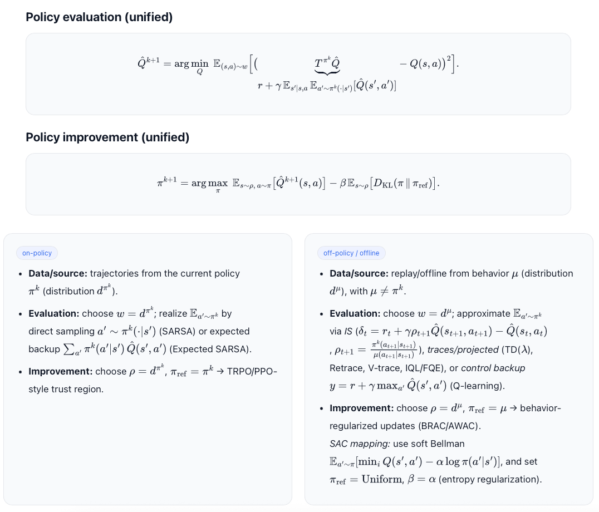
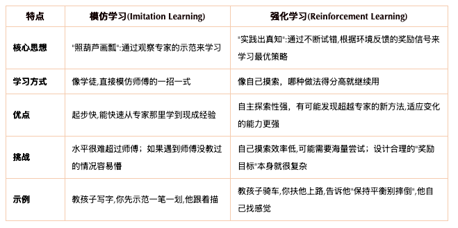